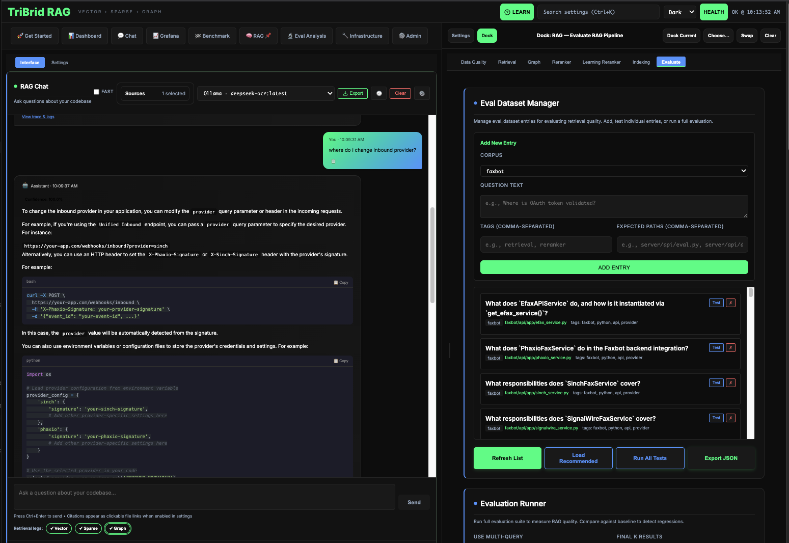
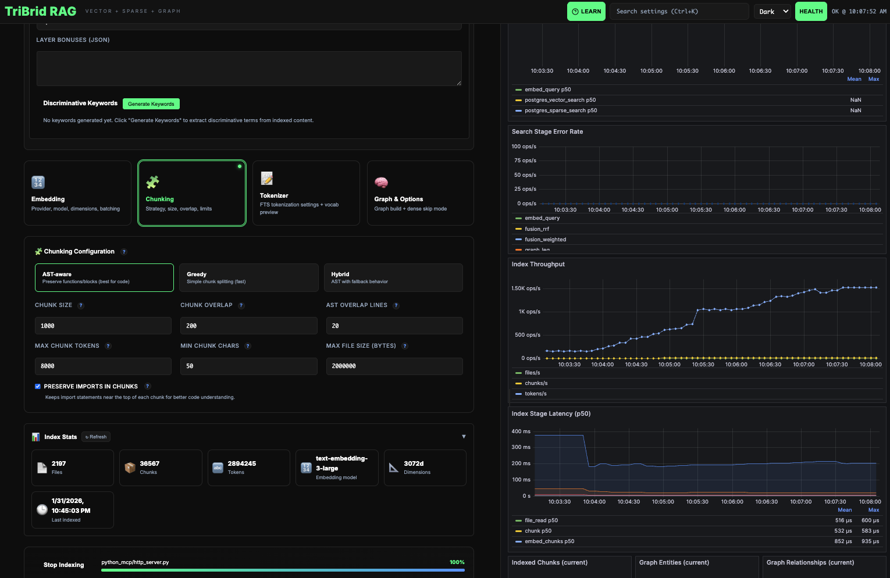

> **This project has been renamed to ragweld.** The internal codebase still references "tribrid" in many places — config keys, interfaces, variable names — and that will stay as-is. The product name, repo, and website are now **[ragweld](https://ragweld.com)**.

<p align="center">
  
</p>

<h1 align="center">ragweld</h1>

<p align="center">
  <strong>Production-grade Retrieval-Augmented Generation combining Vector, Sparse, and Graph search</strong>
</p>

<p align="center">
  <a href="https://github.com/DMontgomery40/tribrid-rag/actions"></a>
  <a href="https://dmontgomery40.github.io/tribrid-rag/"></a>
  <a href="LICENSE"></a>
  <a href="https://python.org"></a>
  <a href="#mcp-integration"></a>
</p>

---

## Screenshots

<details>
  <summary>
    <strong>RAG Chat + Eval Dataset Manager</strong> — grounded answers with sources, plus regression evaluation (click to expand)
    <br />
    
  </summary>
  <br />
  <p align="center">
    <a href="assets/chat-and-dataset.png">
      
    </a>
  </p>
</details>

<details>
  <summary>
    <strong>Indexing Settings + Grafana Dashboards</strong> — tune chunking/embedding and watch indexing metrics live (click to expand)
    <br />
    
  </summary>
  <br />
  <p align="center">
    <a href="assets/indexing-settings-with-grafana-on-side.png">
      
    </a>
  </p>
</details>

## The Problem

Single-method RAG systems fail in predictable ways:

- **Vector search** misses exact identifiers, function names, and error codes
- **Keyword/BM25 search** fails on conceptual queries and paraphrases
- **Neither** understands code relationships—what calls what, what imports what

## The Solution

TriBridRAG runs **three retrieval methods in parallel**, fuses their results, and optionally reranks:

```
                                    ┌─────────────────────┐
                                    │   Vector Search     │
                                    │   (pgvector)        │
                                    │   Semantic similarity│
                              ┌────►│   "auth flow" →     │────┐
                              │     │   "token exchange"  │    │
                              │     └─────────────────────┘    │
                              │                                │
┌──────────────┐              │     ┌─────────────────────┐    │     ┌─────────────┐     ┌──────────────┐
│              │              │     │   Sparse Search     │    │     │             │     │              │
│    Query     │──────────────┼────►│   (PostgreSQL FTS)  │────┼────►│   Fusion    │────►│   Reranker   │────► Results
│              │              │     │   BM25 ranking      │    │     │   (RRF /    │     │   (optional) │
└──────────────┘              │     │   Exact matches     │    │     │   Weighted) │     │              │
                              │     └─────────────────────┘    │     └─────────────┘     └──────────────┘
                              │                                │
                              │     ┌─────────────────────┐    │
                              │     │   Graph Search      │    │
                              └────►│   (Neo4j)           │────┘
                                    │   Entity traversal  │
                                    │   "what calls this?"│
                                    └─────────────────────┘
```

Each search method compensates for the others' weaknesses. The result: **dramatically better recall** across query types.

---

## Features

### Tri-Brid Retrieval
- **Vector Search**: pgvector in PostgreSQL with HNSW indexing
- **Sparse Search**: PostgreSQL Full-Text Search with BM25-style ranking
- **Graph Search**: Neo4j knowledge graph with entity extraction and relationship traversal
- **Fusion**: Reciprocal Rank Fusion (RRF) or configurable weighted scoring
- **Reranking**: Local HuggingFace rerankers, cloud APIs (Cohere/Voyage/Jina), or Qwen3 LoRA learning rerankers

### Full-Stack Application
- **Backend**: FastAPI with async support, comprehensive API
- **Frontend**: React + TypeScript + Zustand, fully typed from Pydantic
- **Configuration**: 500+ tunable parameters, all via UI or API
- **Observability**: Prometheus metrics, Grafana dashboards, Loki log aggregation, structured logging

### MCP Integration (Model Context Protocol)
- **Embedded MCP Server**: Streamable HTTP transport mounted at `/mcp`
- **Three MCP Tools**: `search`, `answer`, `list_corpora`
- **Claude Desktop / IDE Ready**: Connect any MCP-compatible client directly to TriBridRAG
- **Stateless HTTP Mode**: No session management required (recommended for most use cases)

### Knowledge Graph
- Automatic entity extraction (functions, classes, modules, variables)
- Relationship mapping (calls, imports, inherits, contains, references)
- Community detection (Louvain, Label Propagation)
- Graph inspection via **RAG → Graph** (UI), Neo4j Browser, and `/api/graph/*` endpoints

### Local Tracing & Debugging
- **Per-Request Traces**: Full trace capture for every chat/search request
- **Debug Footer**: Inline debug metadata showing confidence, fusion method, retrieval leg counts
- **Loki Integration**: Stream logs directly in the Chat UI via Loki proxy endpoints
- **Ring Buffer Storage**: Configurable retention, no external dependencies for dev tracing

### Evaluation & Cost Tracking
- Built-in evaluation framework with golden question sets
- **Detailed Cost Breakdowns**: Per-request costs for generation, embeddings, and reranking
- Model comparison tools with accurate pricing from `data/models.json`
- Retrieval quality metrics (MRR, Recall@K, NDCG)

---

## Performance

TriBridRAG measures real pipeline latency and throughput via **Prometheus + Grafana** (see dashboards `tribrid-overview` and `tribrid-rag-metrics`). For reproducible local benchmarking (index + search), use the built-in benchmark runner.

### Reproducible benchmark (index + search)

Prereqs:

```bash
docker compose up -d postgres neo4j
# If using the docker-compose defaults:
export NEO4J_PASSWORD=password
```

Run:

```bash
uv run scripts/benchmark_perf.py --corpus-id tribrid-rag --corpus-path . --force-reindex --iterations 5 --warmup 1
```

This prints **Markdown + JSON** summary you can paste into docs/PRs.

### Latest benchmark (local dev run)

Generated on `2026-02-01` with the command above (vector+sparse+graph enabled, `final_k=10`).

| Operation | Performance | Notes |
|---|---:|---|
| Indexing | 419.0s | 497 files, 8,753 chunks, 702,647 tokens |
| Search (tri-brid) | p50 459ms, p95 487ms | 25 calls (5 queries × 5 iters), ~1.62 QPS |

Per-query (ms):

| Query | p50 | p95 | mean |
|---|---:|---:|---:|
| authentication flow | 373.5 | 758.5 | 449.6 |
| prometheus metrics endpoint /metrics | 462.5 | 484.9 | 466.5 |
| neo4j graph retrieval mode | 461.6 | 487.1 | 467.5 |
| where is /api/search implemented | 449.4 | 458.7 | 450.0 |
| fusion rrf_k parameter | 471.0 | 483.0 | 465.9 |

---

## Quick Start

### Prerequisites

- Docker & Docker Compose
- Python 3.11+ with [uv](https://github.com/astral-sh/uv)
- Node.js 18+
- API keys for your preferred embedding provider (OpenAI, Voyage, etc.)

### 1. Clone and Configure

```bash
git clone https://github.com/DMontgomery40/tribrid-rag.git
cd tribrid-rag
cp .env.example .env
```

Edit `.env` with your API keys:
```bash
OPENAI_API_KEY=sk-...
# or
VOYAGE_API_KEY=pa-...
```

### 2. Start Infrastructure

```bash
docker compose up -d postgres neo4j
```

By default, Docker volumes are stored alongside the repo. To store DB data **outside** the repo (recommended for real corpora),
set `TRIBRID_DB_DIR` (wired in `docker-compose.yml`):

```bash
# Example (macOS)
export TRIBRID_DB_DIR="/Users/davidmontgomery/tribrid-rag-db"
docker compose up -d postgres neo4j
```

This starts:
- **PostgreSQL** with pgvector extension (port 5432)
- **Neo4j** graph database (ports 7474, 7687)

### 3. Start Backend

```bash
uv sync
uv run uvicorn server.main:app --reload --port 8012
```

Notes:
- The backend will **auto-load** repo-root `.env` on startup (dev convenience).
- If you change `.env` while the backend is running, you must **restart** the backend for changes to take effect.

API available at http://localhost:8012
OpenAPI docs at http://localhost:8012/docs

### 4. Start Frontend

```bash
cd web
npm install
npm run dev
```

### One-command dev start (recommended)

From the repo root:

```bash
./start.sh
```

With full observability stack (Prometheus + Grafana + Loki + Promtail):

```bash
./start.sh --with-observability
```

Observability URLs:
- Grafana: http://localhost:3001 (admin/admin)
- Prometheus: http://localhost:9090
- Loki: http://localhost:3100

UI available at http://localhost:5173

### 5. Index Your First Corpus

Via UI: Use the corpus switcher in the top navigation.

Via API:
```bash
# Create a corpus
curl -X POST "http://localhost:8012/api/repos" \
  -H "Content-Type: application/json" \
  -d '{
    "name": "my-project",
    "path": "/absolute/path/to/your/code"
  }'

# Start indexing
curl -X POST "http://localhost:8012/api/index/start" \
  -H "Content-Type: application/json" \
  -d '{"repo_id": "my-project"}'

# Check progress
curl "http://localhost:8012/api/index/my-project/status"
```

### 6. Search

```bash
curl -X POST "http://localhost:8012/api/search" \
  -H "Content-Type: application/json" \
  -d '{
    "query": "How does the authentication system work?",
    "corpus_id": "my-project",
    "top_k": 10
  }'
```

---

## MCP Integration

TriBridRAG includes a built-in **Model Context Protocol (MCP)** server, allowing any MCP-compatible client (Claude Desktop, Cursor, VS Code extensions, custom agents) to use tri-brid retrieval directly.

### MCP Tools Available

| Tool | Description |
|------|-------------|
| `search` | Tri-brid search (vector + sparse + graph) returning ranked chunks |
| `answer` | RAG-powered answer generation with citations |
| `list_corpora` | List all available corpora for searching |

### Connecting Claude Desktop

Add to your Claude Desktop config (`~/Library/Application Support/Claude/claude_desktop_config.json`):

```json
{
  "mcpServers": {
    "tribrid-rag": {
      "url": "http://localhost:8012/mcp/"
    }
  }
}
```

Restart Claude Desktop. You can now ask Claude to search your indexed codebases.

### MCP Configuration

MCP settings are in `tribrid_config.json` under the `mcp` section:

| Setting | Default | Description |
|---------|---------|-------------|
| `enabled` | `true` | Enable/disable the MCP server |
| `mount_path` | `/mcp` | HTTP endpoint path |
| `stateless_http` | `true` | Stateless mode (recommended) |
| `json_response` | `true` | JSON responses (recommended) |
| `require_api_key` | `false` | Require Bearer token auth |
| `default_top_k` | `20` | Default result count |
| `default_mode` | `tribrid` | Default retrieval mode |

### MCP Retrieval Modes

| Mode | Vector | Sparse | Graph | Use Case |
|------|--------|--------|-------|----------|
| `tribrid` | ✓ | ✓ | ✓ | Best recall (default) |
| `dense_only` | ✓ | - | - | Semantic queries only |
| `sparse_only` | - | ✓ | - | Exact keyword matching |
| `graph_only` | - | - | ✓ | Relationship traversal |

### Check MCP Status

```bash
curl http://localhost:8012/api/mcp/status
```

---

## Local Tracing

TriBridRAG captures detailed per-request traces for debugging and development. Traces are stored in an in-memory ring buffer (no external dependencies).

### Trace Features

- **Automatic Capture**: Every chat/search request generates a trace
- **Event Timeline**: Request → Retrieval → Fusion → Response events with timestamps
- **Debug Footer**: Inline metadata on every chat response showing:
  - Confidence score (heuristic based on fusion method)
  - Active retrieval legs (vector/sparse/graph)
  - Fusion method and parameters (RRF k or weighted weights)
  - Result counts per leg
  - Run ID for correlation

### API Endpoints

| Endpoint | Description |
|----------|-------------|
| `GET /api/traces/latest` | Get the most recent trace |
| `GET /api/traces/latest?run_id=...` | Get a specific trace by run ID |
| `GET /api/traces/latest?repo=...` | Get latest trace for a corpus |

### Configuration

| Setting | Default | Description |
|---------|---------|-------------|
| `tracing.tracing_enabled` | `1` | Enable trace capture |
| `tracing.tracing_mode` | `local` | Trace mode (`local`, `langsmith`, `off`) |
| `tracing.trace_retention` | `50` | Max traces per corpus (ring buffer) |
| `tracing.trace_sampling_rate` | `1.0` | Sampling rate (1.0 = capture all) |
| `ui.chat_show_debug_footer` | `1` | Show debug footer under chat answers |

---

## Loki Log Integration

When running with the observability stack, TriBridRAG proxies Loki queries for unified log viewing in the Chat UI.

### Loki Proxy Endpoints

| Endpoint | Description |
|----------|-------------|
| `GET /api/loki/status` | Check Loki reachability |
| `GET /api/loki/query_range` | Query logs (LogQL) |
| `GET /api/stream/loki/tail` | SSE stream of live logs |

### Chat UI Integration

The Chat tab includes a **Trace & Logs** panel that:
- Shows the trace timeline for the current/selected run
- Streams live logs from Loki filtered by service
- Correlates logs with trace events by timestamp

---

## Operator Runbook (Real Corpus GraphRAG)

This section is optimized for running a **real on-disk corpus** end-to-end (Postgres + Neo4j), indexing it safely (gitignore-aware + size skips), and verifying graph retrieval is actually contributing results.

### TL;DR (10–15 line runbook)

```bash
# (Optional) store DB volumes outside repo
export TRIBRID_DB_DIR="/Users/davidmontgomery/tribrid-rag-db"

# Neo4j memory tuning (recommended for large corpora on ~24GB VM)
export NEO4J_HEAP_INIT=4G NEO4J_HEAP_MAX=12G NEO4J_PAGECACHE=8G
docker compose up -d postgres neo4j

# If you see Permission denied / AccessDeniedException in DB logs, fix perms then restart:
chmod -R a+rwX "$TRIBRID_DB_DIR/postgres" "$TRIBRID_DB_DIR/neo4j/data" "$TRIBRID_DB_DIR/neo4j/logs"
docker compose restart postgres neo4j

# Start backend (avoid --reload for long indexing)
NEO4J_PASSWORD=password uv run uvicorn server.main:app --host 127.0.0.1 --port 8012

# Create corpus + exclude known heavy build outputs (epstein-files-1)
curl -sS -X POST http://127.0.0.1:8012/api/repos -H 'Content-Type: application/json' -d '{"corpus_id":"epstein-files-1","name":"epstein-files-1","path":"/Users/davidmontgomery/epstein-files-1"}'
curl -sS -X PATCH http://127.0.0.1:8012/api/repos/epstein-files-1 -H 'Content-Type: application/json' -d '{"exclude_paths":[".worktrees/","out.noindex/","data/qdrant/","node_modules/","dist/"]}'

# Index + poll
curl -sS -X POST http://127.0.0.1:8012/api/index -H 'Content-Type: application/json' -d '{"corpus_id":"epstein-files-1","repo_path":"/Users/davidmontgomery/epstein-files-1","force_reindex":true}'
while true; do curl -sS http://127.0.0.1:8012/api/index/epstein-files-1/status | python -m json.tool; sleep 2; done
```

### Verify GraphRAG is actually contributing results

```bash
curl -sS -X POST http://127.0.0.1:8012/api/search \
  -H 'Content-Type: application/json' \
  -d '{"corpus_id":"epstein-files-1","query":"authentication flow","top_k":8,"include_vector":true,"include_sparse":true,"include_graph":true}' \
  | python -m json.tool
```

Success criteria:
- `debug.fusion_graph_attempted` is `true`
- `debug.fusion_graph_error` is `null`
- `debug.fusion_graph_hydrated_chunks > 0`
- At least one match has `"source": "graph"`

### How file inclusion works (gitignore + safety/perf)

- **Gitignore semantics**: indexing uses a gitignore-aware loader that supports **nested `.gitignore` files**.
- **Always-ignored** (even if corpus has no `.gitignore`): `.git/`, `.venv/`, `node_modules/`, `__pycache__/`, `*.pyc`, `.DS_Store`, `.env`.
- **Size skip (LAW)**: files larger than `min(chunking.max_indexable_file_size, indexing.index_max_file_size_mb*1024*1024)` are skipped *before* reading/chunking.
- **Corpus-level excludes**: set `exclude_paths` on the corpus (stored in Postgres `corpora.meta`) to skip large build outputs that are not gitignored. You can set this via **UI** (`RAG → Indexing → Corpus settings`) or **API** (`PATCH /api/corpora/{corpus_id}`).

### Troubleshooting (real failures we hit)

- **Neo4j health in `docker compose ps` may say "starting" forever**: the Neo4j container healthcheck uses `curl`, but the Neo4j image doesn't ship curl. Use cypher-shell instead:

```bash
docker exec tribrid-neo4j cypher-shell -u neo4j -p password 'RETURN 1 AS ok;'
```

- **Neo4j "critical error needs restart"**:
  - Most commonly caused by bind-mount permissions (Neo4j can't write vector-index temp files).
  - Fix permissions on `$TRIBRID_DB_DIR/neo4j/data` and `$TRIBRID_DB_DIR/neo4j/logs`, then `docker compose restart neo4j`.
  - If Neo4j data is corrupted from a prior crash, you may need to wipe `$TRIBRID_DB_DIR/neo4j/data` (destructive).

- **Postgres "Permission denied" writing relation files**:
  - Fix permissions on `$TRIBRID_DB_DIR/postgres`, then `docker compose restart postgres`.

### Graph inspection (UI + Neo4j Browser)

- **UI (recommended)**: `RAG → Graph` shows graph stats, communities, entity search, and entity neighborhood subgraphs.
  - Endpoints: `/api/graph/{corpus_id}/stats`, `/api/graph/{corpus_id}/entities`, `/api/graph/{corpus_id}/entity/{entity_id}/neighbors`, `/api/graph/{corpus_id}/communities`, `/api/graph/{corpus_id}/community/{community_id}/members`
- **Neo4j Browser**: http://localhost:7474 (neo4j/password)
- Useful Cypher examples:

```cypher
MATCH (c:Chunk {repo_id:"epstein-files-1"}) RETURN count(c);
MATCH (d:Document {repo_id:"epstein-files-1"}) RETURN count(d);
MATCH (e:Entity {repo_id:"epstein-files-1"}) RETURN e.entity_type, count(*) ORDER BY count(*) DESC;
MATCH (e:Entity {repo_id:"epstein-files-1"})-[:IN_CHUNK]->(c:Chunk {repo_id:"epstein-files-1"}) RETURN e.name, c.file_path, c.chunk_id LIMIT 25;
SHOW INDEXES YIELD name, type, state WHERE type="VECTOR" RETURN name, state;
```

### UI notes (current state)

- **Indexing UI**: `RAG → Indexing` is fully functional and streams progress via SSE (`/api/stream/operations/index?corpus_id=...`). Long indexing runs won't hang if the UI isn't connected.
- **Corpus settings**: `RAG → Indexing → Corpus settings` lets you edit `exclude_paths` (and other corpus metadata) used by indexing.
- **Retrieval UI**: `RAG → Retrieval` exposes graph retrieval toggles (e.g., `graph_search.enabled`, `graph_search.mode`, `graph_search.max_hops`, `graph_search.chunk_neighbor_window`).
- **Graph UI**: `RAG → Graph` lets you browse communities, search entities, and load neighbor subgraphs (powered by `/api/graph/*`).
- **MCP UI**: `Infrastructure → MCP` shows transport status and connection info.

---

## Architecture

### The Golden Rule

> **Pydantic is the law.**

All configuration, all types, all API contracts are defined in `server/models/tribrid_config_model.py`. TypeScript types are **generated** from Pydantic—never hand-written. This ensures the backend and frontend can never drift apart.

```
tribrid_config_model.py  ──►  generate_types.py  ──►  web/src/types/generated.ts
     (Pydantic)                    (script)              (TypeScript)
         │                                                    │
         ▼                                                    ▼
    FastAPI uses                                      React components use
    these types                                       these types
```

### Directory Structure

```
tribrid-rag/
├── server/                     # Python FastAPI backend
│   ├── api/                    # REST endpoints
│   │   ├── search.py           # /api/search - tri-brid retrieval
│   │   ├── chat.py             # /api/chat - conversational RAG + tracing
│   │   ├── index.py            # /api/index - corpus indexing
│   │   ├── repos.py            # /api/repos - corpus management
│   │   ├── config.py           # /api/config - configuration + MCP status
│   │   ├── graph.py            # /api/graph - knowledge graph queries
│   │   ├── docker.py           # /api/dev/* - dev stack + Loki proxy
│   │   ├── cost.py             # /api/cost - detailed cost estimation
│   │   ├── eval.py             # /api/eval - evaluation framework
│   │   └── health.py           # /api/health - service health
│   ├── mcp/                    # MCP server implementation
│   │   ├── server.py           # FastMCP server singleton
│   │   └── tools.py            # MCP tool implementations
│   ├── db/
│   │   ├── postgres.py         # pgvector + FTS operations
│   │   └── neo4j.py            # Graph database operations
│   ├── indexing/
│   │   ├── chunker.py          # Code-aware chunking
│   │   ├── embedder.py         # Embedding generation
│   │   ├── graph_builder.py    # Entity/relationship extraction
│   │   └── loader.py           # File loading with gitignore support
│   ├── models/
│   │   └── tribrid_config_model.py  # THE source of truth (~500+ fields)
│   ├── retrieval/
│   │   ├── vector.py           # Dense retrieval
│   │   ├── sparse.py           # BM25/FTS retrieval
│   │   ├── graph.py            # Graph traversal
│   │   ├── fusion.py           # RRF and weighted fusion
│   │   └── rerank.py           # Reranking (local, cloud, learning)
│   └── services/
│       ├── rag.py              # RAG orchestration + ChatDebugInfo
│       ├── traces.py           # Local trace store (ring buffer)
│       └── config_store.py     # Configuration persistence
│
├── web/                        # React TypeScript frontend
│   └── src/
│       ├── components/         # UI components
│       │   ├── Dashboard/      # System status, metrics
│       │   ├── RAG/            # Search, config panels
│       │   ├── Chat/           # Conversational interface + debug footer
│       │   └── Infrastructure/ # Service management, MCP status
│       ├── stores/             # Zustand state management
│       ├── hooks/              # React hooks
│       ├── types/
│       │   └── generated.ts    # Auto-generated from Pydantic
│       └── api/                # API client
│
├── data/
│   ├── models.json             # LLM/embedding model definitions + pricing
│   └── glossary.json           # UI tooltip definitions (~250 terms)
│
├── infra/                      # Docker and deployment configs
├── scripts/                    # Development and maintenance scripts
├── tests/                      # Test suite
└── mkdocs/                     # Documentation site
```

---

## Configuration

TriBridRAG is highly configurable. Every parameter is defined in Pydantic with validation, defaults, and descriptions.

### Key Configuration Sections

| Section | What it controls |
|---------|------------------|
| `retrieval` | Top-K per leg, BM25 parameters, query expansion, confidence thresholds |
| `fusion` | Method (RRF/weighted), per-leg weights, normalization |
| `graph_storage` | Max hops, entity types, relationship types, community detection |
| `reranking` | Mode (none/local/cloud/trained), model selection, top-N |
| `embedding` | Provider, model, dimensions, batch size |
| `chunking` | Strategy, max tokens, overlap |
| `indexing` | Postgres config, concurrent workers |
| `tracing` | Local trace capture, sampling rate, retention |
| `mcp` | MCP server enable, mount path, defaults |
| `ui` | Debug footer visibility, streaming, history limits |

### Configuration Methods

1. **UI**: RAG tab in the web interface
2. **API**: `GET/PUT /api/config`
3. **File**: `tribrid_config.json`
4. **Per-corpus**: `?repo_id=...` parameter for corpus-specific settings

### Example: Adjust Fusion Weights

```bash
curl -X PUT "http://localhost:8012/api/config" \
  -H "Content-Type: application/json" \
  -d '{
    "fusion": {
      "vector_weight": 0.5,
      "sparse_weight": 0.3,
      "graph_weight": 0.2
    }
  }'
```

---

## API Reference

### Search & Retrieval

| Endpoint | Method | Description |
|----------|--------|-------------|
| `/api/search` | POST | Tri-brid search with fusion and optional reranking |
| `/api/answer` | POST | RAG-powered answer generation with citations |
| `/api/chat` | POST | Conversational RAG with history and tracing |
| `/api/chat/stream` | POST | Streaming chat with SSE |

### Corpus Management

| Endpoint | Method | Description |
|----------|--------|-------------|
| `/api/repos` | GET | List all corpora |
| `/api/repos` | POST | Create a new corpus |
| `/api/repos/{id}` | GET | Get corpus details |
| `/api/repos/{id}` | PATCH | Update corpus settings |
| `/api/repos/{id}` | DELETE | Delete a corpus |

### Indexing

| Endpoint | Method | Description |
|----------|--------|-------------|
| `/api/index/start` | POST | Start indexing a corpus |
| `/api/index/{id}/status` | GET | Get indexing progress |
| `/api/index/{id}/stats` | GET | Get index statistics |

### Knowledge Graph

| Endpoint | Method | Description |
|----------|--------|-------------|
| `/api/graph/{id}/entities` | GET | List entities in the graph |
| `/api/graph/{id}/communities` | GET | List detected communities |
| `/api/graph/{id}/stats` | GET | Graph stats (entity/rel/community counts) |
| `/api/graph/{id}/entity/{entity_id}` | GET | Fetch a single entity |
| `/api/graph/{id}/entity/{entity_id}/neighbors` | GET | Entity neighborhood subgraph |
| `/api/graph/{id}/query` | POST | Read-only Cypher query (debug) |

### Tracing & Debugging

| Endpoint | Method | Description |
|----------|--------|-------------|
| `/api/traces/latest` | GET | Get latest trace (optional `run_id` or `repo` filter) |
| `/api/loki/status` | GET | Check Loki reachability |
| `/api/loki/query_range` | GET | Query Loki logs (LogQL) |
| `/api/stream/loki/tail` | GET | SSE stream of live logs |

### MCP

| Endpoint | Method | Description |
|----------|--------|-------------|
| `/api/mcp/status` | GET | MCP transport status |
| `/api/mcp/rag_search` | GET | Debug endpoint for quick tri-brid search |
| `/mcp/` | POST | MCP Streamable HTTP endpoint (for MCP clients) |

### Configuration

| Endpoint | Method | Description |
|----------|--------|-------------|
| `/api/config` | GET | Get current configuration |
| `/api/config` | PUT | Update configuration |
| `/api/models` | GET | List available models |

### Cost Estimation

| Endpoint | Method | Description |
|----------|--------|-------------|
| `/api/cost/estimate` | POST | Detailed cost breakdown (gen + embed + rerank) |
| `/api/cost/history` | GET | Historical cost records |
| `/api/cost/summary` | GET | Cost summary by period |

### Evaluation

| Endpoint | Method | Description |
|----------|--------|-------------|
| `/api/eval/run` | POST | Run evaluation suite |
| `/api/eval/results` | GET | Get evaluation results |

Full OpenAPI documentation: http://localhost:8012/docs

---

## Development

### Commands

```bash
# Install dependencies
uv sync

# Run tests
uv run pytest

# Type checking
uv run mypy server

# Linting
uv run ruff check server

# Format code
uv run ruff format server

# Regenerate TypeScript types (after changing Pydantic models)
uv run python scripts/generate_types.py

# Validate type sync
uv run python scripts/validate_types.py
```

### Adding a New Feature

1. **Add to Pydantic first**: Define the field in `tribrid_config_model.py`
2. **Regenerate types**: Run `scripts/generate_types.py`
3. **Implement backend**: Use the new field in your Python code
4. **Implement frontend**: Use the generated TypeScript type
5. **Add tests**: Both Python and Playwright

### Testing

```bash
# Unit tests
uv run pytest tests/unit

# API tests
uv run pytest tests/api

# Integration tests (requires running services)
uv run pytest tests/integration

# Frontend tests
cd web && npm test

# E2E tests
cd web && npx playwright test
```

---

## Observability

### Endpoints

| Service | URL | Credentials |
|---------|-----|-------------|
| API Docs | http://localhost:8012/docs | - |
| Grafana | http://localhost:3001 | admin/admin |
| Prometheus | http://localhost:9090 | - |
| Loki | http://localhost:3100 | - |
| Neo4j Browser | http://localhost:7474 | neo4j/password |

### Health Check

```bash
curl http://localhost:8012/api/health
```

Returns status of all services (Postgres, Neo4j, embedding provider).

### Metrics

```bash
curl http://localhost:8012/metrics
```

Prometheus-format metrics for retrieval latency, throughput, error rates.

---

## Embedding Providers

| Provider | Models | Notes |
|----------|--------|-------|
| OpenAI | `text-embedding-3-small`, `text-embedding-3-large` | Best general-purpose |
| Voyage | `voyage-code-2`, `voyage-large-2` | Optimized for code |
| Local | Any sentence-transformers model | No API costs |

Configure in `.env` or via the UI.

---

## Reranking Options

| Mode | Model | Notes |
|------|-------|-------|
| `none` | - | Fastest, use fusion scores only |
| `local` | `ms-marco-MiniLM-L-6-v2` | Good balance of speed/quality |
| `cloud` | Cohere, Voyage, Jina | Best quality, API costs |
| `trained` | Your fine-tuned model | Custom domain adaptation |

---

## Cost Estimation

The `/api/cost/estimate` endpoint provides detailed breakdowns:

```bash
curl -X POST "http://localhost:8012/api/cost/estimate" \
  -H "Content-Type: application/json" \
  -d '{
    "gen_provider": "openai",
    "gen_model": "gpt-4o-mini",
    "tokens_in": 2000,
    "tokens_out": 500,
    "embed_provider": "openai",
    "embed_model": "text-embedding-3-small",
    "embeds": 10,
    "requests_per_day": 100
  }'
```

Response includes:
- **Per-request cost**: Generation + embedding + reranking
- **Daily/monthly projections**: Based on requests_per_day
- **Detailed breakdown**: Costs per component with model pricing info
- **Validation errors**: Missing model definitions or pricing data

---

## Documentation

Full documentation: https://dmontgomery40.github.io/tribrid-rag/

Build locally:
```bash
mkdocs serve
```

---

## Contributing

1. Fork the repository
2. Create a feature branch
3. Make your changes (Pydantic first!)
4. Run tests and type checking
5. Submit a pull request

---

## License

MIT License. See [LICENSE](LICENSE) for details.

---

<p align="center">
  <strong>Three search engines. One answer.</strong>
</p>
