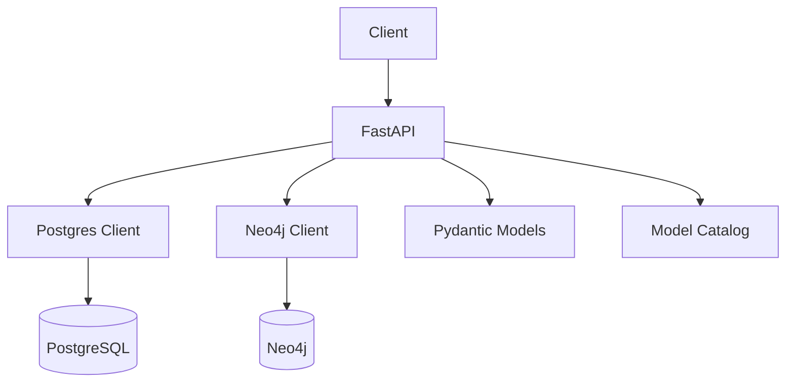

# API Reference

<div class="grid chunk_summaries" markdown>

-   :material-api:{ .lg .middle } **FastAPI Endpoints**

    ---

    Clean endpoints for config, indexing, retrieval, graph, models, keywords, reranker, and health.

-   :material-file-code:{ .lg .middle } **Schema by Pydantic**

    ---

    Request/response models are defined in Pydantic. The frontend imports generated TypeScript types.

-   :material-shield-key:{ .lg .middle } **Secrets Check**

    ---

    Validate configured API keys and DB connections via `/secrets/check`.

</div>

[Get started](index.md){ .md-button .md-button--primary }
[Configuration](configuration.md){ .md-button }
[API](api.md){ .md-button }

!!! tip "Pro Tip — Inspect Schemas"
    Each endpoint returns Pydantic-driven shapes. Prefer querying `/config` first to align UI interactions with actual server capabilities.

!!! note "HTTP Conventions"
    - JSON requests/responses
    - Errors via standard HTTP status codes with `detail`
    - Streaming responses for long-running operations use `StreamingResponse`

!!! warning "Rate & Resource Limits"
    Reranking and keyword generation incur model usage and cost. Control with config and model selection.

## Endpoint Inventory

| Area | Route | Method | Function |
|------|-------|--------|----------|
| Config | `/config` | GET | `get_config` |
| Config | `/config/reset` | POST | `reset_config` |
| Config | `/config/{section}` | PATCH | Sectional patch, e.g., `fusion` |
| Secrets | `/secrets/check` | GET | `check_secrets` |
| Index | `/index` | POST | Start indexing |
| Index | `/index/status` | GET | `IndexStatus` for corpus |
| Index | `/index/stats` | GET | `IndexStats` summary |
| Search | `/search` | POST | Tri-brid retrieval + fusion (+reranker) |
| Graph | `/graph/{corpus_id}/entities` | GET | List entities |
| Graph | `/graph/{corpus_id}/entity/{entity_id}` | GET | Entity details |
| Graph | `/graph/{corpus_id}/entity/{entity_id}/relationships` | GET | Relationships |
| Graph | `/graph/{corpus_id}/entity/{entity_id}/neighbors` | GET | 1-hop neighbors |
| Graph | `/graph/{corpus_id}/community/{community_id}/members` | GET | Members |
| Graph | `/graph/{corpus_id}/community/{community_id}/subgraph` | GET | Subgraph |
| Models | `/models/by-type/{component_type}` | GET | List models for component |
| Models | `/models/providers` | GET | All providers |
| Models | `/models/providers/{provider}` | GET | Models by provider |
| Chunk Summaries | `/chunk_summaries` | GET | List summaries |
| Chunk Summaries | `/chunk_summaries/build` | POST | Build summaries |
| Keywords | `/keywords/generate` | POST | Generate keywords |
| Reranker | `/reranker/status` | GET | Status |
| Reranker | `/reranker/info` | GET | Info |
| Reranker | `/reranker/mine` | POST | Mine triplets |
| Reranker | `/reranker/train` | POST | Train |
| Reranker | `/reranker/evaluate` | POST | Evaluate |
| Reranker | `/reranker/logs/count` | GET | Logs count |
| Reranker | `/reranker/triplets/count` | GET | Triplets count |
| Reranker | `/reranker/costs` | GET | Cost report |
| Health | `/health` | GET | Liveness |
| Health | `/ready` | GET | Readiness |
| Health | `/metrics` | GET | Prometheus |
| Docker | `/docker/status` | GET | Runtime info |
| Docker | `/docker/{container}/restart` | POST | Restart container |
| Docker | `/docker/{container}/logs` | GET | Container logs |



## Example: Config Roundtrip

=== "Python"
    ```python
    import httpx

    base = "http://localhost:8000"
    cfg = httpx.get(f"{base}/config").json()          # (1)

    # Enable reranker
    httpx.patch(f"{base}/config/reranker", json={"enabled": True})  # (2)

    # Check secrets (API keys, DBs) (3)
    print(httpx.get(f"{base}/secrets/check").json())
    ```

=== "curl"
    ```bash
    BASE=http://localhost:8000
    curl -sS "$BASE/config" | jq . # (1)
    curl -sS -X PATCH "$BASE/config/reranker" -H 'Content-Type: application/json' -d '{"enabled": true}' | jq . # (2)
    curl -sS "$BASE/secrets/check" | jq . # (3)
    ```

=== "TypeScript"
    ```typescript
    import { TriBridConfig } from "./web/src/types/generated";

    async function check(): Promise<void> {
      const cfg: TriBridConfig = await (await fetch("/config")).json(); // (1)
      await fetch("/config/reranker", { method: "PATCH", headers: {"Content-Type":"application/json"}, body: JSON.stringify({ enabled: true }) }); // (2)
      const secrets = await (await fetch("/secrets/check")).json(); // (3)
      console.log(secrets);
    }
    ```

1. All shapes defined by Pydantic
2. Patch one section with validation
3. Validate secrets and DB connectivity

!!! success "Model Catalog Endpoint"
    The UI must populate model selectors from `/models/...`. No hard-coded lists.

## Graph API Example

=== "Python"
    ```python
    import httpx
    base = "http://localhost:8000"

    entities = httpx.get(f"{base}/graph/tribrid/entities").json()
    node = httpx.get(f"{base}/graph/tribrid/entity/{entities[0]['id']}").json()
    rels = httpx.get(f"{base}/graph/tribrid/entity/{entities[0]['id']}/relationships").json()
    print(node, len(rels))
    ```

=== "curl"
    ```bash
    BASE=http://localhost:8000
    curl -sS "$BASE/graph/tribrid/entities" | jq '.[0]'
    ```

=== "TypeScript"
    ```typescript
    async function firstEntity(corpus: string) {
      const ents = await (await fetch(`/graph/${corpus}/entities`)).json();
      const id = ents[0].id;
      const rels = await (await fetch(`/graph/${corpus}/entity/${id}/relationships`)).json();
      console.log(id, rels.length);
    }
    ```

!!! danger "Do Not Transform Shapes"
    If the frontend needs different `Entity` shapes, change the Pydantic models that define these endpoints and regenerate types.

??? note "Streaming Search"
    Some endpoints may stream responses for long operations. Use backpressure-aware clients when consuming `text/event-stream` or chunked JSON.
