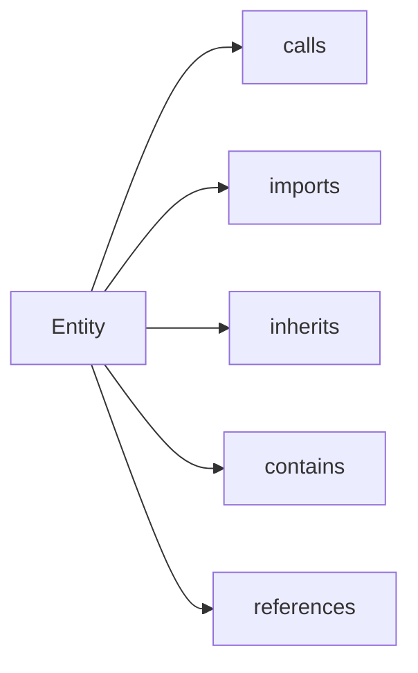

# Graph API (Entities and Relationships)

<div class="grid chunk_summaries" markdown>

-   :material-source-branch:{ .lg .middle } **Entities**

    ---

    Functions, classes, modules, variables, concepts.

-   :material-link-variant:{ .lg .middle } **Relationships**

    ---

    calls, imports, inherits, contains, references.

-   :material-account-group:{ .lg .middle } **Communities**

    ---

    Optional clustering for related entities.

</div>

[Get started](index.md){ .md-button .md-button--primary }
[Configuration](configuration.md){ .md-button }
[API](api.md){ .md-button }

| Route | Method | Description |
|-------|--------|-------------|
| `/graph/{corpus_id}/entities` | GET | List entities |
| `/graph/{corpus_id}/entity/{entity_id}` | GET | Entity details |
| `/graph/{corpus_id}/entity/{entity_id}/relationships` | GET | Direct edges |
| `/graph/{corpus_id}/entity/{entity_id}/neighbors` | GET | 1-hop neighborhood |
| `/graph/{corpus_id}/communities` | GET | List communities |



=== "Python"
```python
import httpx
base = "http://localhost:8000"
ents = httpx.get(f"{base}/graph/tribrid/entities").json()
print("entities", len(ents))
```

=== "curl"
```bash
BASE=http://localhost:8000
curl -sS "$BASE/graph/tribrid/entities" | jq '.[0]'
```

=== "TypeScript"
```typescript
const ents = await (await fetch('/graph/tribrid/entities')).json();
console.log(ents.length)
```
