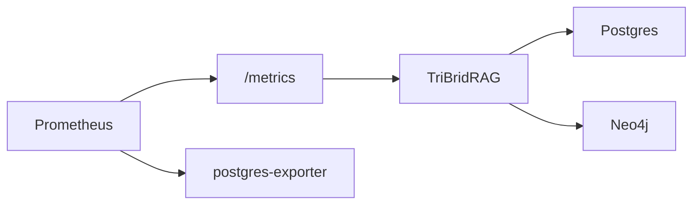

# Health, Readiness, and Metrics API

<div class="grid chunk_summaries" markdown>

-   :material-heart-pulse:{ .lg .middle } **Liveness**

    ---

    `/health` returns process liveness.

-   :material-check-decagram:{ .lg .middle } **Readiness**

    ---

    `/ready` verifies DB connectivity.

-   :material-chart-areaspline:{ .lg .middle } **Metrics**

    ---

    `/metrics` exposes Prometheus metrics.

</div>

[Get started](index.md){ .md-button .md-button--primary }
[Configuration](configuration.md){ .md-button }
[API](api.md){ .md-button }

!!! tip "Gate Traffic"
    Route production traffic only after readiness returns 200.

!!! note "Exporter"
    A Postgres exporter is included in the compose stack; scrape it alongside `/metrics`.

!!! warning "High-cardinality"
    Avoid per-query labels in custom metrics. Aggregate by corpus or retriever.

=== "Python"
```python
import httpx
print(httpx.get("http://localhost:8000/health").json())
print(httpx.get("http://localhost:8000/ready").json())
print(httpx.get("http://localhost:8000/metrics").text[:200])
```

=== "curl"
```bash
curl -sS http://localhost:8000/health | jq .
curl -sS http://localhost:8000/ready | jq .
curl -sS http://localhost:8000/metrics | head -n 20
```

=== "TypeScript"
```typescript
await fetch('/health')
await fetch('/ready')
const m = await (await fetch('/metrics')).text();
console.log(m.split('\n').slice(0,5))
```



??? info "Loki/Grafana"
    Logs and dashboards are available via Loki and Grafana services started by `docker compose`.
