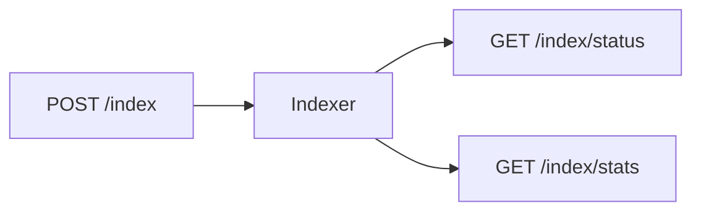

# Indexing API

<div class="grid chunk_summaries" markdown>

-   :material-file-document-multiple:{ .lg .middle } **Start**

    ---

    `POST /index` with `IndexRequest`.

-   :material-progress-clock:{ .lg .middle } **Status**

    ---

    `GET /index/status` returns progress, current file.

-   :material-harddisk:{ .lg .middle } **Stats**

    ---

    `GET /index/stats` returns storage breakdown.

</div>

[Get started](index.md){ .md-button .md-button--primary }
[Configuration](configuration.md){ .md-button }
[API](api.md){ .md-button }

| Route | Method | Description |
|-------|--------|-------------|
| `/index` | POST | Start indexing |
| `/index/status` | GET | Current state |
| `/index/stats` | GET | Storage stats |



=== "Python"
```python
import httpx
httpx.post("http://localhost:8000/index", json={"corpus_id":"tribrid","repo_path":"/repo","force_reindex":False})
```

=== "curl"
```bash
curl -sS -X POST http://localhost:8000/index -H 'Content-Type: application/json' -d '{"corpus_id":"tribrid","repo_path":"/repo","force_reindex":false}'
```

=== "TypeScript"
```typescript
await fetch('/index', { method:'POST', headers:{'Content-Type':'application/json'}, body: JSON.stringify({ corpus_id:'tribrid', repo_path:'/repo', force_reindex:false }) })
```

!!! info "Storage"
    See `DashboardIndexStatsResponse` for per-corpus bytes in Postgres (chunks, embeddings, pgvector index, BM25) and Neo4j store size.
