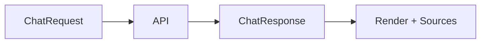

# Chat Models

<div class="grid chunk_summaries" markdown>

-   :material-chat-processing:{ .lg .middle } **Request/Response**

    ---

    `ChatRequest` and `ChatResponse` with streaming option.

-   :material-bug-outline:{ .lg .middle } **Debug Info**

    ---

    `ChatDebugInfo` includes per-leg enablement and fusion params.

-   :material-timeline-text:{ .lg .middle } **Tracing**

    ---

    `Trace`, `TraceEvent`, and `/api/traces/latest` for last run.

</div>

[Get started](index.md){ .md-button .md-button--primary }
[Configuration](configuration.md){ .md-button }
[API](api.md){ .md-button }

| Model | Key Fields |
|-------|------------|
| `ChatRequest` | `message`, `corpus_id`, `top_k`, `include_vector/sparse/graph`, `stream` |
| `ChatResponse` | `message`, `sources`, `tokens_used`, `debug` |
| `ChatDebugInfo` | `fusion_method`, `rrf_k`, per-leg weights, confidence thresholds |



=== "Python"
```python
import httpx
print(httpx.post("http://localhost:8000/chat", json={"corpus_id":"tribrid","message":"where is auth?"}).json())
```

=== "curl"
```bash
curl -sS -X POST http://localhost:8000/chat -H 'Content-Type: application/json' -d '{"corpus_id":"tribrid","message":"where is auth?"}' | jq .
```

=== "TypeScript"
```typescript
const r = await (await fetch('/chat', { method:'POST', headers:{'Content-Type':'application/json'}, body: JSON.stringify({ corpus_id:'tribrid', message:'where is auth?' }) })).json();
```
