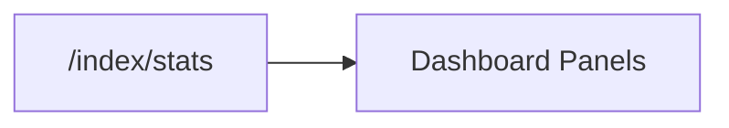

# Index Dashboard Models

<div class="grid chunk_summaries" markdown>

-   :material-chart-box-outline:{ .lg .middle } **Storage Breakdown**

    ---

    `DashboardIndexStorageBreakdown` shows bytes across Postgres + Neo4j.

-   :material-currency-usd:{ .lg .middle } **Costs**

    ---

    `DashboardIndexCosts` estimates embedding costs.

-   :material-database-cog:{ .lg .middle } **Embedding Config**

    ---

    `DashboardEmbeddingConfigSummary` summarizes vector storage settings.

</div>

[Get started](index.md){ .md-button .md-button--primary }
[Configuration](configuration.md){ .md-button }
[API](api.md){ .md-button }

| Model | Fields |
|-------|--------|
| `DashboardIndexStorageBreakdown` | `chunks_bytes`, `embeddings_bytes`, `pgvector_index_bytes`, `bm25_index_bytes`, `neo4j_store_bytes`, `total_storage_bytes` |
| `DashboardIndexStatusResponse` | `lines`, `metadata`, `running`, `progress`, `current_file` |



=== "Python"
```python
import httpx
print(httpx.get("http://localhost:8000/index/stats?corpus_id=tribrid").json())
```

=== "curl"
```bash
curl -sS "http://localhost:8000/index/stats?corpus_id=tribrid" | jq .
```

=== "TypeScript"
```typescript
const stats = await (await fetch('/index/stats?corpus_id=tribrid')).json();
```
