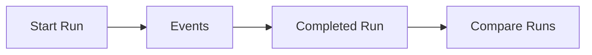

# Reranker Training Models

<div class="grid chunk_summaries" markdown>

-   :material-flask:{ .lg .middle } **Runs**

    ---

    `RerankerTrainRun` captures hyperparameters and metrics.

-   :material-graph-outline:{ .lg .middle } **Streaming Metrics**

    ---

    `RerankerTrainMetricEvent` over SSE for progress.

-   :material-check:{ .lg .middle } **Diff**

    ---

    Compare two runs with `RerankerTrainDiffResponse`.

</div>

[Get started](index.md){ .md-button .md-button--primary }
[Configuration](configuration.md){ .md-button }
[API](api.md){ .md-button }

!!! tip "Primary Metric"
    Let the profile choose `mrr@k` vs `ndcg@k` based on label structure; override only with clear reason.

!!! note "Local Logs"
    Events stream and also persist to `metrics.jsonl` for later inspection.

!!! warning "Compatibility"
    Diff will mark runs incompatible if headline metric/k differ.

| Model | Purpose |
|-------|---------|
| `RerankerTrainRun` | Captures `primary_metric`, hyperparameters, and summary |
| `RerankerTrainMetricEvent` | Progress, metrics, and state events |
| `RerankerTrainDiffResponse` | Compatibility + delta comparisons |



=== "Python"
```python
import httpx
base = "http://localhost:8000"
print(httpx.post(f"{base}/reranker/train/start", json={"corpus_id":"tribrid"}).json())
```

=== "curl"
```bash
BASE=http://localhost:8000
curl -sS -X POST "$BASE/reranker/train/start" -H 'Content-Type: application/json' -d '{"corpus_id":"tribrid"}' | jq .
```

=== "TypeScript"
```typescript
await fetch('/reranker/train/start', { method:'POST', headers:{'Content-Type':'application/json'}, body: JSON.stringify({ corpus_id:'tribrid' }) })
```

??? info "Choosing batch/length"
    For constrained machines, reduce `tribrid_reranker_batch` and `tribrid_reranker_maxlen` to avoid OOM.
