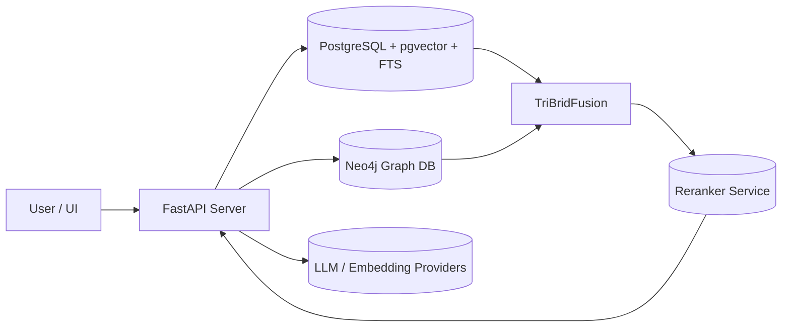
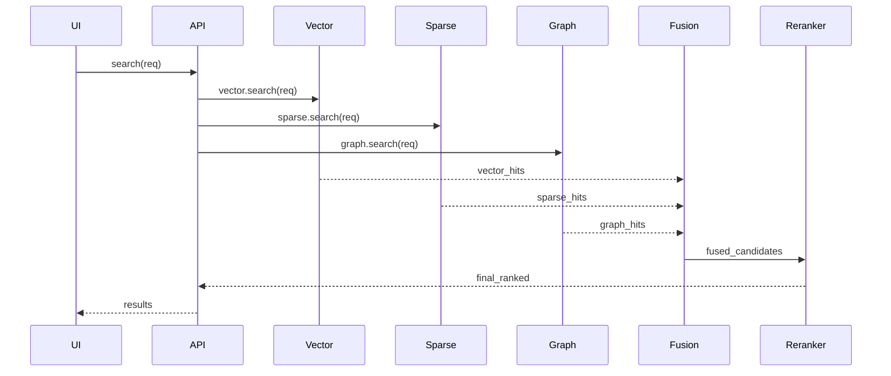

<div class="grid chunk_summaries" markdown>

-   :material-magnify:{ .lg .middle } **Tri-Bridge Fusion**

    ---

    Fusion engine merges signals from multiple retrievers

-   :material-database:{ .lg .middle } **Single Postgres Store**

    ---

    Embeddings (pgvector) + FTS for sparse search

-   :material-graph:{ .lg .middle } **Knowledge Graph**

    ---

    Neo4j holds entity nodes and relationships

</div>

!!! tip "Pro Tip"
    Design UI controls only after adding fields to the Pydantic model. Generated TypeScript types drive the front-end stores.

!!! note "Implementation Note"
    The derived TypeScript in web/src/types/generated.ts is auto-generated from server/models/tribrid_config_model.py.

!!! danger "Critical"
    The Pydantic schema is the source of truth. If it's missing a field, that feature does not exist.

??? note "Collapsible: Architecture detail"

    This section explains how repositories (corpora) map to storage and graph.


## High-level architecture




### Components and responsibilities

| Component | Responsibility | Example Files |
|-----------|----------------|---------------|
| API Server | Exposes endpoints, orchestrates retrieval and indexing | server/api/*.py |
| Postgres Index | Stores chunks, embeddings, FTS index | server/db/postgres.py |
| Neo4j Graph | Stores entities, relationships, communities | server/db/neo4j.py |
| Indexing | Chunking, embedding, summarization | server/indexing/* |
| Retrieval | Vector, Sparse, Graph retrievers + Fusion | server/retrieval/* |


=== "Python"
    ```python
    # (1) Example: wiring clients
    from server.db.postgres import PostgresClient
    from server.db.neo4j import Neo4jClient

    pg = PostgresClient()
    ng = Neo4jClient()

    pg.connect() # (2)
    ng.connect()
    ```

=== "curl"
    ```bash
    # (1) Ping health endpoint
    curl http://localhost:8000/health
    ```

=== "TypeScript"
    ```typescript
    // (1) Frontend reads types from generated.ts
    import { TriBridConfig } from '../types/generated'

    // (2) useConfig() hook returns typed config
    const cfg = useConfig()
    ```


1. Example annotations for code wiring
2. Connect calls open DB connections


### Merits of tri-brid approach

| Feature | Benefit | Notes |
|---------|---------|-------|
| Parallel retrieval | Better recall across query types | Vector=semantic, Sparse=identifiers, Graph=relationships |
| Corpus isolation | Separate storage and graph per corpus | Use repo_id as corpus identifier |
| Config-driven behavior | All thresholds, model choices are in Pydantic model | Ensures traceability |


### Fusion flow (detailed)




- [x] Confirm DB connections
- [x] Verify embeddings table exists
- [ ] Tune fusion weights via config


??? note "Collapsible: Design decisions"

    - Corpus-first design isolates data per corpus for multi-tenant safety.
    - No frontend type should be hand-written; generated types are the contract.

