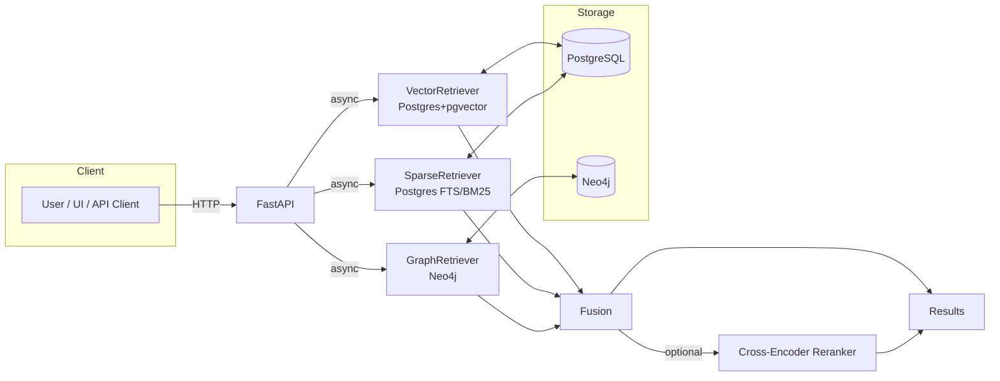
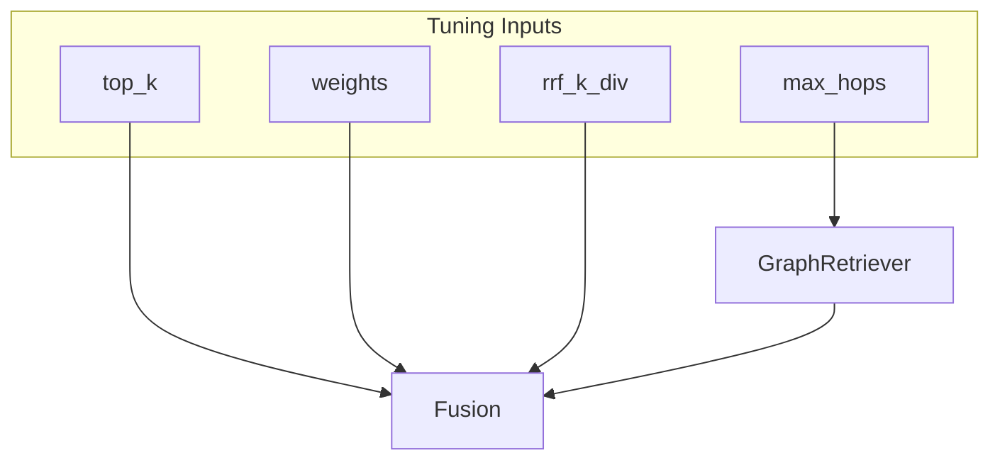

# Architecture

<div class="grid chunk_summaries" markdown>

-   :material-source-branch:{ .lg .middle } **Tri-Path Retrieval**

    ---

    Vector, Sparse, and Graph retrievers run concurrently for maximum recall.

-   :material-shuffle-variant:{ .lg .middle } **Fusion Layer**

    ---

    Weighted fusion or RRF unifies heterogeneous scores into one ranking.

-   :material-swap-vertical:{ .lg .middle } **Optional Reranker**

    ---

    Cross-encoder can refine the fused list by understanding local context.

-   :material-cog:{ .lg .middle } **Pydantic-Orchestrated**

    ---

    All engine parameters are Pydantic fields with constraints and defaults.

-   :material-rocket:{ .lg .middle } **FastAPI Surface**

    ---

    Clean endpoints for indexing, retrieval, graph queries, and system health.

-   :material-chart-areaspline:{ .lg .middle } **Observability**

    ---

    Readiness + Prometheus metrics + PostgreSQL exporter.

</div>

[Get started](index.md){ .md-button .md-button--primary }
[Configuration](configuration.md){ .md-button }
[API](api.md){ .md-button }

!!! tip "Pro Tip — Concurrency"
    TriBridRAG parallelizes retrievers using asyncio. Keep DB connection pools sized adequately to avoid I/O starvation under concurrency.

!!! note "Implementation Note — Failure Modes"
    Each retriever is wrapped so failures degrade that path only. Fusion runs on the subset that succeeded, and `metadata.partial` flags can indicate a degraded answer.

!!! warning "Graph Availability"
    If Neo4j is unavailable, retrieval still works with vector and sparse results. Ensure fallback behavior is tested for your deployment.

## System Diagram



## Layer Responsibilities

| Layer | Module | Responsibilities | Key Config |
|------|--------|------------------|------------|
| Vector | `server/retrieval/vector.py` | Dense search via pgvector | `retrieval.vector.*` |
| Sparse | `server/retrieval/sparse.py` | FTS/BM25 on chunks | `retrieval.sparse.*` |
| Graph | `server/retrieval/graph.py` | Entity traversal, context expansion | `retrieval.graph.*` |
| Fusion | `server/retrieval/fusion.py` | Merge scores (weighted or RRF) | `fusion.*` |
| Reranker | `server/retrieval/rerank.py` | Cross-encoder ranking | `reranker.*` |

## Hot Path Example

=== "Python"
    ```python
    from server.retrieval.fusion import TriBridFusion

    async def search(corpus_id: str, query: str, cfg):
        fusion = TriBridFusion(cfg)                     # (1)
        results = await fusion.search(corpus_id, query) # (2)
        if cfg.reranker.enabled:
            from server.retrieval.rerank import Reranker
            rr = Reranker(cfg)
            results = await rr.rerank(query, results)  # (3)
        return results
    ```

=== "curl"
    ```bash
    # High-level: Fusion + optional reranker is server-controlled by config.
    curl -sS -X POST http://localhost:8000/search \
      -H 'Content-Type: application/json' \
      -d '{
        "corpus_id": "tribrid",
        "query": "database client architecture",
        "top_k": 10,
        "enable_reranker": true
      }' | jq .
    ```

=== "TypeScript"
    ```typescript
    import { SearchRequest, SearchResponse } from "./web/src/types/generated";

    export async function triSearch(req: SearchRequest): Promise<SearchResponse> {
      const resp = await fetch("/search", {
        method: "POST",
        headers: { "Content-Type": "application/json" },
        body: JSON.stringify(req),
      });
      return await resp.json();
    }
    ```

1. `TriBridFusion` encapsulates running vector/sparse/graph in parallel
2. Returns fused results, with per-source metadata for auditing
3. Optional reranking pass

!!! success "Separation of Concerns"
    The fusion layer is agnostic of storage details. Retrievers expose a common interface returning scored matches with provenance.

## Performance Considerations

- Use HNSW or IVFFlat pgvector indexes depending on corpus size and update frequency.
- Keep FTS indexes up to date after reindexing.
- Neo4j memory (heap/pagecache) should be tuned for graph traversal fan-out.
- Set Postgres and Neo4j connection pool sizes to match concurrency.



??? note "Advanced: Caching Strategy"
    - Retrieval cache key: `corpus_id + query + retriever config hash`.
    - Expiration controlled by config; invalidate on reindex or config change.
    - Cache entries store per-retriever scores and feature vectors for analysis.
