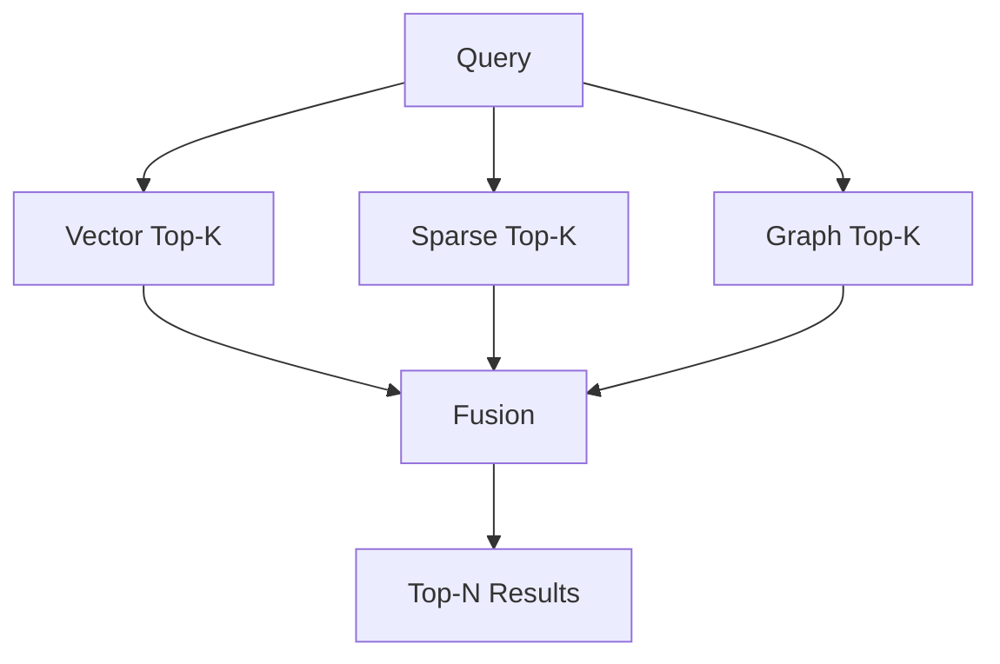

# Architecture

<div class="grid chunk_summaries" markdown>

-   :material-source-branch:{ .lg .middle } **Tri-Path Retrieval**

    ---

    Vector, Sparse, and Graph retrievers run concurrently for maximum recall.

-   :material-shuffle-variant:{ .lg .middle } **Fusion Layer**

    ---

    Weighted fusion or RRF unifies heterogeneous scores into one ranking.

-   :material-swap-vertical:{ .lg .middle } **Optional Reranker**

    ---

    Cross-encoder can refine the fused list by understanding local context.

-   :material-cog:{ .lg .middle } **Pydantic-Orchestrated**

    ---

    All engine parameters are Pydantic fields with constraints and defaults.

-   :material-rocket:{ .lg .middle } **FastAPI Surface**

    ---

    Clean endpoints for indexing, retrieval, graph queries, and system health.

-   :material-chart-areaspline:{ .lg .middle } **Observability**

    ---

    Readiness + Prometheus metrics + PostgreSQL exporter.

</div>

[Get started](index.md){ .md-button .md-button--primary }
[Configuration](configuration.md){ .md-button }
[API](api.md){ .md-button }

!!! tip "Concurrency"
    TriBridRAG parallelizes retrievers with async I/O. Size DB connection pools to match concurrency and avoid I/O starvation.

!!! note "Failure Isolation"
    Each retriever is wrapped so failures degrade that leg only. Fusion runs on the subset that succeeded; fused results keep provenance in `ChunkMatch.source`.

!!! warning "Graph Availability"
    If Neo4j is temporarily unavailable, retrieval continues with vector + sparse. Test fallback behavior in your deployment.

## System Diagram

```mermaid
flowchart LR
    subgraph API
      FAPI["FastAPI"]
    end

    FAPI --> V["VectorRetriever"]
    FAPI --> S["SparseRetriever"]
    FAPI --> G["GraphRetriever"]

    V --> FU["Fusion"]
    S --> FU
    G --> FU

    FU --> RR["Reranker (optional)"]
    RR --> RES["Results"]
    FU --> RES

    V <--> PG["("PostgreSQL\n(pgvector+FTS)")"]
    S <--> PG
    G <--> NEO["("Neo4j\nGraph")"]
```

## Layer Responsibilities

| Layer | Module | Responsibilities | Representative Config |
|------|--------|------------------|-----------------------|
| Vector | `server/retrieval/vector.py` | Dense search via pgvector | `vector_search.enabled`, `vector_search.top_k`, `embedding.*` |
| Sparse | `server/retrieval/sparse.py` | FTS/BM25 over chunks | `sparse_search.enabled`, `sparse_search.top_k`, `indexing.bm25_*` |
| Graph | `server/retrieval/graph.py` | Entity traversal, context expansion | `graph_search.enabled`, `graph_search.max_hops`, `graph_storage.*` |
| Fusion | `server/retrieval/fusion.py` | Merge lists and scores | `fusion.method`, `fusion.rrf_k`, `fusion.*_weight` |
| Reranker | `server/retrieval/rerank.py` | Cross-encoder scoring | `reranking.reranker_mode`, `reranking.*` |

## Hot Path (Annotated)

=== "Python"
```python
from server.retrieval.fusion import TriBridFusion
from server.retrieval.rerank import Reranker

async def search(query: str, corpus_id: str, cfg):  # (1)
    fusion = TriBridFusion(cfg)
    fused = await fusion.search(corpus_id, query)   # (2)
    if cfg.reranking.reranker_mode != "none":
        rr = Reranker(cfg)
        fused = await rr.rerank(query, fused)       # (3)
    return fused                                   # (4)
```

=== "curl"
```bash
BASE=http://localhost:8000
# (2) Fusion (vector+sparse+graph)
curl -sS -X POST "$BASE/search" \
  -H 'Content-Type: application/json' \
  -d '{
    "corpus_id": "tribrid",
    "query": "connection pool size",
    "top_k": 10
  }' | jq '.matches[0]'
```

=== "TypeScript"
```typescript
import type { SearchRequest, SearchResponse } from "../web/src/types/generated";

export async function triSearch(req: SearchRequest): Promise<SearchResponse> {
  const resp = await fetch("/search", {
    method: "POST",
    headers: { "Content-Type": "application/json" },
    body: JSON.stringify(req),
  });
  return await resp.json(); // (4)
}
```

1. Query and corpus identifier; use `corpus_id` (alias of legacy `repo_id`)
2. Fusion runs vector/sparse/graph concurrently and merges results
3. Optional reranking with cross-encoder based on config
4. Returns unified `SearchResponse` with provenance and latency

## Fusion Choices

| Method | Formula | Strengths | Notes |
|--------|---------|-----------|-------|
| weighted | `w_v*sv + w_s*ss + w_g*sg` | Interpretable weight tuning | Normalize scores if distributions differ |
| rrf | `sum 1/(k+rank_i)` | Robust across heterogeneous scales | Tune `rrf_k` in `fusion.rrf_k` |



??? note "Implementation Notes"
    - All configurable fields (weights, top_k, thresholds) live in `TriBridConfig`. Frontend sliders and toggles must map 1:1 to these fields via `generated.ts`.
    - DB clients: `server/db/postgres.py` (pgvector + FTS) and `server/db/neo4j.py` (graph). Keep pools separate to avoid head-of-line blocking.

!!! danger "Do Not Hand-Write Types"
    All API types must be imported from `web/src/types/generated.ts`. Regenerate with `uv run scripts/generate_types.py` whenever Pydantic models change.
