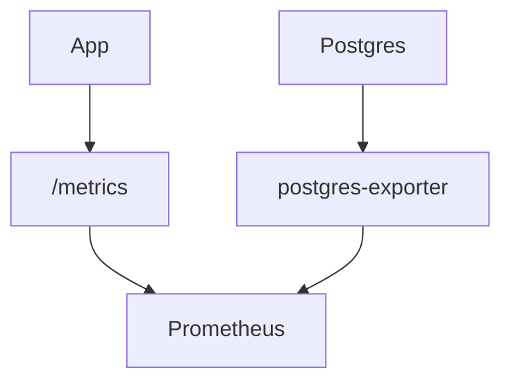

# Health and Metrics Internals

<div class="grid chunk_summaries" markdown>

-   :material-heart:{ .lg .middle } **Liveness/Readiness**

    ---

    Handlers return fine-grained status with DB probes.

-   :material-chart-box:{ .lg .middle } **Prometheus**

    ---

    Export standard and custom app metrics.

-   :material-database-cog:{ .lg .middle } **DB Exporter**

    ---

    PostgreSQL exporter complements app metrics.

</div>

[Get started](../index.md){ .md-button .md-button--primary }
[Configuration](../configuration.md){ .md-button }
[API](../api.md){ .md-button }

!!! tip "Scrape Intervals"
    Start with 15s scraping and tighten as necessary to capture spikes while controlling overhead.

!!! note "Metrics Names"
    Use a `tribrid_` prefix for app metrics. Include `corpus_id` labels where appropriate.

!!! warning "Label Cardinality"
    Avoid per-file labels in hot paths. Aggregate at corpus/module level to keep metrics tractable.



## Access Examples

=== "Python"
    ```python
    import httpx
    assert httpx.get("http://localhost:8000/health").status_code == 200
    assert httpx.get("http://localhost:8000/ready").status_code == 200
    print(httpx.get("http://localhost:8000/metrics").text.splitlines()[:5])
    ```

=== "curl"
    ```bash
    curl -sS http://localhost:8000/health
    curl -sS http://localhost:8000/ready
    curl -sS http://localhost:8000/metrics | head -n 20
    ```

=== "TypeScript"
    ```typescript
    await fetch('/health').then(r => r.ok || Promise.reject('down'))
    await fetch('/ready').then(r => r.ok || Promise.reject('not ready'))
    const sample = await (await fetch('/metrics')).text();
    console.log(sample.split('\n').slice(0, 5));
    ```

- [x] Gate traffic on readiness
- [x] Alert on 5xx and slow search
- [x] Monitor DB connection pool saturation

!!! success "Observability"
    Combine `/metrics` with logs and tracing (if added) for a complete operational picture.

??? note "Implementation"
    Handlers are in `server/api/health.py`. Readiness checks Postgres/Neo4j pings before returning 200.
