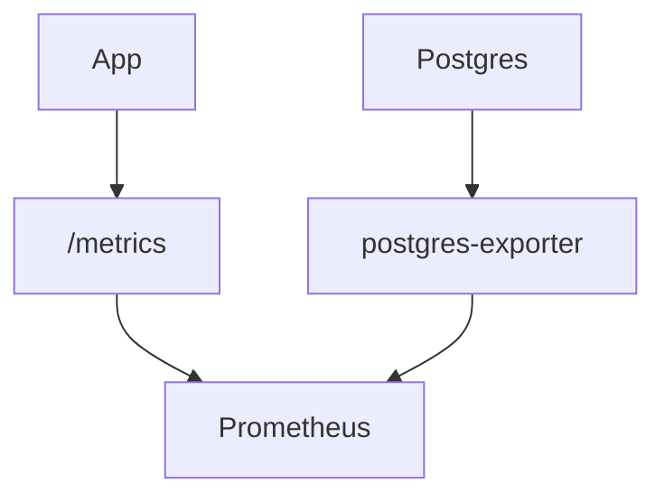

# Health and Metrics Internals

<div class="grid chunk_summaries" markdown>

-   :material-heart:{ .lg .middle } **Liveness/Readiness**

    ---

    Handlers return fine-grained status with DB probes.

-   :material-chart-box:{ .lg .middle } **Prometheus**

    ---

    Export standard and custom app metrics.

-   :material-database-cog:{ .lg .middle } **DB Exporter**

    ---

    PostgreSQL exporter complements app metrics.

</div>

[Get started](../index.md){ .md-button .md-button--primary }
[Configuration](../configuration.md){ .md-button }
[API](../api.md){ .md-button }

!!! tip "Scrape Intervals"
    Start with 15s scraping and tighten as necessary to capture spikes while controlling overhead.

!!! note "Metric Names"
    Prefix application metrics with `tribrid_` and prefer corpus-level labels.

!!! warning "Cardinality"
    Avoid labels that grow per-query.



## Access Examples

=== "Python"
```python
import httpx
assert httpx.get("http://localhost:8000/health").status_code == 200
assert httpx.get("http://localhost:8000/ready").status_code == 200
print(httpx.get("http://localhost:8000/metrics").text.splitlines()[:5])
```

=== "curl"
```bash
curl -sS http://localhost:8000/health
curl -sS http://localhost:8000/ready
curl -sS http://localhost:8000/metrics | head -n 20
```

=== "TypeScript"
```typescript
await fetch('/health').then(r => r.ok || Promise.reject('down'))
await fetch('/ready').then(r => r.ok || Promise.reject('not ready'))
const sample = await (await fetch('/metrics')).text();
console.log(sample.split('\n').slice(0, 5));
```

!!! success "Observability"
    Combine `/metrics` with logs and tracing for a complete operational picture.
