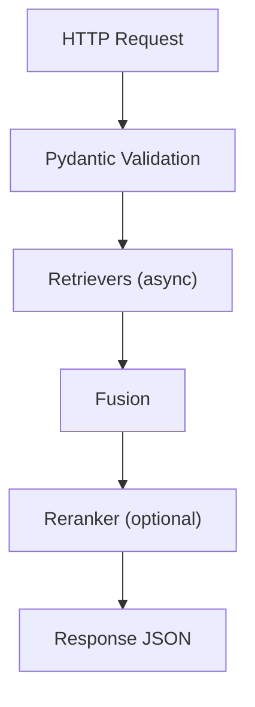

# Request Lifecycle (Deep Dive)

<div class="grid chunk_summaries" markdown>

-   :material-arrow-decision-auto:{ .lg .middle } **Routing**

    ---

    Requests pass through validation, retrieval, fusion, and optional reranking.

-   :material-speedometer:{ .lg .middle } **Latency Budget**

    ---

    Each stage contributes; measure and tune.

-   :material-file-tree:{ .lg .middle } **Tracing**

    ---

    Optional tracing emits per-stage events for debugging.

</div>

[Get started](index.md){ .md-button .md-button--primary }
[Configuration](configuration.md){ .md-button }
[API](api.md){ .md-button }

!!! tip "Emit debug"
    Enable `tracing` fields in config to capture per-stage events and timings for regressions.

!!! note "Validation First"
    Pydantic validates shapes, ranges, and enums before any business logic runs. Use that feedback to correct clients quickly.

!!! warning "Hydration Cost"
    `hydration_mode=eager` yields larger payloads and memory usage. Prefer `lazy` unless you specifically need full-context payloads immediately.



=== "Python"
```python
# server/api/search.py pseudo-flow
async def search(req):  # (1)!
    cid = req.corpus_id or req.repo_id  # (2)!
    fused = await fusion.search(cid, req.query)  # (3)!
    return await maybe_rerank(req.query, fused)  # (4)!
```

1. Pydantic ensures req shape matches `SearchRequest`
2. Alias resolution for corpus id
3. Parallel legs + fusion
4. Optional rerank before returning

=== "curl"
```bash
BASE=http://localhost:8000
curl -sS -X POST "$BASE/search" -H 'Content-Type: application/json' \
  -d '{"corpus_id":"tribrid","query":"pagination helper","top_k":5}' | jq .
```

=== "TypeScript"
```typescript
// Client perspective: POST /search with SearchRequest
import type { SearchRequest, SearchResponse } from "./web/src/types/generated";

async function doSearch(): Promise<SearchResponse> {
  const req: SearchRequest = { corpus_id: "tribrid", query: "pagination", top_k: 5 } as any;
  const r = await fetch("/search", { method: "POST", headers: {"Content-Type":"application/json"}, body: JSON.stringify(req) });
  return await r.json();
}
```

## Latency Budget Checklist

- [x] Keep `topk_dense` and `topk_sparse` reasonable (50–100)
- [x] Use `fusion.method=rrf` for robustness
- [x] Set `reranking.tribrid_reranker_topn` to 40–60 for balance
- [ ] Avoid `graph_search.max_hops>3` unless you truly need deep traversal
- [ ] Profile per-stage timings with tracing enabled

??? info "Minimal Trace Payload"
    Use `Trace` and `TraceEvent` models to capture `kind`, `ts`, and structured `data` per stage. The UI shows the latest via `/traces/latest`.
