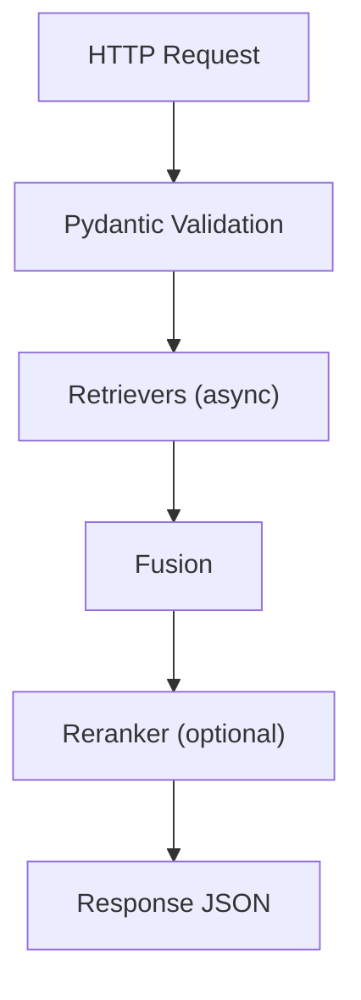

# Request Lifecycle (Deep Dive)

<div class="grid chunk_summaries" markdown>

-   :material-arrow-decision-auto:{ .lg .middle } **Routing**

    ---

    Requests pass through validation, retrieval, fusion, and optional reranking.

-   :material-speedometer:{ .lg .middle } **Latency Budget**

    ---

    Each stage contributes; measure and tune.

-   :material-file-tree:{ .lg .middle } **Tracing**

    ---

    Optional tracing emits per-stage events for debugging.

</div>

[Get started](index.md){ .md-button .md-button--primary }
[Configuration](configuration.md){ .md-button }
[API](api.md){ .md-button }



=== "Python"
```python
# server/api/search.py pseudo-flow
async def search(req: SearchRequest):  # (1)
    fused = await fusion.search(req.repo_id or req.corpus_id, req.query)  # (2)
    return rerank_if_configured(req.query, fused)  # (3)
```

=== "curl"
```bash
# See api.md for concrete curl
```

=== "TypeScript"
```typescript
// Client perspective: POST /search with SearchRequest
```

1. Pydantic validation and alias resolution (repo_id → corpus_id)
2. Parallel leg execution + fusion
3. Optional rerank, then return typed response

!!! tip "Emit debug"
    Enable `tracing` fields in config to capture per-stage events and timings for regressions.
