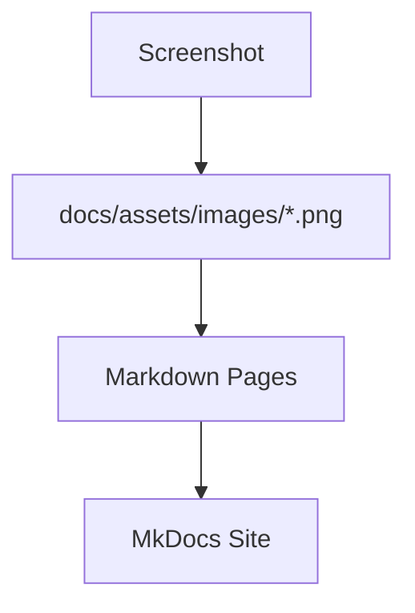

# Screenshots Guide

<div class="grid chunk_summaries" markdown>

-   :material-image:{ .lg .middle } **High-Quality Images**

    ---

    Dark theme, 1920x1080, real data.

-   :material-camera:{ .lg .middle } **What to Capture**

    ---

    RAG config, search results, graph visualization, model picker, glossary.

-   :material-folder-image:{ .lg .middle } **Organization**

    ---

    Save descriptive filenames in `docs/assets/images/`.

</div>

[Get started](../../index.md){ .md-button .md-button--primary }
[Configuration](../../configuration.md){ .md-button }
[API](../../api.md){ .md-button }

!!! tip "Suggested Shots"
    - RAG configuration with fusion weights and reranker
    - Search results with citations
    - Graph visualization (entities, relationships)
    - Model selector and pricing info
    - Glossary tooltips in action

!!! note "Filenames"
    - `rag-config-interface.png`
    - `search-results.png`
    - `graph-visualization.png`
    - `model-selector.png`

!!! warning "Privacy"
    Ensure screenshots do not contain secrets or PII.

## Add Images to Docs

```markdown

```

=== "Python"
```python
# Tip: keep images under docs/assets/images and reference with relative paths
print("Embed with ")
```

=== "curl"
```bash
# No runtime step; images are static assets.
```

=== "TypeScript"
```typescript
// Not applicable; images are referenced in markdown.
```



- [x] Use dark mode
- [x] Real data
- [x] Descriptive filenames
