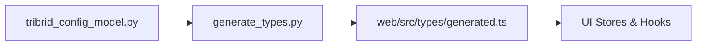

<div class="grid chunk_summaries" markdown>

-   :material-cog:{ .lg .middle } **Pydantic Config Model**

    ---

    All tunables live in server/models/tribrid_config_model.py

-   :material-information:{ .lg .middle } **Models List**

    ---

    data/models.json is the source of truth for available LLMs and embeddings

-   :material-check-circle:{ .lg .middle } **Environment & Secrets**

    ---

    DB URIs, API keys, and container memory are set via .env

</div>

!!! tip "Pro Tip"
    Always add a new field to tribrid_config_model.py before adding UI controls. Run the generate script to propagate types.

!!! warning "Config Warning"
    Field constraints in Pydantic (Field(..., ge=..., le=...)) are enforced at load time. Invalid config will fail to start.

!!! note "Important"
    The field `repo_id` remains in APIs for backward compatibility. Treat it as `corpus_id` in documentation.

??? note "Collapsible: What belongs in tribrid_config_model.py"

    - All thresholds, weights, and booleans that control runtime behavior
    - Feature flags
    - Model selection defaults


## Configuration overview table

| Section | Example fields | Purpose |
|---------|----------------|---------|
| indexing | indexing.chunk_size, indexing.bm25_tokenizer | Controls how chunking and BM25 are performed |
| retrieval | retrieval.vector_k, retrieval.sparse_limit | Fine-tunes search budgets and limits |
| fusion | fusion.vector_weight, fusion.sparse_weight, fusion.rrf_k_div | Weights and fusion algorithm parameters |
| reranker | reranker.enabled, reranker.model, reranker.top_k | Controls training and runtime reranker behavior |
| graph | graph.max_hops, graph.community_min_size | Controls graph traversal and community detection |


### Example configuration snippets




=== "Python"
    ```python
    from server.models.tribrid_config_model import TriBridConfig

    cfg = TriBridConfig() # (1)
    # (2) Example: read a constrained field
    print(cfg.retrieval.vector_k)
    ```

=== "curl"
    ```bash
    # Get current server config
    curl -X GET "http://localhost:8000/config"
    ```

=== "TypeScript"
    ```typescript
    // DO NOT write types by hand - import generated
    import { TriBridConfig } from '../types/generated'

    const cfg = useConfigStore().config as TriBridConfig // (1)
    ```


1. Config loads from server/models/tribrid_config_model.py
2. Field constraints prevent invalid values


### Key config tables (selected fields)

| Field | Type | Default | Description |
|-------|------|---------|-------------|
| retrieval.vector_k | int | 10 | Number of vector neighbors returned |
| retrieval.sparse_limit | int | 50 | Max number of sparse results to fetch |
| fusion.vector_weight | float | 1.0 | Weight applied to vector results in fusion |
| fusion.sparse_weight | float | 1.0 | Weight applied to sparse results in fusion |
| graph.max_hops | int | 2 | Max number of hops for graph expansion |
| reranker.enabled | bool | False | Enable cross-encoder reranking |


### Models source of truth

| File | Purpose | Where used |
|------|---------|------------|
| data/models.json | All LLM/embedding/reranker model definitions | UI model pickers, cost calculator |
| server/models/tribrid_config_model.py | Runtime defaults for model selection | Server config validation |


### Code examples: update config via API

=== "Python"
    ```python
    # (1) Patch a config section
    import requests

    resp = requests.patch('http://localhost:8000/config/retrieval', json={"vector_k": 20}) # (2)
    print(resp.status_code)
    ```

=== "curl"
    ```bash
    curl -X PATCH "http://localhost:8000/config/retrieval" \
      -H 'Content-Type: application/json' \
      -d '{"vector_k":20}'
    ```

=== "TypeScript"
    ```typescript
    // (1) Use generated types to form request
    import { RetrievalConfig } from '../types/generated'

    const payload: Partial<RetrievalConfig> = { vector_k: 20 }
    await fetch('/api/config/retrieval', { method: 'PATCH', body: JSON.stringify(payload) })
    ```


1. Use typed payloads generated from Pydantic
2. Server validates constraints and returns errors for out-of-range values


- [x] Add new config fields to tribrid_config_model.py
- [x] Run ++uv run scripts/generate_types.py++
- [x] Update UI stores/hooks to consume generated types


??? note "Collapsible: Advanced topics"

    - You can generate JSON schema from the Pydantic model for external validation.
    - Use Field(..., ge=..., le=...) to lock ranges and default values.
