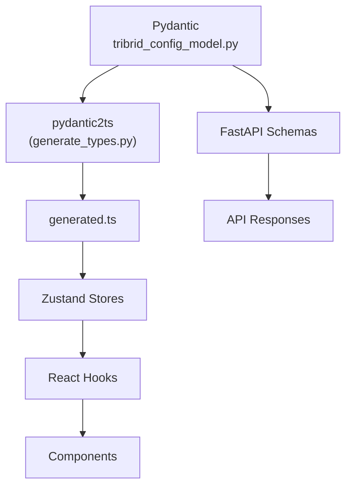

# Configuration

<div class="grid chunk_summaries" markdown>

-   :material-cog:{ .lg .middle } **Single Source of Truth**

    ---

    `server/models/tribrid_config_model.py` defines every tunable parameter with Pydantic `Field()` constraints.

-   :material-file-code:{ .lg .middle } **Generated Types**

    ---

    `uv run scripts/generate_types.py` produces `web/src/types/generated.ts`. No hand-written interfaces.

-   :material-scale-balance:{ .lg .middle } **Constraints Enforced**

    ---

    Min/max ranges, enums, and defaults are validated at load time with precise error messages.

</div>

[Get started](index.md){ .md-button .md-button--primary }
[Configuration](configuration.md){ .md-button }
[API](api.md){ .md-button }

!!! tip "Workflow: Pydantic First"
    1) Add/modify fields in Pydantic. 2) Regenerate TS types. 3) Wire stores/hooks/components using generated types. 4) Update backend logic to honor new fields.

!!! note "Corpus ID Migration"
    Prefer `corpus_id`. Models accept `repo_id` via `AliasChoices` for backward compatibility, but serialize `corpus_id`.

!!! danger "No Adapters"
    If the frontend needs a different shape, change the Pydantic model and regenerate. Adapters introduce drift and are not allowed.

## Derivation Chain



## Major Sections (Selected Fields)

| Section | Key Fields (examples) | Why it matters |
|--------|------------------------|----------------|
| retrieval | `final_k`, `topk_dense`, `topk_sparse`, `fallback_confidence`, `conf_top1`, `conf_avg5`, `multi_query_m` | Controls candidate sizes and retry/accept gates |
| fusion | `method`, `vector_weight`, `sparse_weight`, `graph_weight`, `rrf_k`, `normalize_scores` | How legs combine into a single ranking |
| vector_search | `enabled`, `top_k`, `similarity_threshold` | pgvector retrieval specifics |
| sparse_search | `enabled`, `top_k`, `bm25_k1`, `bm25_b` | BM25/FTS scoring and candidate sizes |
| graph_search | `enabled`, `mode`, `max_hops`, `top_k`, `chunk_neighbor_window`, `chunk_entity_expansion_*` | Neo4j traversal behavior |
| embedding | `embedding_type`, `embedding_model`, `embedding_dim`, `embedding_batch_size` | Embedding provider + dimensions |
| chunking | `chunking_strategy`, `chunk_size`, `chunk_overlap`, `max_chunk_tokens`, `preserve_imports` | Index quality and performance |
| reranking | `reranker_mode`, `reranker_*`, `tribrid_reranker_*` | Cross-encoder stage tuning |
| graph_storage | `neo4j_*`, `neo4j_database_mode` | Graph connectivity and isolation |
| chat.recall_gate | `enabled`, `default_intensity`, `skip_*`, `*top_k`, `*recency_weight` | Smart memory gating |

### Fusion Configuration

| Field | Type | Constraints | Description |
|------|------|-------------|-------------|
| `fusion.method` | Literal["rrf","weighted"] | required | Fusion algorithm |
| `fusion.vector_weight` | float | 0.0–1.0 | Weight for vector scores (weighted mode) |
| `fusion.sparse_weight` | float | 0.0–1.0 | Weight for sparse scores (weighted mode) |
| `fusion.graph_weight` | float | 0.0–1.0 | Weight for graph scores (weighted mode) |
| `fusion.rrf_k` | int | 1–200 | RRF smoothing constant |
| `fusion.normalize_scores` | bool | — | Normalize inputs before weighted fusion |

!!! warning "Weights Must Sum"
    Weighted mode normalizes tri-brid weights to approximately 1.0. If total ≤ 0, safe defaults are applied.

### Graph Retrieval Configuration

| Field | Type | Constraints | Description |
|------|------|-------------|-------------|
| `graph_search.enabled` | bool | — | Enable Neo4j traversal in retrieval |
| `graph_search.mode` | Literal["chunk","entity"] | — | Chunk-graph with vector seeds vs legacy entity graph |
| `graph_search.max_hops` | int | 1–5 | Traversal depth from seeds |
| `graph_search.top_k` | int | 5–100 | Number of graph hits before fusion |
| `graph_search.chunk_neighbor_window` | int | 0–10 | Include neighboring chunks as context (chunk mode) |
| `graph_search.chunk_entity_expansion_enabled` | bool | — | Expand via entities linked to chunks |
| `graph_search.chunk_entity_expansion_weight` | float | 0.0–1.0 | Blending of expansion vs seed |

### Retrieval and Confidence Gates

| Field | Default | Description |
|-------|---------|-------------|
| `retrieval.final_k` | 10 | Final top-k after fusion/rerank |
| `retrieval.topk_dense` | 75 | Vector candidates (pgvector) |
| `retrieval.topk_sparse` | 75 | BM25 candidates |
| `retrieval.conf_top1` | 0.62 | Early accept top-1 threshold |
| `retrieval.conf_avg5` | 0.55 | Group quality threshold (top-5) |
| `retrieval.conf_any` | 0.55 | Safety net minimum |

### Chat Recall Gate (Memory)

| Field | Default | Meaning |
|-------|---------|---------|
| `chat.recall_gate.enabled` | true | Turn smart Recall gating on/off |
| `chat.recall_gate.default_intensity` | standard | Fallback when no strong signal |
| `chat.recall_gate.skip_greetings` | true | Skip trivial conversational glue |
| `chat.recall_gate.light_top_k` | 3 | Light mode snippets |
| `chat.recall_gate.standard_top_k` | 5 | Standard mode snippets |
| `chat.recall_gate.deep_top_k` | 10 | Deep mode snippets |
| `chat.recall_gate.standard_recency_weight` | 0.3 | Recent > old balance |
| `chat.recall_gate.deep_recency_weight` | 0.5 | Stronger recency in deep mode |

## Read and Update Config via API (Annotated)

=== "Python"
```python
import httpx
base = "http://localhost:8000"

# Read full config (1)!
cfg = httpx.get(f"{base}/config").json()

# Patch a section (fusion) (2)!
patch = {"method": "weighted", "vector_weight": 0.5, "sparse_weight": 0.3, "graph_weight": 0.2}
httpx.patch(f"{base}/config/fusion", json=patch).raise_for_status()

# Reset to defaults (3)!
httpx.post(f"{base}/config/reset").raise_for_status()
```

1. Fetch authoritative nested config
2. Sectional PATCH is validated by Pydantic
3. Reset restores model defaults

=== "curl"
```bash
BASE=http://localhost:8000

# Read (1)!
curl -sS "$BASE/config" | jq .

# Patch fusion (2)!
curl -sS -X PATCH "$BASE/config/fusion" \
  -H 'Content-Type: application/json' \
  -d '{"method":"weighted","vector_weight":0.5,"sparse_weight":0.3,"graph_weight":0.2}' | jq .

# Reset (3)!
curl -sS -X POST "$BASE/config/reset" | jq .
```

1. Retrieve full config
2. Update only the `fusion` section
3. Restore defaults (useful during experiments)

=== "TypeScript"
```typescript
import type { TriBridConfig } from "./web/src/types/generated";

async function loadConfig(): Promise<TriBridConfig> {
  const r = await fetch("/config");
  return await r.json(); // (1)!
}

async function patchFusion() {
  await fetch("/config/fusion", {
    method: "PATCH",
    headers: { "Content-Type": "application/json" },
    body: JSON.stringify({ method: "weighted", vector_weight: 0.5, sparse_weight: 0.3, graph_weight: 0.2 }),
  }); // (2)!
}
```

1. Typed fetch of config
2. Typed partial update for fusion settings

## Safe Defaults and Tradeoffs

- Vector vs Sparse vs Graph weights
  - If unsure, do this: `fusion.method = "rrf"`, `fusion.rrf_k = 60`. RRF is robust across modalities.
- Candidate sizes
  - Start with `topk_dense=75`, `topk_sparse=75`, `graph_search.top_k=30`. Increase for recall-heavy workloads.
- Confidence gates
  - Start with `conf_top1=0.62`, `conf_avg5=0.55`. Raise to increase precision (fewer answers), lower for more answers.

??? info "Where values come from"
    All defaults live in Pydantic `Field(default=...)` initializers. UI sliders and inputs read min/max from the same model. The server enforces the same constraints.
