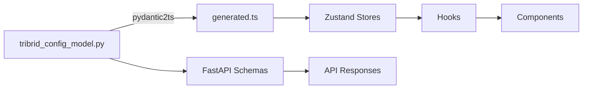
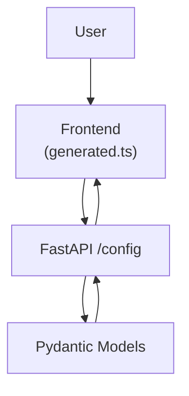

# Configuration

<div class="grid chunk_summaries" markdown>

-   :material-cog:{ .lg .middle } **Single Source of Truth**

    ---

    `server/models/tribrid_config_model.py` defines every tunable parameter with Pydantic `Field()` constraints.

-   :material-file-code:{ .lg .middle } **Generated Types**

    ---

    Run `uv run scripts/generate_types.py` to regenerate `web/src/types/generated.ts`. No hand-written types.

-   :material-scale-balance:{ .lg .middle } **Constraints Enforced**

    ---

    Min/max ranges, enums, and defaults are enforced at load time with precise error messages.

</div>

[Get started](index.md){ .md-button .md-button--primary }
[Configuration](configuration.md){ .md-button }
[API](api.md){ .md-button }

!!! tip "Pro Tip — Change Pydantic First"
    Add fields to `tribrid_config_model.py`, regenerate TypeScript types, then wire through stores/hooks/components. Do not add UI controls first.

!!! note "Terminology — Corpus"
    A corpus is any folder you index. The identifier is serialized as `corpus_id`, but for compatibility `repo_id` is accepted on input.

!!! warning "Validation"
    Invalid config values are rejected at load time. Respect `ge`, `le`, and `Literal` constraints or your server will refuse to start.

## Configuration Surfaces

- `server/models/tribrid_config_model.py` — Pydantic models (authoritative)
- `data/models.json` — Model catalog (pricing, context window)
- `data/glossary.json` — Tooltip terms and categories



## Key Sections and Representative Fields

| Section | Example Fields | Description |
|--------|-----------------|-------------|
| retrieval.vector | `top_k`, `distance_metric`, `min_score` | Dense search controls |
| retrieval.sparse | `top_k`, `use_bm25`, `tsquery_mode` | Text search controls |
| retrieval.graph | `max_hops`, `edge_types`, `community_boost` | Graph traversal |
| fusion | `strategy`, `weights`, `rrf_k_div` | Fusion parameters |
| reranker | `enabled`, `model`, `batch_size` | Cross-encoder settings |
| indexing | `chunker.strategy`, `embedder.model` | Index pipeline knobs |

### Fusion Configuration

| Field | Type | Constraints | Description |
|------|------|-------------|-------------|
| `fusion.strategy` | Literal["weighted", "rrf"] | required | Fusion algorithm |
| `fusion.weights.vector` | float | 0.0–2.0 | Weight for vector scores |
| `fusion.weights.sparse` | float | 0.0–2.0 | Weight for sparse scores |
| `fusion.weights.graph` | float | 0.0–2.0 | Weight for graph scores |
| `fusion.rrf_k_div` | int | 1–200 | RRF divisor constant |

### Graph Retrieval Configuration

| Field | Type | Constraints | Description |
|------|------|-------------|-------------|
| `retrieval.graph.max_hops` | int | 0–5 | Traversal depth from seed entities |
| `retrieval.graph.edge_types` | list[str] | optional | Restrict traversal to specific relationships |
| `retrieval.graph.expand_neighbors` | bool | default False | Expand 1-hop neighbors for context |

### Reranker Configuration

| Field | Type | Constraints | Description |
|------|------|-------------|-------------|
| `reranker.enabled` | bool | default False | Enable reranking stage |
| `reranker.model` | str | must exist in models.json | Reranker model id |
| `reranker.batch_size` | int | 1–128 | Micro-batch size for scoring |

## Reading and Updating Config via API

=== "Python"
    ```python
    import httpx

    base = "http://localhost:8000"

    # Read full config (1)
    cfg = httpx.get(f"{base}/config").json()

    # Patch fusion weights (2)
    patch = {"fusion": {"strategy": "weighted", "weights": {"vector": 1.0, "sparse": 0.8, "graph": 0.6}}}
    r = httpx.patch(f"{base}/config/fusion", json=patch["fusion"]).json()

    # Reset to defaults (3)
    httpx.post(f"{base}/config/reset")
    ```

=== "curl"
    ```bash
    BASE=http://localhost:8000

    curl -sS "$BASE/config" | jq . # (1)

    curl -sS -X PATCH "$BASE/config/fusion" \
      -H 'Content-Type: application/json' \
      -d '{"strategy": "weighted", "weights": {"vector": 1.0, "sparse": 0.8, "graph": 0.6}}' | jq . # (2)

    curl -sS -X POST "$BASE/config/reset" # (3)
    ```

=== "TypeScript"
    ```typescript
    import { TriBridConfig } from "./web/src/types/generated";

    async function loadConfig(): Promise<TriBridConfig> {
      const r = await fetch("/config");
      return await r.json(); // (1)
    }

    async function patchFusion() {
      await fetch("/config/fusion", {
        method: "PATCH",
        headers: { "Content-Type": "application/json" },
        body: JSON.stringify({ strategy: "weighted", weights: { vector: 1.0, sparse: 0.8, graph: 0.6 } }),
      }); // (2)
    }
    ```

1. The API returns the Pydantic-driven shape of the full config
2. Partial patch by section is supported; validation is enforced
3. Reset restores defaults compiled into the Pydantic model

!!! danger "Do Not Write Adapters"
    If the frontend needs a different shape, change the Pydantic model and regenerate types. Adapters are forbidden technical debt.



- [x] Update Pydantic model first
- [x] Run `uv run scripts/generate_types.py`
- [x] Update stores and hooks
- [x] Use generated types in components

??? note "Examples of Field Constraints"
    - `Field(ge=0.0, le=1.0)` for progress fractions
    - `Literal[...]` for state enums like `"idle" | "indexing" | "complete" | "error"`
    - `AliasChoices("repo_id", "corpus_id")` to migrate naming safely
