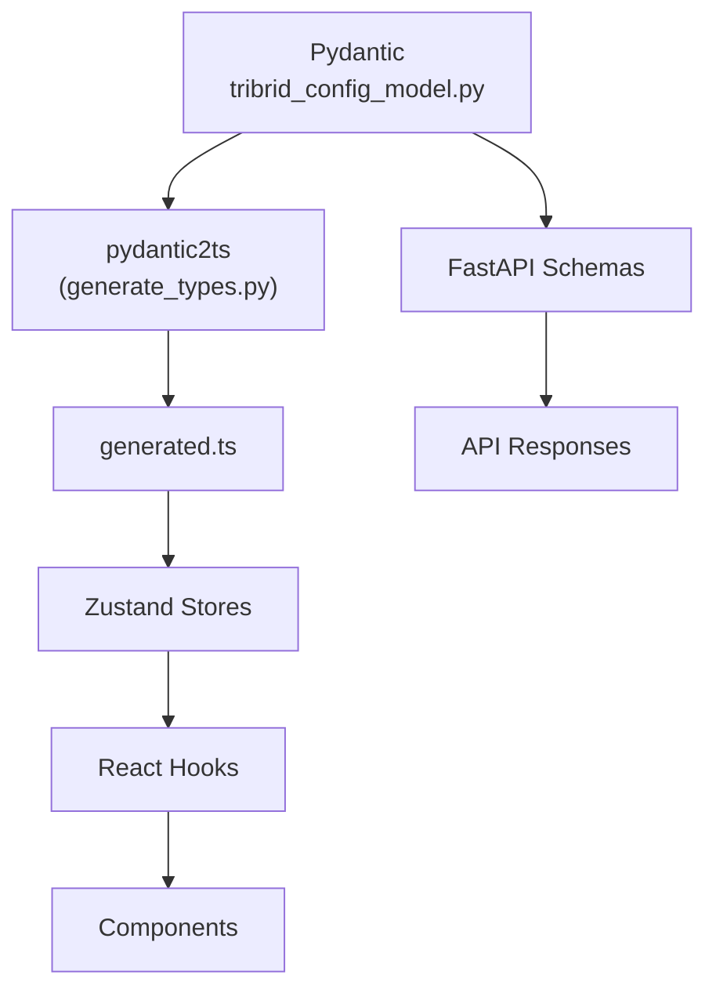

# Configuration

<div class="grid chunk_summaries" markdown>

-   :material-cog:{ .lg .middle } **Single Source of Truth**

    ---

    `server/models/tribrid_config_model.py` defines every tunable parameter with Pydantic `Field()` constraints.

-   :material-file-code:{ .lg .middle } **Generated Types**

    ---

    `uv run scripts/generate_types.py` produces `web/src/types/generated.ts`. No hand-written interfaces.

-   :material-scale-balance:{ .lg .middle } **Constraints Enforced**

    ---

    Min/max ranges, enums, and defaults are validated at load time with precise error messages.

</div>

[Get started](index.md){ .md-button .md-button--primary }
[Configuration](configuration.md){ .md-button }
[API](api.md){ .md-button }

!!! tip "Workflow: Pydantic First"
    1) Add/modify fields in Pydantic. 2) Regenerate TS types. 3) Wire stores/hooks/components using generated types. 4) Update backend logic to honor new fields.

!!! note "Corpus ID Migration"
    Use `corpus_id`. Pydantic models accept `repo_id` via `AliasChoices` for backward compatibility, but serialize `corpus_id`.

!!! warning "Validation"
    Invalid config values are rejected at load time. Respect `ge`, `le`, `Literal`, and `pattern` constraints or the server will refuse to start.

## Derivation Chain



## Key Sections (Representative Fields)

| Section | Example Fields | Description |
|--------|-----------------|-------------|
| retrieval | `final_k`, `topk_dense`, `topk_sparse`, `fallback_confidence`, `conf_top1`, `conf_avg5` | Global retrieval knobs and thresholds |
| fusion | `method`, `vector_weight`, `sparse_weight`, `graph_weight`, `rrf_k`, `normalize_scores` | Fusion behavior |
| vector_search | `enabled`, `top_k`, `similarity_threshold` | pgvector retrieval parameters |
| sparse_search | `enabled`, `top_k`, `bm25_k1`, `bm25_b` | BM25/FTS retrieval parameters |
| graph_search | `enabled`, `max_hops`, `top_k`, `chunk_neighbor_window` | Neo4j traversal parameters |
| embedding | `embedding_type`, `embedding_model`, `embedding_dim`, `embedding_batch_size` | Embedding provider + shapes |
| chunking | `chunk_size`, `chunk_overlap`, `chunking_strategy`, `max_chunk_tokens` | Chunking behavior |
| reranking | `reranker_mode`, `reranker_cloud_provider`, `reranker_local_model`, `tribrid_reranker_topn` | Cross-encoder settings |
| tracing | `tracing_enabled`, `trace_sampling_rate`, `prometheus_port` | Observability controls |

### Fusion Configuration (Selected)

| Field | Type | Constraints | Description |
|------|------|-------------|-------------|
| `fusion.method` | Literal["rrf","weighted"] | required | Fusion algorithm |
| `fusion.vector_weight` | float | 0.0–1.0 | Weight for vector scores |
| `fusion.sparse_weight` | float | 0.0–1.0 | Weight for sparse scores |
| `fusion.graph_weight` | float | 0.0–1.0 | Weight for graph scores |
| `fusion.rrf_k` | int | 1–200 | RRF smoothing constant |
| `fusion.normalize_scores` | bool | — | Normalize input scores before fusion |

### Graph Retrieval Configuration (Selected)

| Field | Type | Constraints | Description |
|------|------|-------------|-------------|
| `graph_search.enabled` | bool | — | Enable Neo4j traversal in retrieval |
| `graph_search.max_hops` | int | 1–5 | Traversal depth from seeds |
| `graph_search.top_k` | int | 5–100 | Number of graph hits before fusion |
| `graph_search.chunk_neighbor_window` | int | 0–10 | Include neighboring chunks as context |

## Reading and Updating Config via API (Annotated)

=== "Python"
```python
import httpx
base = "http://localhost:8000"

# Read full config (1)
cfg = httpx.get(f"{base}/config").json()

# Patch a section (2)
patch = {"method": "weighted", "vector_weight": 0.5, "sparse_weight": 0.3, "graph_weight": 0.2}
httpx.patch(f"{base}/config/fusion", json=patch).raise_for_status()

# Reset to defaults (3)
httpx.post(f"{base}/config/reset").raise_for_status()
```

=== "curl"
```bash
BASE=http://localhost:8000

# (1) Read
curl -sS "$BASE/config" | jq .

# (2) Patch fusion
curl -sS -X PATCH "$BASE/config/fusion" \
  -H 'Content-Type: application/json' \
  -d '{"method":"weighted","vector_weight":0.5,"sparse_weight":0.3,"graph_weight":0.2}' | jq .

# (3) Reset
curl -sS -X POST "$BASE/config/reset" | jq .
```

=== "TypeScript"
```typescript
import type { TriBridConfig } from "./web/src/types/generated";

async function loadConfig(): Promise<TriBridConfig> {
  const r = await fetch("/config");
  return await r.json(); // (1)
}

async function patchFusion() {
  await fetch("/config/fusion", {
    method: "PATCH",
    headers: { "Content-Type": "application/json" },
    body: JSON.stringify({ method: "weighted", vector_weight: 0.5, sparse_weight: 0.3, graph_weight: 0.2 }),
  }); // (2)
}
```

1. The API returns the Pydantic-driven shape of the full config
2. Partial patch by section is supported; validation enforced by Pydantic
3. Reset restores defaults compiled into the Pydantic model

!!! danger "No Adapters"
    If the frontend needs a different shape, change the Pydantic model and regenerate types. Adapters introduce drift and are not allowed.

## Keyboard Shortcuts and Tasks

- [x] ++ctrl+c++ to stop local `uvicorn`
- [x] `uv run scripts/generate_types.py` to sync UI types
- [ ] `uv run scripts/validate_types.py` to verify Pydantic ↔ TS sync
- [ ] `uv run scripts/check_banned.py` to ensure codebase hygiene

??? note "Config Surfaces"
    - `server/models/tribrid_config_model.py` — authoritative models
    - `data/models.json` — model catalog with pricing/context
    - `data/glossary.json` — tooltip texts and categories
