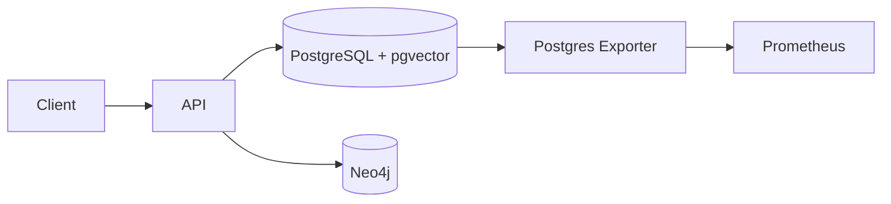

# Databases and Storage

<div class="grid chunk_summaries" markdown>

-   :material-database:{ .lg .middle } **PostgreSQL + pgvector**

    ---

    Single store for chunks, embeddings, and FTS/BM25 indexes.

-   :material-graph:{ .lg .middle } **Neo4j Graph**

    ---

    Entities and relationships power graph traversal and community queries.

-   :material-file-cog:{ .lg .middle } **Operational Controls**

    ---

    Connection pools, health checks, and exporters for metrics.

</div>

[Get started](index.md){ .md-button .md-button--primary }
[Configuration](configuration.md){ .md-button }
[API](api.md){ .md-button }

!!! tip "Co-locate Storage"
    Use the provided Docker Compose to run Postgres and Neo4j locally with sane defaults and persistent volumes outside the repository.

!!! note "pgvector Index Choice"
    Choose HNSW for high-recall, read-heavy workloads; IVFFlat for faster build times and stable performance on mid-size corpora.

!!! warning "Neo4j Memory"
    Set `NEO4J_HEAP_INIT`, `NEO4J_HEAP_MAX`, and `NEO4J_PAGECACHE` environment variables for large graphs to avoid GC thrash.

## Services

| Service | Image | Ports | Data Volume |
|---------|-------|-------|-------------|
| Postgres | `pgvector/pgvector:pg16` | `${POSTGRES_PORT:-5432}:5432` | `${TRIBRID_DB_DIR}/postgres:/var/lib/postgresql/data` |
| Postgres Exporter | `prometheuscommunity/postgres-exporter:latest` | internal | n/a |
| Neo4j | `neo4j:5.x` | `7687`, `7474` | `${TRIBRID_DB_DIR}/neo4j/*` |



## Connectivity Checks

=== "Python"
```python
import httpx
print(httpx.get("http://localhost:8000/health").json())   # liveness
print(httpx.get("http://localhost:8000/ready").json())    # readiness
```

=== "curl"
```bash
curl -sS http://localhost:8000/health | jq .
curl -sS http://localhost:8000/ready | jq .
```

=== "TypeScript"
```typescript
async function readiness() {
  const health = await (await fetch("/health")).json();
  const ready = await (await fetch("/ready")).json();
  console.log(health, ready);
}
```

!!! success "Index Footprint"
    Use `DashboardIndexStatsResponse` to view `pgvector_index_bytes`, `bm25_index_bytes`, and `neo4j_store_bytes` per corpus.
