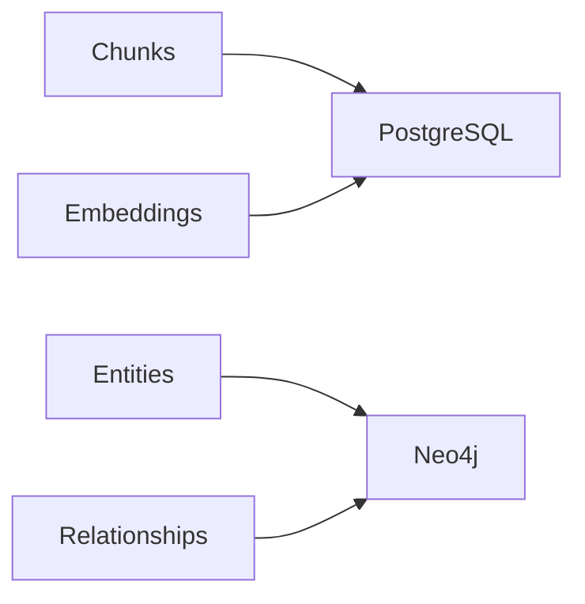

# Storage: PostgreSQL (pgvector + FTS) and Neo4j

<div class="grid chunk_summaries" markdown>

-   :material-database:{ .lg .middle } **PostgreSQL**

    ---

    Single source for chunks, embeddings, and FTS.

-   :material-vector-polyline:{ .lg .middle } **pgvector**

    ---

    High-dimensional vector similarity for dense retrieval.

-   :material-graph:{ .lg .middle } **Neo4j**

    ---

    Entity/relationship graph and optional vector index on chunks.

</div>

[Get started](index.md){ .md-button .md-button--primary }
[Configuration](configuration.md){ .md-button }
[API](api.md){ .md-button }

!!! tip "One Postgres, Many Corpora"
    Partition by `repo_id`/`corpus_id` in schema to keep corpus isolation at the data layer.

!!! note "TSConfig"
    `indexing.postgres_ts_config` resolves the text search config (`simple` or a stemmer language) based on tokenizer settings.

!!! warning "Neo4j Isolation"
    `neo4j_database_mode=per_corpus` avoids expensive cross-corpus filters but requires Enterprise Edition.

## PostgreSQL Client Responsibilities

- Upsert chunk rows with metadata and content
- Upsert embeddings for pgvector similarity
- Maintain FTS (tsvector) index
- Execute vector and sparse searches with corpus scope

## Neo4j Client Responsibilities

- Ensure database exists (per mode)
- Ensure vector index on Chunk nodes when enabled
- Upsert entities and relationships
- Expand from seed hits to related chunks



### Configuration Hooks

| Section | Field(s) | Meaning |
|---------|----------|---------|
| indexing | `postgres_url` | DSN for Postgres |
| graph_storage | `neo4j_uri`, `neo4j_user`, `neo4j_password` | Neo4j connectivity |
| graph_storage | `neo4j_database_mode`, `neo4j_database_prefix` | DB isolation strategy |
| graph_indexing | `store_chunk_embeddings`, `chunk_vector_index_name` | Neo4j vector search on chunks |

=== "Python"
```python
# Resolve Neo4j database name for a corpus (1)!
from server.models.tribrid_config_model import GraphStorageConfig
print(GraphStorageConfig().resolve_database("dev_corpus"))
```

=== "curl"
```bash
# Connectivity checks are via readiness
curl -sS http://localhost:8000/ready | jq .
```

=== "TypeScript"
```typescript
// Client: no direct DB use — rely on API readiness
```

1. Uses prefix + sanitized corpus id in per_corpus mode

??? info "Vector Similarity"
    Set `graph_indexing.vector_similarity_function` to `cosine` or `euclidean` based on your embedding model norms.
