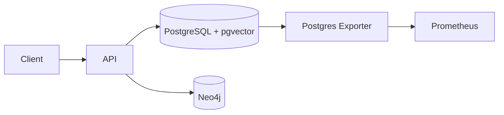

# Databases and Storage

<div class="grid chunk_summaries" markdown>

-   :material-database:{ .lg .middle } **PostgreSQL + pgvector**

    ---

    Single store for chunks, embeddings, and FTS/BM25 indexes.

-   :material-graph:{ .lg .middle } **Neo4j Graph**

    ---

    Entities and relationships power graph traversal and community queries.

-   :material-file-cog:{ .lg .middle } **Operational Controls**

    ---

    Connection pools, health checks, and exporters for metrics.

</div>

[Get started](index.md){ .md-button .md-button--primary }
[Configuration](configuration.md){ .md-button }
[API](api.md){ .md-button }

!!! tip "Pro Tip — Co-locate Storage"
    Use the provided Docker Compose to run Postgres and Neo4j locally with sane defaults and persistent volumes outside the repository.

!!! note "pgvector Index Choice"
    Choose HNSW for high-recall and read-heavy workloads; IVFFlat for faster build times and stable performance on mid-size corpora.

!!! warning "Neo4j Memory"
    Set `NEO4J_HEAP_INIT`, `NEO4J_HEAP_MAX`, and `NEO4J_PAGECACHE` environment variables for large graphs to avoid GC thrash.

## Docker Compose Services

| Service | Image | Ports | Data Volume |
|---------|-------|-------|-------------|
| Postgres | `pgvector/pgvector:pg16` | `${POSTGRES_PORT:-5432}:5432` | `${TRIBRID_DB_DIR}/postgres:/var/lib/postgresql/data` |
| Postgres Exporter | `prometheuscommunity/postgres-exporter:latest` | internal | n/a |
| Neo4j | `${NEO4J_IMAGE:-neo4j:5.26.20-community}` | `7687`, `7474` | internal volume |



## Environment Variables

| Key | Description |
|-----|-------------|
| `POSTGRES_HOST` | Hostname for PostgreSQL |
| `POSTGRES_PORT` | Port number |
| `POSTGRES_DB` | Database name |
| `POSTGRES_USER` | Username |
| `POSTGRES_PASSWORD` | Password |
| `NEO4J_URI` | `bolt://host:7687` or `neo4j://host:7687` |
| `NEO4J_USER` | Neo4j username |
| `NEO4J_PASSWORD` | Neo4j password |
| `TRIBRID_DB_DIR` | Host directory for DB bind-mounts |
| `NEO4J_HEAP_INIT`, `NEO4J_HEAP_MAX`, `NEO4J_PAGECACHE` | Neo4j memory tuning |

## Connectivity Checks

=== "Python"
    ```python
    import httpx

    base = "http://localhost:8000"
    print(httpx.get(f"{base}/health").json())  # (1)
    print(httpx.get(f"{base}/ready").json())   # (2)
    ```

=== "curl"
    ```bash
    curl -sS http://localhost:8000/health | jq .
    curl -sS http://localhost:8000/ready | jq .
    ```

=== "TypeScript"
    ```typescript
    async function readiness() {
      const health = await (await fetch("/health")).json(); // (1)
      const ready = await (await fetch("/ready")).json();   // (2)
      console.log(health, ready);
    }
    ```

1. Liveness: server process up
2. Readiness: DBs connected and ready to accept requests

!!! success "Index Footprint"
    Use `DashboardIndexStatsResponse` to view `pgvector_index_bytes`, `bm25_index_bytes`, and `neo4j_store_bytes` per corpus.

- [x] Use separate credentials per environment
- [x] Restrict network access to DB services
- [x] Enable backups for Postgres and Neo4j stores

??? note "Postgres Client"
    `PostgresClient` manages connection pooling and ensures FTS + pgvector indexes exist per corpus table. It exposes `connect`, `disconnect`, and `close_shared_pools` for lifecycle control.
