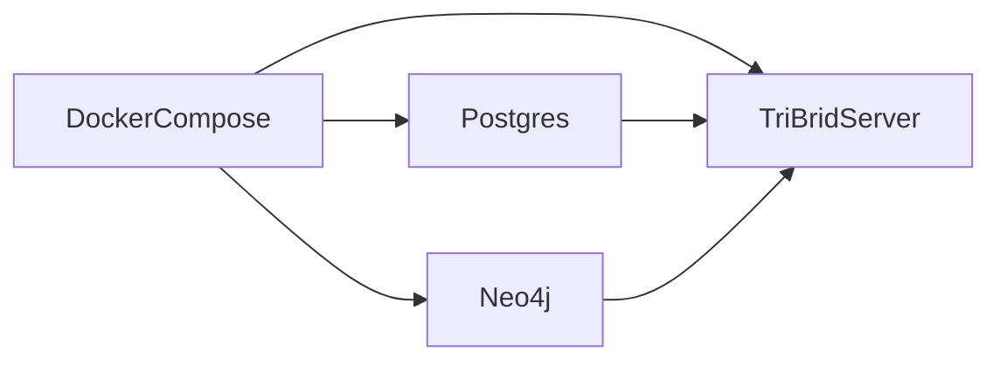

<div class="grid chunk_summaries" markdown>

-   :material-database:{ .lg .middle } **Docker Compose**

    ---

    Postgres (pgvector) + Neo4j + TriBridRAG server

-   :material-information:{ .lg .middle } **Environment variables (.env)**

    ---

    DB URIs, API keys, container memory

-   :material-check-circle:{ .lg .middle } **Health & Metrics**

    ---

    /health and /metrics endpoints for readiness

</div>

!!! tip "Pro Tip"
    Persist DB volumes outside the repo; set TRIBRID_DB_DIR to a stable absolute path.

!!! warning "Security Warning"
    Change default Neo4j passwords and do not expose DB ports to public networks.

!!! danger "Critical"
    Running with default secrets in production is insecure. Rotate keys and use secret stores.

??? note "Collapsible: Docker Compose summary"

    Example services:

    - postgres: uses pgvector-enabled image
    - neo4j: community or enterprise depending on env
    - tribrid server: application server


## Docker compose excerpt

| Service | Image | Ports | Notes |
|---------|-------|-------|-------|
| postgres | pgvector/pgvector:pg16 | 5432 | Stores embeddings + FTS |
| neo4j | neo4j:5.26.20-community | 7474/7687 | Graph DB for entity relationships |





=== "Python"
    ```python
    # (1) Example health ping
    import requests

    resp = requests.get('http://localhost:8000/health')
    print(resp.json())
    ```

=== "curl"
    ```bash
    curl http://localhost:8000/ready
    ```

=== "TypeScript"
    ```typescript
    // (1) UI health check hook
    const { ready } = useHealth()
    ```


1. Health endpoints report readiness and metrics


### Environment variables (selected)

| Variable | Purpose | Example |
|----------|---------|---------|
| POSTGRES_HOST | Postgres host | localhost |
| POSTGRES_PORT | Postgres port | 5432 |
| POSTGRES_DB | Database name | tribrid_rag |
| POSTGRES_USER | DB user | postgres |
| POSTGRES_PASSWORD | DB password | <secret> |
| NEO4J_URI | Neo4j connection URI | bolt://localhost:7687 |
| NEO4J_USER | Neo4j user | neo4j |
| NEO4J_PASSWORD | Neo4j password | <secret> |


### Startup checklist

- [x] Set .env values
- [x] Start Docker: ++docker compose up -d++
- [x] Verify ++/health++ and ++/ready++ endpoints
- [x] Index at least one corpus


??? note "Collapsible: Troubleshooting"

    - If Postgres fails: check volumes and POSTGRES_PASSWORD
    - If Neo4j fails: increase heap via NEO4J_HEAP_MAX and NEO4J_PAGECACHE
