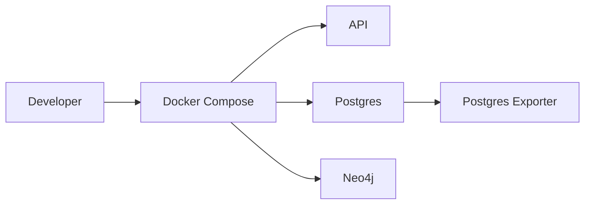
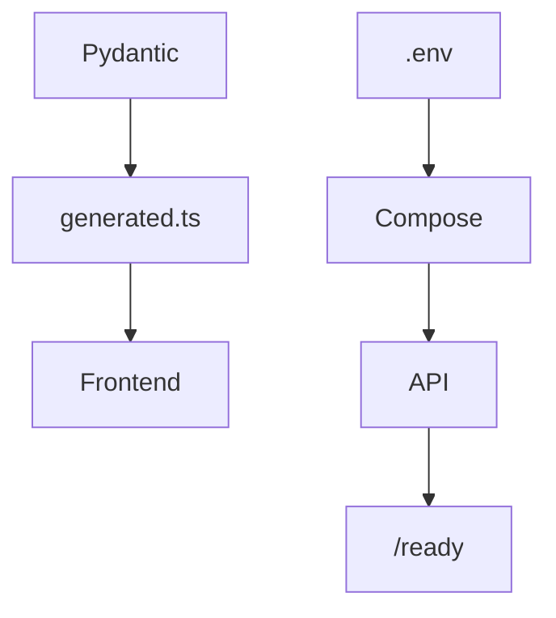

# Deployment

<div class="grid chunk_summaries" markdown>

-   :material-docker:{ .lg .middle } **Docker-First**

    ---

    Compose stack for Postgres, Neo4j, exporter, and API.

-   :material-cog-transfer:{ .lg .middle } **Configurable**

    ---

    All behavior via Pydantic config and environment variables.

-   :material-cloud:{ .lg .middle } **Portable**

    ---

    Works on local dev, CI, or container platforms.

</div>

[Get started](index.md){ .md-button .md-button--primary }
[Configuration](configuration.md){ .md-button }
[API](api.md){ .md-button }

!!! tip "Persistent Volumes"
    Keep DB data outside the repo. Default bind-mount path is `../tribrid-rag-db/`. Override with `TRIBRID_DB_DIR`.

!!! note "Environment Template"
    Copy the provided environment configuration to `.env`, fill in DB credentials and API keys, and export it into your shell for local runs.

!!! warning "Production Secrets"
    Use a secret manager for API keys and DB credentials in production. Do not rely on `.env` files in containerized environments.

## Services and Ports

| Service | Port | Purpose |
|---------|------|---------|
| API (uvicorn) | 8000 | REST endpoints |
| PostgreSQL | 5432 | Chunk + vector + FTS storage |
| Neo4j Bolt | 7687 | Graph driver |
| Neo4j Browser | 7474 | Admin UI |
| Prometheus | 9090 | Metrics |
| Grafana | 3001 | Dashboards |



## Bring-Up Tasks

- [x] Create `.env` with DB creds and API keys
- [x] `docker compose up -d`
- [x] `uv run scripts/generate_types.py`
- [x] Start API service

=== "Python"
```python
import subprocess, os

# Generate types from Pydantic (1)!
subprocess.check_call(["uv", "run", "scripts/generate_types.py"])  # (1) Pydantic → TS types

# Start FastAPI via uvicorn (2)!
os.system("uvicorn server.main:app --reload --port 8000")  # (2) Dev server
```

=== "curl"
```bash
# After containers are up:
curl -sS http://localhost:8000/ready | jq .  # readiness check (3)!
```

=== "TypeScript"
```typescript
// Frontend dev typically proxies to :8000
console.log("Ensure generated.ts exists and API ready at /ready");
```



??? note "Container Logs"
    Use `/docker/{container}/logs` to fetch current log lines via API for basic troubleshooting when UI access is limited.
