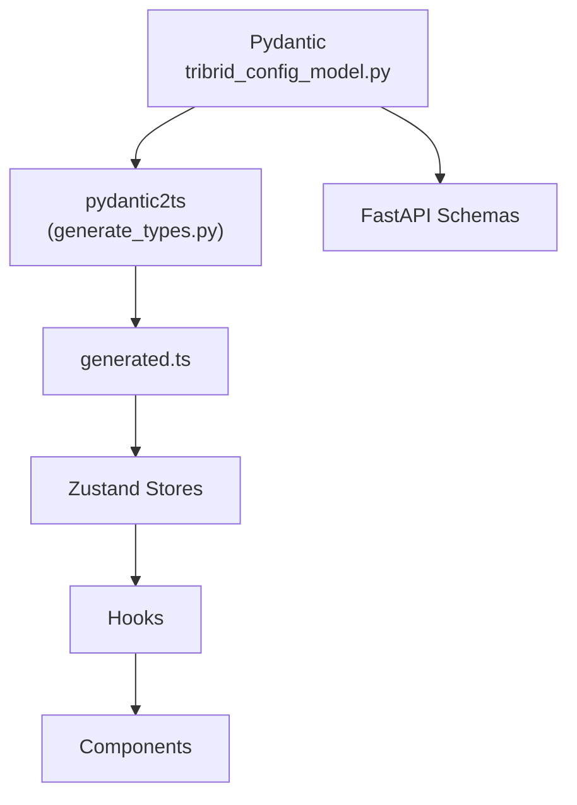
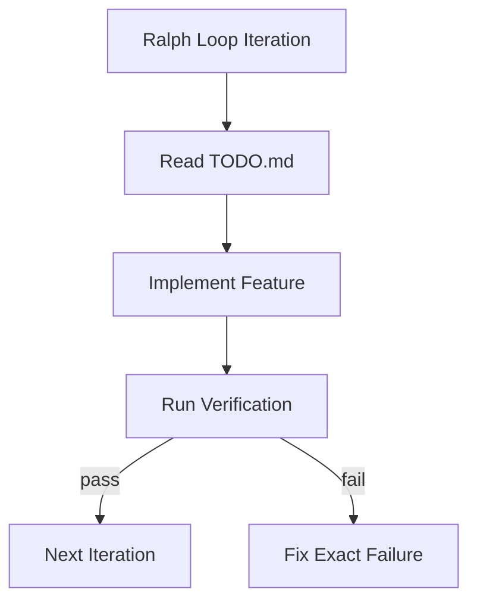

# Pydantic-First Development

<div class="grid chunk_summaries" markdown>

-   :material-gavel:{ .lg .middle } **The Law**

    ---

    Everything starts in `tribrid_config_model.py`. If it’s not there, it does not exist.

-   :material-code-json:{ .lg .middle } **Generate Types**

    ---

    `uv run scripts/generate_types.py` produces `web/src/types/generated.ts`.

-   :material-link-variant:{ .lg .middle } **Derivation Chain**

    ---

    Pydantic → generated.ts → stores → hooks → components.

</div>

[Get started](../index.md){ .md-button .md-button--primary }
[Configuration](../configuration.md){ .md-button }
[API](../api.md){ .md-button }

!!! tip "Workflow"
    - Add/modify fields in Pydantic with `Field()` constraints and descriptions.
    - Generate TS types.
    - Use types in stores/hooks/components.
    - Implement backend behavior that uses those fields.

!!! note "Constraints"
    Use `Field(ge=..., le=..., description=...)` everywhere. Descriptions power docs and UI tooltips.

!!! warning "No Adapters"
    Never write client-side adapters to change response shapes. Fix the Pydantic model instead and regenerate.

## Derivation Chain



## Commands (Annotated)

=== "Python"
```python
import subprocess

# Generate TS types from Pydantic (1)
subprocess.check_call(["uv", "run", "scripts/generate_types.py"])  # (1)

# Validate sync (2)
subprocess.check_call(["uv", "run", "scripts/validate_types.py"])  # (2)
```

=== "curl"
```bash
# Run locally with Python; no direct curl equivalent
```

=== "TypeScript"
```typescript
// After generation, import from generated.ts (3)
import type { TriBridConfig } from '../web/src/types/generated'; // (3)
```

1. Generate TypeScript types from Pydantic models
2. Validate that generated types match current models
3. Consume generated types exclusively

## Ralph Loop (Verification-Based Development)

- [x] Start from repo root
- [x] For each iteration: pick first unchecked TODO, implement end-to-end
- [x] Verification sequence:
  - `uv run scripts/check_banned.py`
  - `uv run scripts/validate_types.py`
  - `uv run pytest -q`
- [ ] Only mark TODO complete when verification passes



??? note "Testing Discipline"
    - GUI changes: Playwright tests with real interactions
    - API changes: pytest with real request/response assertions
    - Retrieval logic: verify relevance in results
