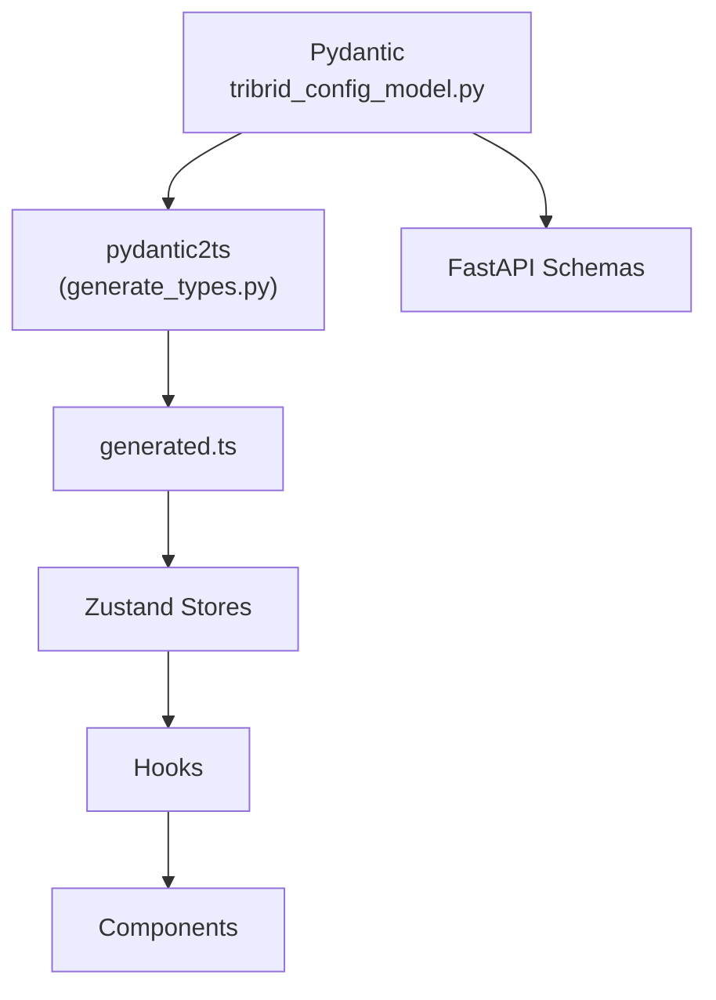

# Pydantic-First Development

<div class="grid chunk_summaries" markdown>

-   :material-gavel:{ .lg .middle } **The Law**

    ---

    Everything starts in `tribrid_config_model.py`. If it’s not there, it does not exist.

-   :material-code-json:{ .lg .middle } **Generate Types**

    ---

    `uv run scripts/generate_types.py` produces `web/src/types/generated.ts`.

-   :material-link-variant:{ .lg .middle } **Derivation Chain**

    ---

    Pydantic → generated.ts → stores → hooks → components.

</div>

[Get started](../index.md){ .md-button .md-button--primary }
[Configuration](../configuration.md){ .md-button }
[API](../api.md){ .md-button }

!!! tip "Workflow"
    1) Add/modify fields in Pydantic. 2) Generate TS types. 3) Use types in stores/hooks/components. 4) Update backend logic to honor new fields.

!!! note "Constraints"
    Use `Field(ge=..., le=..., description=...)` everywhere. Descriptions become tooltips and docs.

!!! warning "No Adapters"
    Never write client-side adapters to change response shapes. Fix the Pydantic model instead.

## Derivation Chain



## Commands

=== "Python"
    ```python
    import subprocess
    subprocess.check_call(["uv", "run", "scripts/generate_types.py"])  # (1)
    ```

=== "curl"
    ```bash
    # Not applicable — run locally with uv
    echo "Run: uv run scripts/generate_types.py" # (1)
    ```

=== "TypeScript"
    ```typescript
    // After generation, import from generated.ts (2)
    import { TriBridConfig } from '../web/src/types/generated';
    ```

1. Generate TypeScript types from Pydantic models
2. Consume generated types exclusively

### Source-of-Truth Files

| File | Purpose |
|------|---------|
| `server/models/tribrid_config_model.py` | All config and domain models |
| `data/models.json` | Model catalog, pricing, context windows |
| `data/glossary.json` | Tooltip terms and categories |

!!! success "UI Traceability"
    Every prop in React components must trace back to a Pydantic field through generated types.

- [x] Add field in Pydantic first
- [x] Generate types
- [x] Update store/hook
- [x] Use in component

??? note "Common Pitfalls"
    - Missing `validation_alias` when migrating `repo_id` → `corpus_id`
    - Forgetting to include `description` leads to poor auto-docs
    - Unbounded fields without `ge/le` allow invalid config into production
