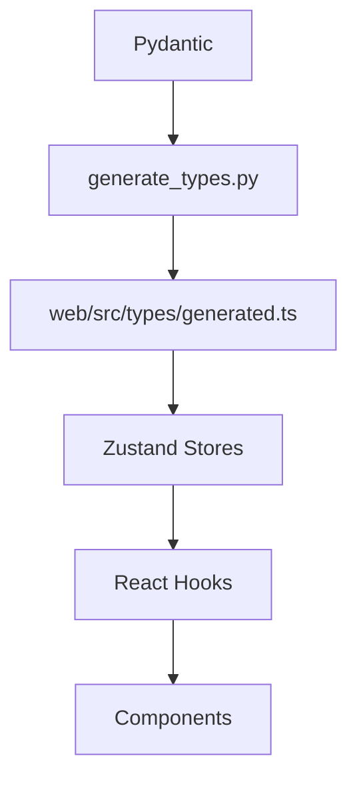

# Developer Workflow (Pydantic → TypeScript → UI)

<div class="grid chunk_summaries" markdown>

-   :material-shield-edit:{ .lg .middle } **Hard Rules**

    ---

    Pydantic first. No adapters. No hand-written API types.

-   :material-code-json:{ .lg .middle } **Generated Types**

    ---

    `uv run scripts/generate_types.py` produces `generated.ts`.

-   :material-file-tree:{ .lg .middle } **Clean Flow**

    ---

    models → stores → hooks → components.

</div>

[Get started](index.md){ .md-button .md-button--primary }
[Configuration](configuration.md){ .md-button }
[API](api.md){ .md-button }

!!! tip "Single Source of Truth"
    All configurable parameters and data shapes live in `server/models/tribrid_config_model.py`.

!!! note "Validate Sync"
    Run `uv run scripts/validate_types.py` to confirm generated types match Pydantic.

!!! danger "Banned Patterns"
    - Hand-written interfaces for API payloads
    - `*Adapter`, `*Transformer`, `*Mapper` classes to reshape payloads

## Derivation Chain



## Commands

- [x] `uv run scripts/generate_types.py` (after ANY Pydantic change)
- [x] `uv run scripts/validate_types.py` (CI/verify before commit)
- [x] `uv run scripts/check_banned.py` (guardrails)

=== "Python"
```python
import subprocess
subprocess.check_call(["uv", "run", "scripts/generate_types.py"])  # (1)!
subprocess.check_call(["uv", "run", "scripts/validate_types.py"])  # (2)!
```

=== "curl"
```bash
# No curl for local codegen; use uv-run commands
```

=== "TypeScript"
```typescript
// Use generated types only
import type { SearchRequest } from "../types/generated"; // (3)!
```

1. Generate TS types from Pydantic
2. Validate that TS matches server models
3. Client code imports generated types

## Directory Purposes

| Path | Purpose |
|------|---------|
| `server/models/tribrid_config_model.py` | Pydantic models — THE LAW |
| `web/src/types/generated.ts` | Auto-generated API types |
| `web/src/stores/*.ts` | Zustand stores using generated types |
| `web/src/hooks/*.ts` | React hooks wrapping stores |
| `web/src/components/**/*.tsx` | Components consuming hooks |

??? info "Ralph Loop"
    Use the recommended loop to implement TODOs end-to-end with verification: validators, tests, and Stop hook enforcement.
