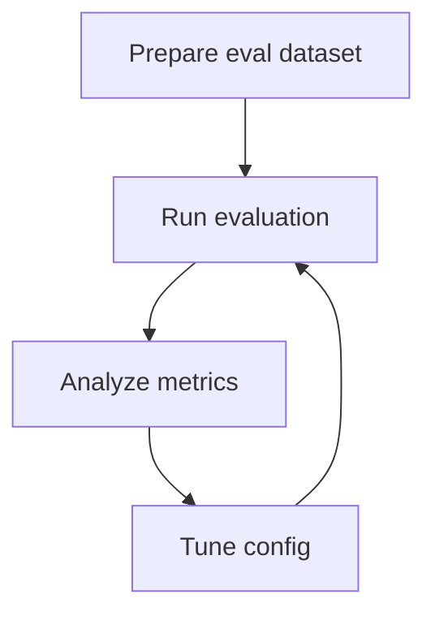

# Evaluation Guide

<div class="grid chunk_summaries" markdown>

-   :material-clipboard-check:{ .lg .middle } **Goals**

    ---

    Detect regressions, compare configs, and track latency.

-   :material-database-cog:{ .lg .middle } **Datasets**

    ---

    Use `EvalDatasetItem` with expected file paths.

-   :material-chart-line:{ .lg .middle } **Metrics**

    ---

    MRR, Recall@K, NDCG@10, p50/p95 latency.

</div>

[Get started](index.md){ .md-button .md-button--primary }
[Configuration](configuration.md){ .md-button }
[API](api.md){ .md-button }

!!! tip "Match prod"
    Align `eval_final_k` and `eval_multi` with production to avoid misleading results.

!!! note "Compare Runs"
    Use `/reranker/train/diff` or evaluation comparison endpoints to see deltas and compatibility.

!!! warning "Small samples"
    Use small samples for iteration, but run full suites before shipping changes.

## Typical Flow



=== "Python"
```python
import httpx
base = "http://localhost:8000"
# Trigger evaluation (1)!
print(httpx.post(f"{base}/reranker/evaluate", json={"corpus_id":"tribrid"}).json())
```

=== "curl"
```bash
BASE=http://localhost:8000
curl -sS -X POST "$BASE/reranker/evaluate" -H 'Content-Type: application/json' -d '{"corpus_id":"tribrid"}' | jq .
```

=== "TypeScript"
```typescript
// Load eval results and render charts
const result = await (await fetch('/reranker/evaluate', { method:'POST', headers:{'Content-Type':'application/json'}, body: JSON.stringify({ corpus_id: 'tribrid' }) })).json();
```

| Knob | Where | Default |
|------|-------|---------|
| `evaluation.eval_multi_m` | `TriBridConfig.evaluation` | 10 |
| `retrieval.eval_final_k` | `TriBridConfig.retrieval` | 5 |
| `retrieval.eval_multi` | `TriBridConfig.retrieval` | 1 (on) |

??? info "Prompt analysis"
    Use `system_prompts.eval_analysis` to generate skeptical post-hoc analysis comparing two runs.
