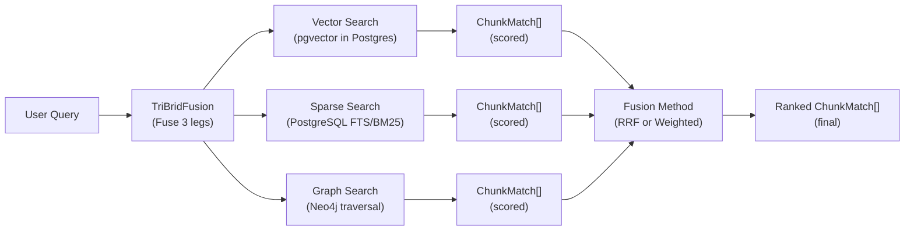

# Tri-Brid Search Architecture

TriBridRAG is a **tri-brid** retrieval engine: we run **three independent search legs**—**vector**, **sparse**, and **graph**—and then **fuse** their candidate sets into a single ranked list. This architecture is designed to maximize recall across different “signals” (semantic similarity, lexical match, and structural relationships) while keeping the system tunable and observable.

!!! note "Pydantic is the law"
    All retrieval and fusion behavior is governed by **Pydantic models** in `server/models/tribrid_config_model.py`. Any configuration that affects tri-brid search should be represented there first. TypeScript types are **generated from Pydantic**—never hand-written.

---

## 1) Overview: the three search legs

TriBridRAG runs these legs in parallel (conceptually; implementation may choose concurrency):

| Leg | Backend | Best at | Typical failure mode |
|---|---|---|---|
| Vector search | PostgreSQL + **pgvector** | Semantic similarity, paraphrases, “what does this do?” queries | Misses exact identifiers/strings; can be noisy for short queries |
| Sparse search | PostgreSQL **FTS/BM25** | Exact terms, symbols, filenames, error messages | Misses paraphrases; brittle to synonyms |
| Graph search | **Neo4j** | Relationship-aware retrieval (calls/imports/contains), entity neighborhoods, communities | Needs good entity extraction; can drift if graph is stale |

At the code level, each leg is encapsulated as a retriever:

- `server/retrieval/vector.py` → `VectorRetriever`
- `server/retrieval/sparse.py` → `SparseRetriever`
- `server/retrieval/graph.py` → `GraphRetriever`

Fusion happens in:

- `server/retrieval/fusion.py` → `TriBridFusion` (fusion utilities implemented; `search()` orchestrator is currently `NotImplementedError`)

---

## 2) Data flow (Mermaid)



---

## 3) How each search type works

### 3.1 Vector search (pgvector in PostgreSQL)

**Implementation anchor:** `server/retrieval/vector.py`

```python linenums="1" hl_lines="10 11 12 13"
from server.db.postgres import PostgresClient
from server.indexing.embedder import Embedder
from server.models.config import VectorSearchConfig
from server.models.retrieval import ChunkMatch


class VectorRetriever:
    def __init__(self, postgres: PostgresClient, embedder: Embedder):
        self.postgres = postgres
        self.embedder = embedder

    async def search(self, repo_id: str, query: str, config: VectorSearchConfig) -> list[ChunkMatch]:
        embedding = await self.embedder.embed(query)
        results = await self.postgres.vector_search(repo_id, embedding, config.top_k)
        if config.similarity_threshold > 0:
            results = [r for r in results if r.score >= config.similarity_threshold]
        return results
```

1. We embed the query text into a dense vector using the configured embedding provider/model.
2. We query PostgreSQL via `PostgresClient.vector_search(...)` to retrieve the top-K nearest chunks.
3. We optionally filter by a similarity threshold.

#### Indexing and ANN (HNSW)
In pgvector, approximate nearest neighbor search is typically implemented with **HNSW** indexes. Conceptually:

- We store one embedding per chunk (or per chunk_summary, depending on indexing strategy).
- We create an HNSW index on the vector column.
- Queries use `ORDER BY embedding <-> :query_embedding LIMIT :k` (operator depends on metric).

**Common similarity metrics in pgvector:**

`L2 distance`
:   Good default for many embedding models; uses Euclidean distance.

`Inner product`
:   Often used when embeddings are normalized or trained for dot-product similarity.

`Cosine distance`
:   Common for text embeddings; typically implemented by normalizing vectors or using cosine operators.

!!! tip "When vector search shines"
    Use vector search when users ask conceptual questions (“how does auth work?”), when they paraphrase, or when they don’t know the exact symbol names.

!!! warning "Short queries can be noisy"
    Very short queries (e.g., `cache`) can produce semantically broad matches. In those cases, sparse search and graph search often provide better precision.

---

### 3.2 Sparse search (PostgreSQL FTS / BM25)

**Implementation anchor:** `server/retrieval/sparse.py`

```python linenums="1" hl_lines="10"
from server.db.postgres import PostgresClient
from server.models.config import SparseSearchConfig
from server.models.retrieval import ChunkMatch


class SparseRetriever:
    def __init__(self, postgres: PostgresClient):
        self.postgres = postgres

    async def search(self, repo_id: str, query: str, config: SparseSearchConfig) -> list[ChunkMatch]:
        return await self.postgres.sparse_search(repo_id, query, config.top_k)
```

Sparse retrieval is lexical: it ranks documents/chunks based on **term matching**. In practice, we use PostgreSQL full-text search primitives and a BM25-style scoring model.

#### BM25 intuition (why it works for code)
BM25 is a bag-of-words ranking function that combines:

`TF (term frequency)`
:   More occurrences of a term in a chunk increases score, but with diminishing returns.

`IDF (inverse document frequency)`
:   Rare terms (e.g., a specific function name) are more discriminative and get higher weight.

`Length normalization`
:   Longer chunks are penalized so they don’t win just because they contain more words.

In `server/models/tribrid_config_model.py`, the retrieval section exposes BM25 tuning:

`bm25_k1`
:   Term frequency saturation (higher → TF matters more).

`bm25_b`
:   Length normalization (0 → no length penalty, 1 → full penalty). For code, moderate values are often better.

!!! tip "When sparse search shines"
    Use sparse search for exact identifiers, error messages, config keys, filenames, and API routes—anything where the user likely knows the literal text.

---

### 3.3 Graph search (Neo4j)

**Implementation anchor:** `server/retrieval/graph.py`

```python linenums="1" hl_lines="10"
from server.db.neo4j import Neo4jClient
from server.indexing.embedder import Embedder
from server.models.config import GraphSearchConfig
from server.models.retrieval import ChunkMatch


class GraphRetriever:
    def __init__(self, neo4j: Neo4jClient, embedder: Embedder):
        self.neo4j = neo4j
        self.embedder = embedder

    async def search(self, repo_id: str, query: str, config: GraphSearchConfig) -> list[ChunkMatch]:
        return await self.neo4j.graph_search(repo_id, query, config.max_hops, config.top_k)

    async def expand_context(self, chunk_ids: list[str], max_hops: int) -> list[ChunkMatch]:
        raise NotImplementedError
```

Graph retrieval uses Neo4j to exploit **entity relationships** extracted from the codebase:

- Entities: functions, classes, modules, variables, imports (configurable)
- Relationships: calls, imports, inherits, contains, references (configurable)

Graph search typically works like:

1. Identify seed entities relevant to the query (by name match, indexed metadata, or precomputed mappings).
2. Traverse relationships up to `max_hops`.
3. Return chunks associated with visited entities, optionally boosted by:
   - proximity (fewer hops)
   - relationship type
   - community membership

#### Communities (why they matter)
TriBridRAG supports community detection in the graph storage config:

- `include_communities: bool`
- `community_algorithm: "louvain" | "label_propagation"`

Communities help cluster related entities (e.g., all auth-related modules). During retrieval, community membership can be used to:

- expand results beyond direct neighbors
- reduce noise by preferring entities in the same community as strong seeds

!!! note "Graph search is relationship-first"
    Graph retrieval is not a replacement for semantic or lexical search. It’s a structural amplifier: once we find *something relevant*, the graph helps us pull in the surrounding implementation context (callers, callees, base classes, imported modules, etc.).

---

## 4) Fusion methods: RRF vs weighted scoring

**Implementation anchor:** `server/retrieval/fusion.py`

TriBridRAG supports two fusion strategies:

- **RRF (Reciprocal Rank Fusion)**: rank-based, robust across heterogeneous scoring scales
- **Weighted scoring**: score-based, more controllable when scores are calibrated/normalized

### 4.1 RRF (Reciprocal Rank Fusion)

```python linenums="1" hl_lines="8 9 10 11 12 13 14"
def rrf_fusion(self, results: list[list[ChunkMatch]], k: int) -> list[ChunkMatch]:
    scores: dict[str, float] = defaultdict(float)
    chunk_map: dict[str, ChunkMatch] = {}
    for result_list in results:
        for rank, chunk in enumerate(result_list):
            scores[chunk.chunk_id] += 1.0 / (k + rank + 1)
            chunk_map[chunk.chunk_id] = chunk
    sorted_ids = sorted(scores, key=lambda cid: scores[cid], reverse=True)
    return [chunk_map[cid].model_copy(update={"score": scores[cid]}) for cid in sorted_ids]
```

1. Each leg contributes a score based only on **rank** (not raw score).
2. Higher-ranked items get more contribution; `k` smooths how steeply rank matters.
3. Items appearing in multiple legs naturally rise to the top.

`rrf_k`
:   Smoothing constant. Higher values reduce the dominance of top-1 positions and spread credit further down the list.

!!! tip "Default to RRF when in doubt"
    RRF is usually the safest fusion method because vector, sparse, and graph scores often live on different scales.

### 4.2 Weighted scoring fusion

```python linenums="1" hl_lines="7 8 9 10 11 12"
def weighted_fusion(self, results: list[list[ChunkMatch]], weights: list[float]) -> list[ChunkMatch]:
    scores: dict[str, float] = defaultdict(float)
    chunk_map: dict[str, ChunkMatch] = {}
    for weight, result_list in zip(weights, results):
        for chunk in result_list:
            scores[chunk.chunk_id] += chunk.score * weight
            chunk_map[chunk.chunk_id] = chunk
    sorted_ids = sorted(scores, key=lambda cid: scores[cid], reverse=True)
    return [chunk_map[cid].model_copy(update={"score": scores[cid]}) for cid in sorted_ids]
```

1. Each leg contributes `chunk.score * weight`.
2. This assumes scores are comparable or normalized.

`normalize_scores` (FusionConfig)
:   When enabled, we should normalize per-leg scores to a common range (typically `[0,1]`) before applying weights. (The config exists; ensure the orchestrator applies it consistently.)

!!! warning "Weighted fusion requires score hygiene"
    If one leg produces scores in `[0, 100]` and another in `[0, 1]`, weighted fusion will be dominated by the larger-scale scorer unless we normalize.

---

## 5) Configuration: when to use what

Fusion behavior is controlled by `FusionConfig` in `server/models/tribrid_config_model.py`:

`method`
:   `"rrf"` or `"weighted"`

`vector_weight`, `sparse_weight`, `graph_weight`
:   Used for weighted fusion; automatically normalized to sum to 1.0 by Pydantic.

`rrf_k`
:   Used for RRF.

`normalize_scores`
:   Intended for weighted fusion (and can also be useful for diagnostics).

### Recommended presets

!!! tip "Practical starting points"
    These are starting points; tune using evals and query logs.

| Scenario | Fusion method | Suggested weights / params | Why |
|---|---|---|---|
| General code Q&A | RRF | `rrf_k=60` | Robust across score scales; rewards agreement |
| Symbol-heavy queries (stack traces, identifiers) | Weighted | `sparse_weight↑`, `vector_weight↓` | Lexical match is the strongest signal |
| Architecture / “how does X work” | Weighted or RRF | `vector_weight↑`, keep graph moderate | Semantic similarity finds entry points; graph expands neighborhood |
| Refactor impact / “who calls this” | Weighted | `graph_weight↑`, `max_hops` tuned | Relationship traversal is primary signal |

??? "FusionConfig parameters (definition list)"
    `method`
    :   Fusion strategy: `"rrf"` or `"weighted"`.

    `vector_weight`
    :   Contribution of pgvector results in weighted fusion.

    `sparse_weight`
    :   Contribution of PostgreSQL FTS/BM25 results in weighted fusion.

    `graph_weight`
    :   Contribution of Neo4j graph results in weighted fusion.

    `rrf_k`
    :   RRF smoothing constant.

    `normalize_scores`
    :   Normalize per-leg scores before weighted fusion.

---

## 6) Performance considerations

### 6.1 Latency budget and parallelism
Tri-brid retrieval is only as fast as the slowest leg if executed sequentially. In practice:

- Vector search in Postgres (pgvector + HNSW) is typically fast and predictable.
- Sparse search is usually fast but can degrade with poor indexing/tokenization or very large corpora.
- Graph search latency depends heavily on:
  - traversal depth (`max_hops`)
  - graph density
  - whether community metadata is precomputed
  - query shape and constraints

!!! warning "Graph traversal can explode"
    Keep `max_hops` small (typically 1–2) unless you have strong pruning. Dense graphs can produce huge neighborhoods.

### 6.2 Candidate set sizing (top_k)
Each leg returns `top_k` candidates; fusion then ranks the union. Larger `top_k` increases recall but:

- increases CPU time in fusion
- increases downstream reranking cost (if enabled)
- increases hydration cost (if you hydrate content eagerly)

A common pattern is:

- retrieve generously per leg (e.g., 50–100)
- fuse
- optionally rerank a smaller set
- return a final `final_k`

### 6.3 Score normalization and calibration
If you use weighted fusion:

- normalize scores per leg (min-max or rank-to-score)
- ensure similarity metrics are consistent (cosine vs L2 vs inner product)
- be explicit about thresholds (vector similarity thresholds can prune aggressively)

### 6.4 Index health
Vector and sparse retrieval both depend on Postgres indexes:

- pgvector HNSW index parameters affect recall/latency tradeoffs.
- FTS/BM25 depends on tokenization choices (stemming, stopwords) and maintaining tsvector columns/materialized structures.

Graph retrieval depends on:

- entity extraction quality
- relationship correctness
- keeping Neo4j in sync with the indexed corpus

!!! danger "Stale graph = misleading context"
    If Neo4j is not updated alongside code indexing, graph traversal can return “valid” but outdated relationships. Treat graph freshness as a first-class operational concern.

---

## Related pages

- [Configuration model (Pydantic)](../configuration/pydantic-models.md)
- [Retrieval pipeline overview](../retrieval/pipeline.md)
- [Graph RAG (Neo4j) storage and traversal](../graph/neo4j.md)