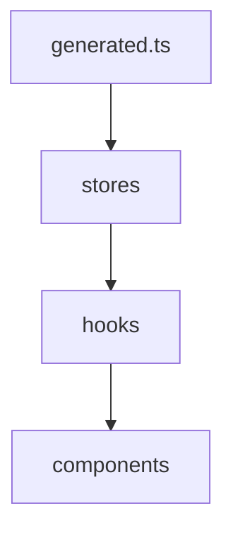
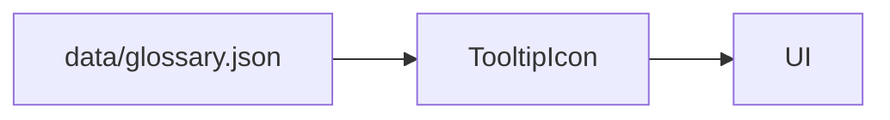

# Frontend Integration and Types

<div class="grid chunk_summaries" markdown>

-   :material-code-json:{ .lg .middle } **Generated Types Only**

    ---

    `web/src/types/generated.ts` is the only source for API interfaces.

-   :material-store:{ .lg .middle } **Zustand Stores**

    ---

    Stores consume generated types; hooks expose typed accessors.

-   :material-react:{ .lg .middle } **Components**

    ---

    Props derive from hooks; no custom interfaces without Pydantic ancestry.

</div>

[Get started](index.md){ .md-button .md-button--primary }
[Configuration](configuration.md){ .md-button }
[API](api.md){ .md-button }

!!! tip "Generate Early"
    Run `uv run scripts/generate_types.py` before starting the frontend. Hot reload relies on correct types.

!!! note "Traceability"
    Every UI element (slider, toggle, input) must map to a Pydantic field. Tooltips come from `data/glossary.json`.

!!! warning "No Hand-Written Interfaces"
    Interfaces like `interface SearchResponse { ... }` are forbidden. Import from `generated.ts`.

## Store and Hook Structure

| File | Purpose |
|------|---------|
| `web/src/stores/useConfigStore.ts` | Holds `TriBridConfig` and patch helpers |
| `web/src/hooks/useConfig.ts` | Read/update config |
| `web/src/hooks/useFusion.ts` | Fusion-related derived state |
| `web/src/hooks/useReranker.ts` | Reranker configuration and status |



## Example Usage

=== "Python"
    ```python
    # Backend reference: see dev/pydantic.md for generation step (1)
    ```

=== "curl"
    ```bash
    # Frontend consumes API; see api.md for routes (2)
    ```

=== "TypeScript"
    ```typescript
    import { TriBridConfig, SearchResponse } from '../web/src/types/generated';

    function useConfig() {
      // typed fetch
      const [cfg, setCfg] = React.useState<TriBridConfig | null>(null);
      React.useEffect(() => { fetch('/config').then(r => r.json()).then(setCfg); }, []); // (3)
      return cfg;
    }
    ```

1. Types generation step is mandatory
2. API is the contract; no local mocks of shapes
3. Fetch returns the Pydantic-driven shape of config

!!! success "Tooltip Integration"
    `data/glossary.json` drives hover help via `TooltipIcon` in the UI. Keep term keys stable.

- [x] Use generated types across stores, hooks, and components
- [x] Remove any legacy custom interfaces
- [x] Validate prop chains map back to Pydantic fields



??? note "Component Inventory"
    - `DockerStatusCard.tsx`, `HealthStatusCard.tsx` show system state
    - `RepoSelector.tsx` binds UI to `corpus_id`
    - `RAGTab.tsx`, `GrafanaTab.tsx`, `AdminTab.tsx` orchestrate panels using typed hooks
