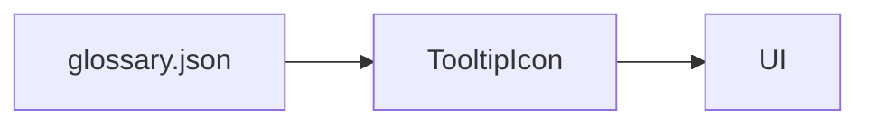

# Glossary

<div class="grid chunk_summaries" markdown>

-   :material-book-information-variant:{ .lg .middle } **Centralized Terms**

    ---

    `data/glossary.json` drives all tooltips in the UI.

-   :material-link-box:{ .lg .middle } **Cross-References**

    ---

    Each term lists related entries to encourage discovery.

-   :material-pencil:{ .lg .middle } **Editable**

    ---

    Update the JSON file, not components, to change tooltip content.

</div>

[Get started](index.md){ .md-button .md-button--primary }
[Configuration](configuration.md){ .md-button }
[API](api.md){ .md-button }

!!! tip "Source of Truth"
    `data/glossary.json` is parsed by the UI. Keep `key` values stable for long-lived tooltips.

!!! note "Representative Entries"
    - PostgreSQL pgvector URL (`POSTGRES_URL`)
    - Neo4j Connection URI (`NEO4J_URI`)
    - Final Top-K (`FINAL_K`)

!!! warning "Typos"
    Misspelled keys break existing tooltips silently. Validate JSON in CI.

## Example Entries

| Term | Key | Definition |
|------|-----|------------|
| PostgreSQL pgvector URL | POSTGRES_URL | Connection URL for pgvector-enabled Postgres |
| Neo4j Connection URI | NEO4J_URI | Connection URI for Neo4j graph |
| Final Top‑K | FINAL_K | Final result size after fusion/reranking |



=== "Python"
```python
# Backend is not reading glossary by default; UI reads the JSON.
```

=== "curl"
```bash
# Validate glossary.json structure
eq 0 $(jq . data/glossary.json >/dev/null 2>&1; echo $?) && echo OK || echo FAIL
```

=== "TypeScript"
```typescript
// UI side: load glossary.json and feed into TooltipIcon
```

!!! success "Consistency"
    Use the glossary for all UI textual explanations to avoid drift between screens.
