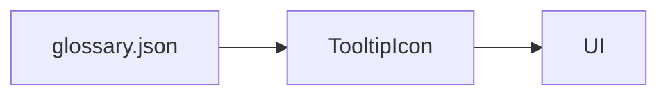

# Glossary

<div class="grid chunk_summaries" markdown>

-   :material-book-information-variant:{ .lg .middle } **Centralized Terms**

    ---

    `data/glossary.json` drives all tooltips in the UI.

-   :material-link-box:{ .lg .middle } **Cross-References**

    ---

    Each term lists related entries to encourage discovery.

-   :material-pencil:{ .lg .middle } **Editable**

    ---

    Update the JSON file, not components, to change tooltip content.

</div>

[Get started](index.md){ .md-button .md-button--primary }
[Configuration](configuration.md){ .md-button }
[API](api.md){ .md-button }

!!! tip "Source of Truth"
    `data/glossary.json` is parsed by the UI. Keep `key` values stable for long-lived tooltips.

!!! note "Examples"
    - PostgreSQL pgvector URL
    - Neo4j Connection URI
    - Active Repository (Corpus)

!!! warning "Typos"
    Misspelled keys break existing tooltips silently. Validate JSON in CI.

## Representative Entries

| Term | Key | Definition |
|------|-----|------------|
| PostgreSQL pgvector URL | POSTGRES_URL | Connection URL for pgvector-enabled Postgres |
| Neo4j Connection URI | NEO4J_URI | Connection URI for Neo4j graph |
| Active Repository | REPO | Logical corpus name for routing and indexing |



=== "Python"
```python
# Tooling note: the UI consumes the JSON directly; backend does not parse this by default.
```

=== "curl"
```bash
# Validate JSON structure in CI, e.g., with jq
jq . data/glossary.json > /dev/null
```

=== "TypeScript"
```typescript
// UI side: import terms via a loader and feed into TooltipIcon
```

!!! success "Consistency"
    Use the glossary for all UI textual explanations to avoid drift between screens.

- [x] Keep terms unique
- [x] Provide related links for navigation
- [x] Update definitions when behavior changes

??? note "Localization"
    If localization is needed, consider expanding the schema with `translations` while keeping `key` stable.
