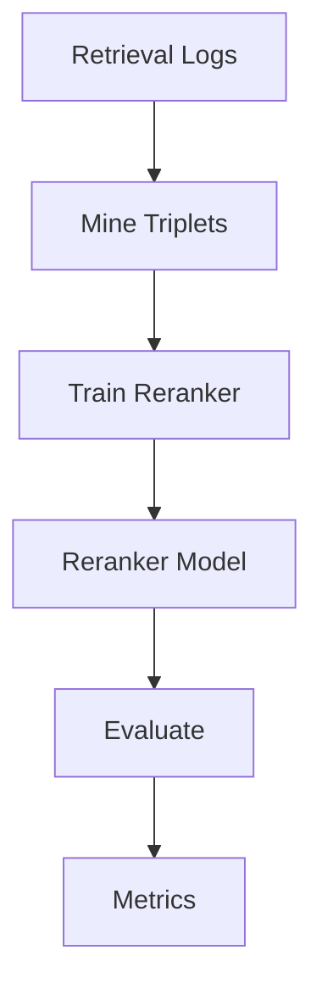

# How-To: Reranker Training and Evaluation

<div class="grid chunk_summaries" markdown>

-   :material-swap-vertical:{ .lg .middle } **Reranker**

    ---

    Cross-encoder stage to refine fused retrieval results.

-   :material-mining:{ .lg .middle } **Triplet Mining**

    ---

    Collect (query, positive, negative) examples from logs or heuristics.

-   :material-test-tube:{ .lg .middle } **Evaluate**

    ---

    Benchmark before/after reranking on an evaluation dataset.

</div>

[Get started](../index.md){ .md-button .md-button--primary }
[Configuration](../configuration.md){ .md-button }
[API](../api.md){ .md-button }

!!! tip "Start Small"
    Begin with a small `eval_dataset` and a few hundred mined triplets. Validate that gains are consistent across corpora.

!!! note "Costs"
    Training and evaluation costs depend on selected `RERANK` and `EMB/GEN` models from `data/models.json`.

!!! warning "Config-Governed"
    Enable via `reranking.reranker_mode`. All training hyperparameters must be present in Pydantic before use.

## API Surface

| Route | Method | Description |
|-------|--------|-------------|
| `/reranker/status` | GET | Load status (mode/model) |
| `/reranker/info` | GET | Implementation details |
| `/reranker/mine` | POST | Mine triplets |
| `/reranker/train` | POST | Train reranker |
| `/reranker/evaluate` | POST | Evaluate against dataset |
| `/reranker/train/run/{run_id}` | GET | Inspect a training run |
| `/reranker/train/run/{run_id}/metrics` | GET | Metrics stream |



## Example Workflow (Annotated)

=== "Python"
```python
import httpx
base = "http://localhost:8000"

# Mine triplets (1)
httpx.post(f"{base}/reranker/mine", json={"corpus_id": "tribrid", "max_pairs": 500}).raise_for_status()

# Train (2)
httpx.post(f"{base}/reranker/train", json={"corpus_id": "tribrid", "epochs": 2, "batch_size": 16}).raise_for_status()

# Evaluate (3)
print(httpx.post(f"{base}/reranker/evaluate", json={"corpus_id": "tribrid"}).json())
```

=== "curl"
```bash
BASE=http://localhost:8000
curl -sS -X POST "$BASE/reranker/mine" -H 'Content-Type: application/json' -d '{"corpus_id":"tribrid","max_pairs":500}'
curl -sS -X POST "$BASE/reranker/train" -H 'Content-Type: application/json' -d '{"corpus_id":"tribrid","epochs":2,"batch_size":16}'
curl -sS -X POST "$BASE/reranker/evaluate" -H 'Content-Type: application/json' -d '{"corpus_id":"tribrid"}' | jq .
```

=== "TypeScript"
```typescript
async function trainReranker(corpus_id: string) {
  await fetch('/reranker/mine', { method: 'POST', headers: {'Content-Type':'application/json'}, body: JSON.stringify({ corpus_id, max_pairs: 500 }) }); // (1)
  await fetch('/reranker/train', { method: 'POST', headers: {'Content-Type':'application/json'}, body: JSON.stringify({ corpus_id, epochs: 2, batch_size: 16 }) }); // (2)
  const report = await (await fetch('/reranker/evaluate', { method: 'POST', headers: {'Content-Type':'application/json'}, body: JSON.stringify({ corpus_id }) })).json(); // (3)
  console.log(report);
}
```

1. Mine triplets from logs/heuristics
2. Train a local cross-encoder
3. Evaluate results on your `eval_dataset`

### Reranker Config Fields (Selected)

| Field | Description |
|-------|-------------|
| `reranking.reranker_mode` | `none | local | learning | cloud` |
| `reranking.reranker_cloud_provider` | Provider id when cloud mode |
| `reranking.reranker_local_model` | HuggingFace/local model id |
| `reranking.tribrid_reranker_topn` | Candidates to rerank |
| `reranking.rerank_input_snippet_chars` | Max chars per candidate snippet |

!!! success "Evaluation Discipline"
    Use a fixed `eval_dataset` to avoid overfitting. Track MRR, Recall@K, and NDCG pre/post reranking.
