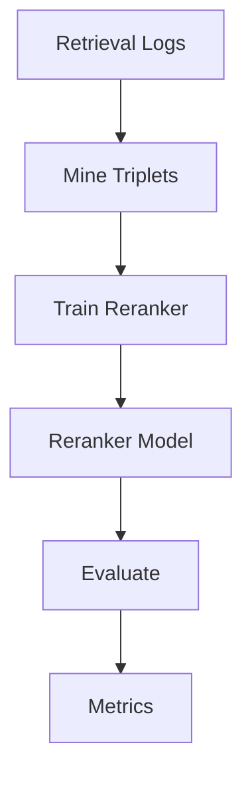

# How-To: Reranker Training and Evaluation

<div class="grid chunk_summaries" markdown>

-   :material-swap-vertical:{ .lg .middle } **Reranker**

    ---

    Cross-encoder stage to refine fused retrieval results.

-   :material-mining:{ .lg .middle } **Triplet Mining**

    ---

    Collect (query, positive, negative) examples from logs or heuristics.

-   :material-test-tube:{ .lg .middle } **Evaluate**

    ---

    Benchmark before/after reranking on an eval dataset.

</div>

[Get started](../index.md){ .md-button .md-button--primary }
[Configuration](../configuration.md){ .md-button }
[API](../api.md){ .md-button }

!!! tip "Start Small"
    Begin with a small `eval_dataset` and a few hundred mined triplets. Validate that gains are consistent across corpora.

!!! note "Costs"
    Training and evaluation costs depend on selected `RERANK` and `EMB/GEN` models from `data/models.json`.

!!! warning "Config-Governed"
    Enable via `reranker.enabled`. All training hyperparameters must be present in Pydantic before use.

## API Surface

| Route | Method | Description |
|-------|--------|-------------|
| `/reranker/status` | GET | Load status (model, enabled) |
| `/reranker/info` | GET | Implementation details |
| `/reranker/mine` | POST | Mine triplets |
| `/reranker/train` | POST | Train reranker |
| `/reranker/evaluate` | POST | Evaluate against dataset |
| `/reranker/logs/count` | GET | Available logs |
| `/reranker/triplets/count` | GET | Triplets available |
| `/reranker/costs` | GET | Estimated costs |



## Example Workflow

=== "Python"
    ```python
    import httpx

    base = "http://localhost:8000"

    # Mine triplets (1)
    mine_req = {"corpus_id": "tribrid", "max_pairs": 500}
    httpx.post(f"{base}/reranker/mine", json=mine_req)

    # Train (2)
    train_req = {"corpus_id": "tribrid", "epochs": 2, "batch_size": 16}
    httpx.post(f"{base}/reranker/train", json=train_req)

    # Evaluate (3)
    eval_req = {"corpus_id": "tribrid"}
    print(httpx.post(f"{base}/reranker/evaluate", json=eval_req).json())
    ```

=== "curl"
    ```bash
    BASE=http://localhost:8000
    curl -sS -X POST "$BASE/reranker/mine" -H 'Content-Type: application/json' -d '{"corpus_id":"tribrid","max_pairs":500}'
    curl -sS -X POST "$BASE/reranker/train" -H 'Content-Type: application/json' -d '{"corpus_id":"tribrid","epochs":2,"batch_size":16}'
    curl -sS -X POST "$BASE/reranker/evaluate" -H 'Content-Type: application/json' -d '{"corpus_id":"tribrid"}' | jq .
    ```

=== "TypeScript"
    ```typescript
    async function trainReranker(corpus_id: string) {
      await fetch('/reranker/mine', { method: 'POST', headers: {'Content-Type':'application/json'}, body: JSON.stringify({ corpus_id, max_pairs: 500 }) }); // (1)
      await fetch('/reranker/train', { method: 'POST', headers: {'Content-Type':'application/json'}, body: JSON.stringify({ corpus_id, epochs: 2, batch_size: 16 }) }); // (2)
      const report = await (await fetch('/reranker/evaluate', { method: 'POST', headers: {'Content-Type':'application/json'}, body: JSON.stringify({ corpus_id }) })).json(); // (3)
      console.log(report);
    }
    ```

1. Mine triplets
2. Train model
3. Evaluate results

### Reranker Config Fields

| Field | Description |
|-------|-------------|
| `reranker.enabled` | Toggle reranker usage in search |
| `reranker.model` | Model id from `models.json` |
| `reranker.batch_size` | Micro-batch for reranking |

!!! success "Evaluation Discipline"
    Use a fixed `eval_dataset` to avoid overfitting. Track MAP@K and NDCG@K pre/post reranking.

- [x] Mine → Train → Evaluate
- [x] Compare metrics vs baseline
- [x] Monitor cost estimates via `/reranker/costs`

??? note "Triplet Mining"
    - Hard negatives from near-miss candidates
    - Positives from clicked/accepted chunks in logs
    - Balance classes to prevent bias
