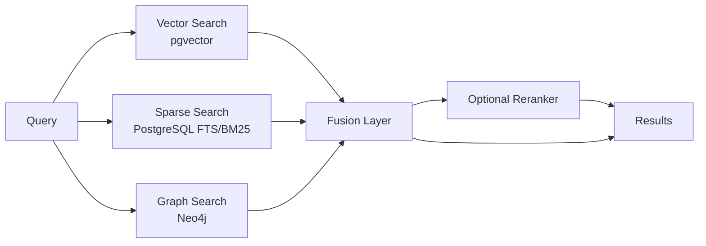
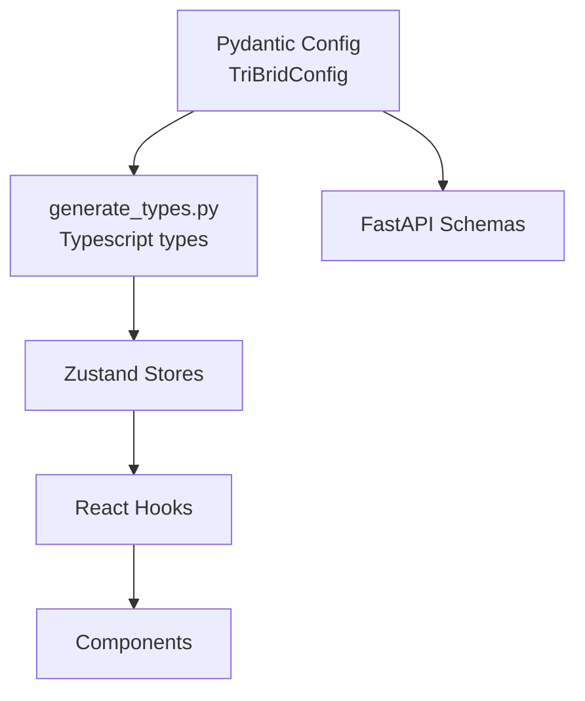

# TriBridRAG Documentation

<div class="grid chunk_summaries" markdown>

-   :material-vector-combine:{ .lg .middle } **Tri-brid Retrieval**

    ---

    Parallel Vector (pgvector), Sparse (PostgreSQL FTS/BM25), and Graph (Neo4j) search fused with configurable strategies.

-   :material-cog:{ .lg .middle } **Pydantic Is The Law**

    ---

    All configuration and API shapes come from `server/models/tribrid_config_model.py`. TypeScript types are generated — never hand-written.

-   :material-database:{ .lg .middle } **PostgreSQL Backbone**

    ---

    Chunk storage, embeddings, pgvector indexing, and FTS live in one database. No separate vector DB to manage.

-   :material-graph:{ .lg .middle } **Knowledge Graph**

    ---

    Neo4j stores entities and relationships; graph traversal augments retrieval for cross-file context.

-   :material-rocket-launch:{ .lg .middle } **API-First**

    ---

    FastAPI endpoints for indexing, retrieval, config, models, graph, health, and metrics.

-   :material-shield-lock:{ .lg .middle } **Operational Safety**

    ---

    Field constraints, health/readiness, Prometheus metrics, and cost-aware models.

</div>

[Get started](index.md){ .md-button .md-button--primary }
[Configuration](configuration.md){ .md-button }
[API](api.md){ .md-button }

!!! tip "Pro Tip — Read This First"
    TriBridRAG is strictly Pydantic-first. If a field or feature is not in `tribrid_config_model.py`, it does not exist. Add it there, regenerate TypeScript types, then build the rest.

!!! note "Implementation Note — repo_id vs corpus_id"
    The API still uses `repo_id` for historical reasons. Treat it as the corpus identifier. Many Pydantic models accept both via `validation_alias`, and serialize as `corpus_id`.

!!! warning "Security Warning — Secrets and DB Access"
    Ensure `.env` is not committed. Limit database exposure to trusted networks. Use strong passwords for PostgreSQL and Neo4j. Rotate API keys regularly.

## What TriBridRAG Does

TriBridRAG executes three independent retrieval methods in parallel and fuses them into a single result list that can optionally be reranked with a cross-encoder. All behavior is controlled by the Pydantic configuration model.

| Feature | Description | Status |
|---------|-------------|--------|
| Vector Search | Dense similarity via pgvector in PostgreSQL | ✅ Active |
| Sparse Search | PostgreSQL FTS/BM25 for exact terms, identifiers | ✅ Active |
| Graph Search | Neo4j traversal to follow entities/relations | ✅ Active |
| Fusion | Weighted/reciprocal-rank fusion of sources | ✅ Active |
| Reranker | Optional cross-encoder reranking | ✅ Active |

## End-to-End Retrieval Flow



## Quickstart — Run, Index, Search

- [x] Configure environment (.env)
- [x] Launch services with Docker Compose
- [x] Index a corpus
- [x] Search via API
- [ ] Tune fusion weights
- [ ] Enable reranking if needed

Use ++ctrl+c++ to stop local uvicorn or Docker Tail sessions.

=== "Python"
    ```python
    import httpx

    BASE = "http://localhost:8000"

    # 1) Trigger indexing of a corpus (1)
    req = {
        "corpus_id": "tribrid",  # repo_id alias is also accepted (2)
        "repo_path": "/path/to/your/codebase",
        "force_reindex": False,
    }
    r = httpx.post(f"{BASE}/index", json=req)
    r.raise_for_status()

    # 2) Poll status
    status = httpx.get(f"{BASE}/index/status", params={"corpus_id": "tribrid"}).json()
    print(status)

    # 3) Search (parallel vector/sparse/graph with fusion -> optional rerank) (3)
    payload = {
        "corpus_id": "tribrid",
        "query": "How does the chunker split Python files?",
        "top_k": 8,
        "enable_reranker": False,
    }
    res = httpx.post(f"{BASE}/search", json=payload).json()
    for m in res["results"]:
        print(m["file_path"], m["score"])  # fused score
    ```

=== "curl"
    ```bash
    BASE=http://localhost:8000

    # (1) Start indexing
    curl -sS -X POST "$BASE/index" \
      -H 'Content-Type: application/json' \
      -d '{
        "corpus_id": "tribrid",
        "repo_path": "/path/to/your/codebase",
        "force_reindex": false
      }'

    # (2) Status
    curl -sS "$BASE/index/status?corpus_id=tribrid" | jq .

    # (3) Search
    curl -sS -X POST "$BASE/search" \
      -H 'Content-Type: application/json' \
      -d '{
        "corpus_id": "tribrid",
        "query": "How does the chunker split Python files?",
        "top_k": 8,
        "enable_reranker": false
      }' | jq '.results[] | {file_path, score}'
    ```

=== "TypeScript"
    ```typescript
    // (1) Use generated types — do not hand-write interfaces
    import { IndexRequest } from "./web/src/types/generated"; // (2)

    async function search() {
      const base = "http://localhost:8000";

      const indexReq: IndexRequest = {
        corpus_id: "tribrid", // repo_id alias is accepted server-side
        repo_path: "/path/to/your/codebase",
        force_reindex: false,
      };

      await fetch(`${base}/index`, {
        method: "POST",
        headers: { "Content-Type": "application/json" },
        body: JSON.stringify(indexReq),
      });

      const res = await fetch(`${base}/search`, {
        method: "POST",
        headers: { "Content-Type": "application/json" },
        body: JSON.stringify({ corpus_id: "tribrid", query: "chunker", top_k: 8 }),
      });
      const data = await res.json();
      console.log(data.results.map((m: any) => [m.file_path, m.score])); // (3)
    }
    ```

1. Index start: pushes files through loader → chunker → embedder → graph builder
2. repo_id/corpus_id aliasing is enforced in Pydantic with `AliasChoices`
3. Search runs vector/sparse/graph in parallel → fusion → optional reranker

!!! success "Success — One Config To Rule Them All"
    Every behavior above is configured by the Pydantic model. Toggle fusion weights, graph hop limits, top_k, and reranker directly in config.

## Configuration and Operational Knobs

| Area | Key Examples | Description |
|------|--------------|-------------|
| Retrieval | `retrieval.vector.top_k`, `retrieval.sparse.top_k`, `retrieval.graph.max_hops` | Controls depth and breadth per retriever |
| Fusion | `fusion.strategy`, `fusion.weights`, `fusion.rrf_k_div` | Controls score fusion behavior |
| Reranker | `reranker.enabled`, `reranker.model` | Optional cross-encoder reranking |
| Indexing | `indexing.chunker.strategy`, `indexing.embedder.model` | Chunking and embeddings |



!!! danger "Critical — Do Not Hand-Write API Types"
    All frontend types are generated from Pydantic. Run `uv run scripts/generate_types.py` after any config model changes.

[Configuration](configuration.md){ .md-button .md-button--primary }
[API](api.md){ .md-button }
[Retrieval](retrieval/overview.md){ .md-button }

[^1]: Costs are derived from `data/models.json` and displayed in the UI.

??? note "Advanced Topics"
    - Fusion math: supports weighted linear combination and Reciprocal Rank Fusion with configurable `rrf_k_div`.
    - Retrieval cache: cache keys include `corpus_id`, `query`, and relevant config hashes for correctness.
    - Failure isolation: vector, sparse, and graph paths are resilient; a failure in one path degrades gracefully without crashing the whole search.
