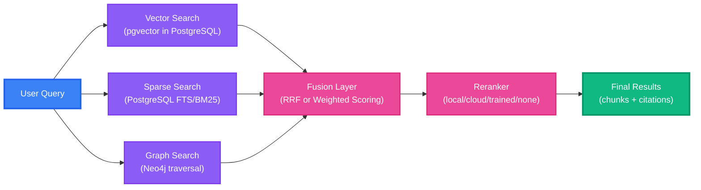

# TriBridRAG — Tri-Brid RAG Engine

TriBridRAG is a **tri-brid Retrieval-Augmented Generation (RAG)** engine for code understanding. “Tri-brid” means we run **three retrieval legs in parallel**—**vector**, **sparse**, and **graph**—then **fuse** their results into a single ranked candidate set for answering and analysis.

This design is intentional: code search quality fails in different ways depending on the query. TriBridRAG reduces those failure modes by combining complementary signals:

- **Vector search (pgvector in PostgreSQL)** captures semantic similarity (e.g., “auth flow” → “token exchange”).
- **Sparse search (PostgreSQL FTS / BM25-style ranking)** captures exact terms, identifiers, and filenames.
- **Graph search (Neo4j)** captures **relationships** between entities (calls/imports/inherits/contains/references) and can surface “connected” code even when lexical similarity is low.

!!! note "Pydantic is the law"
    TriBridRAG’s behavior is defined by `server/models/tribrid_config_model.py`. If a feature is configurable, it exists there first. The frontend types are generated from that model—never hand-written.

---

## Tri-brid retrieval pipeline



---

## Screenshots

!!! tip "Live Demo"
    Visit the running application at http://localhost:5175/ to explore all features.

### RAG Configuration Interface

<!-- TODO: Add screenshot of RAG tab with fusion weights, sliders, etc -->

### Search & Results

<!-- TODO: Add screenshot of search interface with tri-brid results -->

### Knowledge Graph Visualization

<!-- TODO: Add screenshot of Neo4j graph visualization tab -->

### Model Selection & Cost Tracking

<!-- TODO: Add screenshot of model picker and cost calculator -->

---

## Key features

- **Three retrieval legs, fused**
  - Vector + sparse + graph retrieval run together and are combined via **Reciprocal Rank Fusion (RRF)** or **weighted scoring**.

- **Single-database simplicity for dense + sparse**
  - Dense embeddings live in **PostgreSQL via pgvector**, and sparse retrieval uses **PostgreSQL Full-Text Search**—fewer moving parts, consistent operational model.

- **Graph RAG with Neo4j**
  - Entities (functions/classes/modules/etc.), relationships (calls/imports/inherits/contains/references), and optional **community detection** support graph-aware retrieval.

- **Config-driven behavior**
  - Thresholds, weights, top-k values, timeouts, and feature flags are all controlled through the Pydantic config model.

- **Type-safe frontend**
  - TypeScript types are **generated from Pydantic** (via `scripts/generate_types.py`). The UI imports `web/src/types/generated.ts` and does not define parallel interfaces.

- **Optional reranking**
  - After fusion, candidates can be reranked using a local cross-encoder, a cloud provider, a learning-based model, or disabled entirely.

!!! tip "When to expect the biggest gains"
    - Sparse search excels at exact identifiers, filenames, and error strings.  
    - Vector search excels at conceptual queries and paraphrases.  
    - Graph search excels at “what calls/uses this?” and “where does this flow go next?” questions.

---

## Quick start

### Prerequisites

- Python 3.11+
- Node.js 18+
- Docker + Docker Compose
- `uv` (Python package manager)

### Commands

```bash linenums="1"
git clone https://github.com/your-org/tribrid-rag.git
cd tribrid-rag
cp .env.example .env
docker compose up -d postgres neo4j grafana
uv sync
uv run uvicorn server.main:app --reload
```

Frontend (optional, separate terminal):

```bash linenums="1"
cd web
npm install
npm run dev
```

### Core API endpoints

| Endpoint | Method | Purpose |
|---|---:|---|
| `/search` | POST | Tri-brid retrieval + fusion (optionally reranked) |
| `/answer` | POST | RAG answer generation with citations |
| `/index` | POST | Index a repository (chunking + embeddings + graph build) |
| `/graph/{repo_id}/entities` | GET | Inspect graph entities |
| `/config` | GET/PUT | Read/update config (validated by Pydantic) |
| `/eval/run` | POST | Run evaluation suite |

!!! note "Observability"
    - FastAPI docs: `http://localhost:8000/docs`  
    - Grafana: `http://localhost:3000` (admin/admin)  
    - Prometheus: `http://localhost:9090`

---

## Configuration: the derivation chain (non-negotiable)

TriBridRAG treats configuration and types as a strict pipeline:

1. **Pydantic model defines the schema**: `server/models/tribrid_config_model.py`
2. **TypeScript types are generated**: `web/src/types/generated.ts`
3. UI stores/hooks/components import generated types (no parallel interfaces)

??? note "Click to expand: regenerate TypeScript types"
    ```bash linenums="1"
    uv run python scripts/generate_types.py
    ```

=== "Python"
    ```python linenums="1" hl_lines="1 8"
    # server/models/tribrid_config_model.py is the source of truth
    from server.models.tribrid_config_model import TriBridConfigRoot

    def load_config(path: str) -> TriBridConfigRoot:
        # Pydantic validates types, ranges, and defaults
        return TriBridConfigRoot.model_validate_json(open(path, "r").read())
    ```

=== "TypeScript"
    ```typescript linenums="1" hl_lines="1 4"
    // web/src/types/generated.ts is generated from Pydantic
    import type { TriBridConfigRoot } from "../types/generated";

    // Use generated types in stores/hooks/components (never hand-written interfaces)
    ```

!!! warning "Do not hand-write API/config types"
    If the backend returns a shape the frontend doesn’t like, we fix the **Pydantic model** and regenerate types. We do not add adapters/transformers to “patch” mismatches.

---

## Architecture highlights (from `tribrid_config_model.py`)

The landing page is intentionally config-aware: these are the knobs that define TriBridRAG’s behavior.

### Retrieval (vector + sparse behavior)

Key parameters (definition list):

`retrieval.topk_dense`
: Top-K candidates retrieved from dense vector search (pgvector).

`retrieval.topk_sparse`
: Top-K candidates retrieved from sparse search (PostgreSQL FTS / BM25-style).

`retrieval.bm25_k1` / `retrieval.bm25_b`
: BM25 tuning parameters (term frequency saturation and length normalization).

`retrieval.query_expansion_enabled` / `retrieval.max_query_rewrites`
: Multi-query and rewrite controls for recall improvements.

`retrieval.hydration_mode` / `retrieval.hydration_max_chars`
: Controls how much content is hydrated into results (lazy/eager/none).

!!! tip "Weight normalization behavior"
    In `RetrievalConfig`, `bm25_weight` and `vector_weight` are normalized to sum to 1.0 (rather than hard failing). This prevents misconfiguration from silently breaking retrieval.

### Graph storage + traversal (Neo4j)

`graph_storage.max_hops`
: Maximum traversal depth for graph search (controls recall vs. noise).

`graph_storage.entity_types`
: Entity extraction scope (e.g., function/class/module/variable/import).

`graph_storage.relationship_types`
: Relationship extraction scope (calls/imports/inherits/contains/references).

`graph_storage.graph_search_top_k`
: Candidate count returned from graph traversal before fusion.

`graph_storage.include_communities` / `graph_storage.community_algorithm`
: Optional community detection for higher-level structure.

### Fusion (the “tri-brid” join point)

`fusion.method`
: Fusion strategy: `rrf` or `weighted`.

`fusion.vector_weight` / `fusion.sparse_weight` / `fusion.graph_weight`
: Tri-brid weights (normalized to sum to 1.0).

`fusion.rrf_k`
: RRF smoothing constant.

`fusion.normalize_scores`
: Normalize leg scores to [0,1] before weighted fusion.

!!! note "Two fusion modes"
    - **RRF** is robust when each leg’s score scales differ or are hard to calibrate.  
    - **Weighted** scoring is useful when you trust score calibration and want explicit control.

### Reranking (optional refinement)

`reranking.reranker_mode`
: `local`, `cloud`, `learning`, or `none`.

`reranking.tribrid_reranker_topn` / `reranking.reranker_cloud_top_n`
: How many fused candidates to rerank.

`reranking.rerank_input_snippet_chars`
: How much text is sent to the reranker per candidate.

---

## Where to go next

Use these pages to deepen from “what is it?” to “how do I operate it?”:

- [Configuration model (Pydantic is the law)](./configuration.md)
- [Retrieval & fusion (vector + sparse + graph)](./retrieval.md)
- [Graph RAG with Neo4j (entities, relationships, communities)](./graph-rag.md)
- [Indexing pipeline (chunking, embeddings, chunk_summaries)](./indexing.md)
- [Reranking (modes, performance, tuning)](./reranking.md)
- [API reference (search, answer, index, config)](./api.md)
- [Observability (metrics, dashboards, tracing)](./observability.md)

!!! danger "If it’s not in Pydantic, it doesn’t exist"
    Before adding a UI control, endpoint field, or new behavior: add it to `server/models/tribrid_config_model.py`, regenerate TypeScript types, then implement. This is how TriBridRAG stays coherent as it grows.