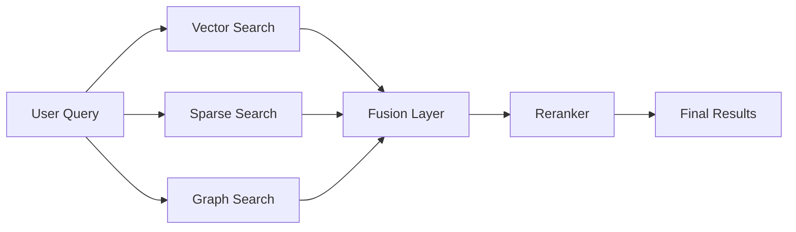

<div class="grid chunk_summaries" markdown>

-   :material-vector-combine:{ .lg .middle } **TriBridRAG Overview**

    ---

    Three retrieval methods fused for precise, recall-first search

-   :material-database:{ .lg .middle } **PostgreSQL + pgvector**

    ---

    Dense vectors + FTS in a single Postgres backbone

-   :material-graph:{ .lg .middle } **Neo4j Knowledge Graph**

    ---

    Entity traversal and relationships for contextual expansion

</div>

!!! tip "Pro Tip"
    Start by reading the Configuration page — Pydantic is the law and defines every option the system supports.

!!! note "Implementation Note"
    TriBridRAG is corpus-first. The codebase and UI still call this field `repo_id`, treat it as `corpus_id`.

!!! warning "Security Warning"
    Never check production API keys or DB passwords into source control. Use environment variables and ++ctrl+c++ to copy sensitive values only in secure contexts.

## Table of contents

- [Architecture](architecture.md)
- [Retrieval Overview](retrieval/overview.md)
- [Configuration & Models](configuration.md)
- [API Reference](api.md)
- [Indexing Pipeline](indexing.md)
- [Deployment & Docker](deploy.md)
- [Glossary](glossary.md)

??? note "Collapsible: Quick Start"

    Follow these high-level steps to get TriBridRAG running locally.

    - [x] Install dependencies
    - [x] Fill out .env (see Deployment)
    - [x] Start Docker services
    - [x] Index a corpus and build the graph
    - [ ] Configure models in UI


## Key configuration snapshot

| Feature | Description | Status |
|---------|-------------|--------|
| Vector Search | pgvector in PostgreSQL for semantic similarity | ✅ Active |
| Sparse Search | Postgres FTS/BM25 for exact matches | ✅ Active |
| Graph Search | Neo4j traversal for relationships | ✅ Active |


## Architecture summary




=== "Python"
    ```python
    def search(query: str, repo_id: str): # (1)
        results = fusion.search(query, repo_id) # (2)
        results = reranker.rerank(results, query) # (3)
        return results
    ```

=== "curl"
    ```bash
    curl -X POST "http://localhost:8000/search" \
      -H "Content-Type: application/json" \
      -d '{"query": "how to open a file", "repo_id": "my_corpus"}'
    ```

=== "TypeScript"
    ```typescript
    // (1) Use generated types from Pydantic conversion
    import { SearchRequest } from '../types/generated'

    async function runSearch(req: SearchRequest) { // (2)
      const res = await fetch('/api/search', { method: 'POST', body: JSON.stringify(req) })
      return res.json()
    }
    ```


1. The query and corpus identifier
2. Fusion runs vector + sparse + graph in parallel
3. Optional reranking with a cross-encoder reranker


### Accessibility & reading

- Clear headers and visual breaks are used for dyslexic-friendly reading
- Use ++ctrl+c++ to copy commands


[^1]: See tribrid_config_model.py for the authoritative list of configuration fields
