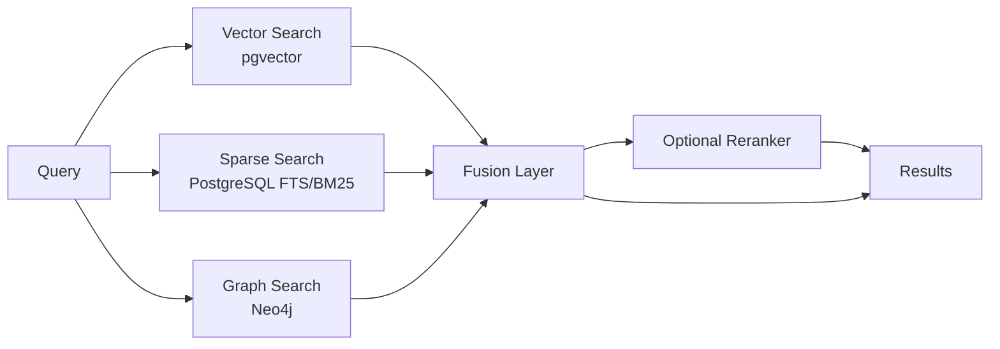
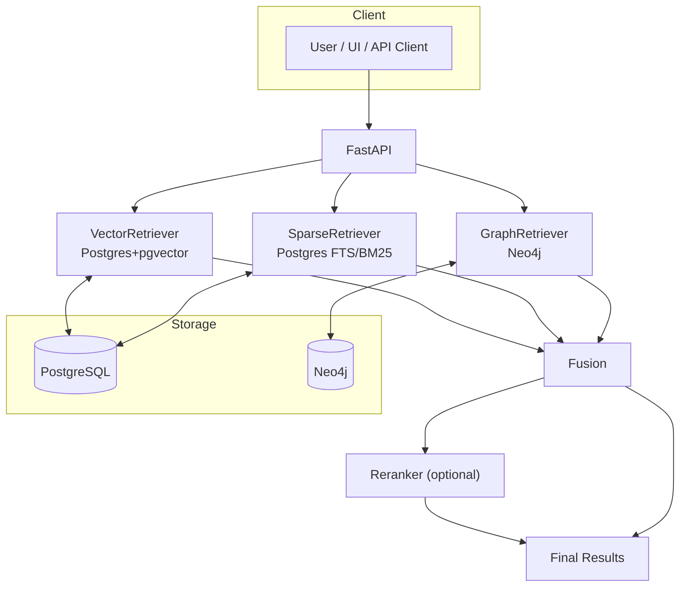

# TriBridRAG Documentation

<div class="grid chunk_summaries" markdown>

-   :material-vector-combine:{ .lg .middle } **Tri-brid Retrieval**

    ---

    Parallel Vector (pgvector), Sparse (PostgreSQL FTS/BM25), and Graph (Neo4j) search fused with configurable strategies.

-   :material-cog:{ .lg .middle } **Pydantic Is The Law**

    ---

    All configuration and API shapes come from `server/models/tribrid_config_model.py`. TypeScript types are generated — never hand-written.

-   :material-database:{ .lg .middle } **PostgreSQL Backbone**

    ---

    Chunk storage, embeddings, pgvector indexing, and FTS live in one database.

-   :material-graph:{ .lg .middle } **Knowledge Graph**

    ---

    Neo4j stores entities and relationships; graph traversal augments retrieval for cross-file context.

-   :material-rocket-launch:{ .lg .middle } **API-First**

    ---

    FastAPI endpoints for indexing, retrieval, config, models, graph, health, and metrics.

-   :material-shield-lock:{ .lg .middle } **Operational Safety**

    ---

    Field constraints, health/readiness, Prometheus metrics, and cost-aware models.

</div>

[Get started](index.md){ .md-button .md-button--primary }
[Configuration](configuration.md){ .md-button }
[API](api.md){ .md-button }

!!! tip "Read This First"
    TriBridRAG is strictly Pydantic-first. If a field or feature is not in `server/models/tribrid_config_model.py`, it does not exist. Add it there, regenerate TypeScript types, then build the rest.

!!! note "Terminology — corpus vs repo_id"
    The API still accepts `repo_id` for legacy reasons. Treat it as the corpus identifier. Pydantic models use `AliasChoices("repo_id", "corpus_id")` and serialize as `corpus_id`.

!!! warning "Security"
    Keep `.env` out of version control. Restrict database access. Use strong passwords for PostgreSQL and Neo4j. Rotate API keys regularly.

## What TriBridRAG Does

| Feature | Description | Status |
|---------|-------------|--------|
| Vector Search | Dense similarity via pgvector in PostgreSQL | ✅ Active |
| Sparse Search | PostgreSQL FTS/BM25 for exact terms, identifiers | ✅ Active |
| Graph Search | Neo4j traversal to follow entities/relations | ✅ Active |
| Fusion | Weighted/reciprocal-rank fusion of sources | ✅ Active |
| Reranker | Optional cross-encoder reranking | ✅ Active |

## End-to-End Retrieval Flow



## Quickstart — Run, Index, Search

- [x] Configure environment (.env)
- [x] Launch services with Docker Compose
- [x] Regenerate TypeScript types from Pydantic
- [x] Index a corpus
- [x] Search via API
- [ ] Tune fusion weights and confidence thresholds
- [ ] Enable reranking if needed

Use ++ctrl+c++ to stop local uvicorn or Docker Tail sessions.

=== "Python"
```python
import httpx, subprocess

BASE = "http://localhost:8000"

# 1) Generate TS types from Pydantic (required for UI) (1)
subprocess.check_call(["uv", "run", "scripts/generate_types.py"])  # (1)

# 2) Trigger indexing of a corpus (2)
req = {
    "corpus_id": "tribrid",  # repo_id alias is also accepted (3)
    "repo_path": "/path/to/your/codebase",
    "force_reindex": False,
}
httpx.post(f"{BASE}/index", json=req).raise_for_status()

# 3) Poll status (4)
status = httpx.get(f"{BASE}/index/status", params={"corpus_id": "tribrid"}).json()
print(status)

# 4) Search (parallel vector/sparse/graph -> fusion -> optional rerank) (5)
payload = {
    "corpus_id": "tribrid",
    "query": "How does the chunker split Python files?",
    "top_k": 8,
}
res = httpx.post(f"{BASE}/search", json=payload).json()
for m in res.get("matches", []):
    print(m["file_path"], m["score"])  # fused score
```

=== "curl"
```bash
BASE=http://localhost:8000

# (1) Types are generated locally via Python; no curl equivalent

# (2) Start indexing
curl -sS -X POST "$BASE/index" \ 
  -H 'Content-Type: application/json' \ 
  -d '{
    "corpus_id": "tribrid",
    "repo_path": "/path/to/your/codebase",
    "force_reindex": false
  }'

# (4) Status
curl -sS "$BASE/index/status?corpus_id=tribrid" | jq .

# (5) Search
curl -sS -X POST "$BASE/search" \ 
  -H 'Content-Type: application/json' \ 
  -d '{
    "corpus_id": "tribrid",
    "query": "How does the chunker split Python files?",
    "top_k": 8
  }' | jq '.matches[] | {file_path, score}'
```

=== "TypeScript"
```typescript
// (1) Ensure ./web/src/types/generated.ts exists (generated by Python)
import type { IndexRequest, SearchRequest, SearchResponse } from "./web/src/types/generated";

async function indexAndSearch() {
  const base = "http://localhost:8000";

  const indexReq: IndexRequest = {
    corpus_id: "tribrid", // repo_id alias is also accepted server-side (3)
    repo_path: "/path/to/your/codebase",
    force_reindex: false,
  };
  await fetch(`${base}/index`, {
    method: "POST",
    headers: { "Content-Type": "application/json" },
    body: JSON.stringify(indexReq),
  }); // (2)

  const searchReq: SearchRequest = {
    corpus_id: "tribrid",
    query: "chunker split Python",
    top_k: 8,
  } as any; // depending on generated type

  const r = await fetch(`${base}/search`, {
    method: "POST",
    headers: { "Content-Type": "application/json" },
    body: JSON.stringify(searchReq),
  });
  const data: SearchResponse = await r.json(); // (5)
  console.log(data.matches.map(m => [m.file_path, m.score]));
}
```

1. Generate UI types from Pydantic models — this is the contract for the frontend
2. Start indexing your corpus folder
3. Inputs accept `repo_id` but serialize as `corpus_id`
4. Poll index status to show progress in UI
5. Search runs vector/sparse/graph in parallel, fuses, then optionally reranks

!!! success "One Config To Rule Them All"
    Every behavior above is configured by `TriBridConfig`. Adjust fusion weights, hop limits, Top-K, and reranking in the config and the system adapts immediately.

## Architecture Overview



??? note "Advanced Topics"
    - Fusion math: supports weighted linear combination and Reciprocal Rank Fusion with configurable `rrf_k`.
    - Retrieval cache: cache keys include `corpus_id`, `query`, and a hash of the retrieval config segment for correctness.
    - Failure isolation: vector, sparse, and graph legs are resilient; a failure in one path degrades gracefully without crashing the whole search.
