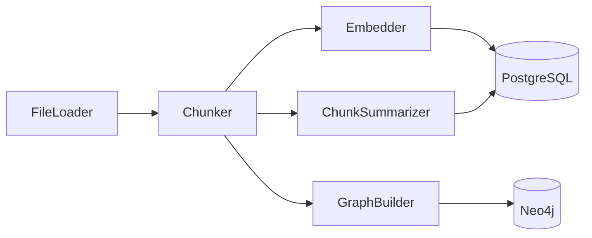
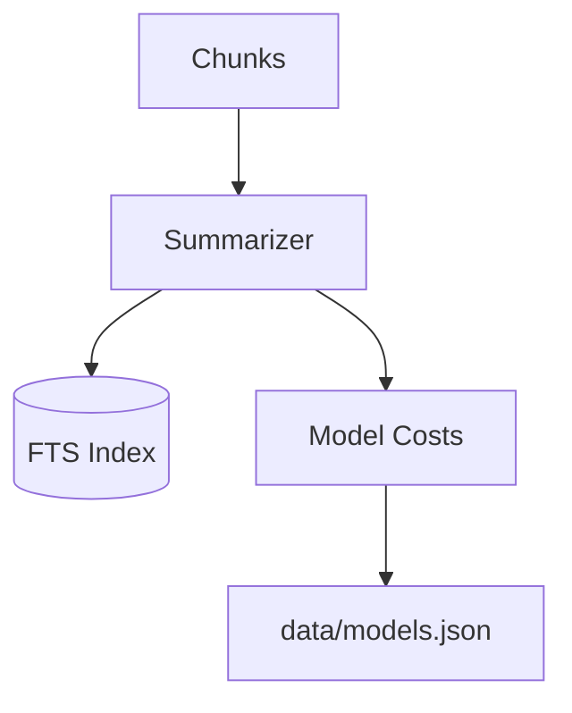

# Indexing Pipeline

<div class="grid chunk_summaries" markdown>

-   :material-file-find:{ .lg .middle } **Loader**

    ---

    Git-aware discovery honoring `.gitignore` with root-relative patterns.

-   :material-content-cut:{ .lg .middle } **Chunker**

    ---

    Fixed, AST-aware, or semantic chunk strategies with line attribution.

-   :material-vector-polyline:{ .lg .middle } **Embedder**

    ---

    Deterministic local embedder or provider-backed embeddings configured in Pydantic.

-   :material-text-short:{ .lg .middle } **Chunk Summaries**

    ---

    Optional LLM-generated `summary` per chunk to improve sparse search.

-   :material-graph:{ .lg .middle } **Graph Builder**

    ---

    Entity/relationship extraction and Neo4j persistence.

</div>

[Get started](index.md){ .md-button .md-button--primary }
[Configuration](configuration.md){ .md-button }
[API](api.md){ .md-button }

!!! tip "Pro Tip — Idempotent Indexing"
    Use `force_reindex=false` for incremental updates. The indexer skips unchanged files using mtime/hash checks where available.

!!! note "Storage Layout"
    Chunks, embeddings, and FTS are in PostgreSQL. Graph artifacts are in Neo4j. Sizes are summarized via dashboard endpoints.

!!! warning "Large Corpora"
    Configure Neo4j heap and page cache in Docker env for multi-million edge graphs. Monitor Postgres disk growth for pgvector indexes.

## Pipeline Flow



## Chunking Strategies

| Strategy | Module | Parameters | Use Case |
|----------|--------|------------|----------|
| `chunk_fixed` | `server/indexing/chunker.py` | `size`, `overlap` | Simple sliding windows |
| `chunk_ast` | `server/indexing/chunker.py` | `language`, `node_types` | Code-aware boundaries |
| `chunk_semantic` | `server/indexing/chunker.py` | `min_tokens`, `max_tokens` | Balanced semantic splits |

### Index Request Models

| Field | Type | Description |
|-------|------|-------------|
| `corpus_id` | str | Corpus identifier (alias of `repo_id`) |
| `repo_path` | str | Absolute path on disk |
| `force_reindex` | bool | Force full rebuild |

## Indexing via API

=== "Python"
    ```python
    import httpx

    base = "http://localhost:8000"

    req = {
        "corpus_id": "tribrid",
        "repo_path": "/work/src/tribrid",
        "force_reindex": False,
    }

    # Start
    httpx.post(f"{base}/index", json=req)  # (1)

    # Status
    status = httpx.get(f"{base}/index/status", params={"corpus_id": "tribrid"}).json()  # (2)

    # Storage stats
    stats = httpx.get(f"{base}/index/stats", params={"corpus_id": "tribrid"}).json()  # (3)
    print(stats)
    ```

=== "curl"
    ```bash
    BASE=http://localhost:8000

    curl -sS -X POST "$BASE/index" -H 'Content-Type: application/json' -d '{
      "corpus_id":"tribrid",
      "repo_path":"/work/src/tribrid",
      "force_reindex":false
    }'

    curl -sS "$BASE/index/status?corpus_id=tribrid" | jq .
    curl -sS "$BASE/index/stats?corpus_id=tribrid" | jq .
    ```

=== "TypeScript"
    ```typescript
    import { IndexRequest, IndexStats } from "./web/src/types/generated";

    async function reindex(path: string) {
      const req: IndexRequest = { corpus_id: "tribrid", repo_path: path, force_reindex: false };
      await fetch("/index", { method: "POST", headers: {"Content-Type":"application/json"}, body: JSON.stringify(req) }); // (1)
      const status = await (await fetch("/index/status?corpus_id=tribrid")).json(); // (2)
      const stats: IndexStats = await (await fetch("/index/stats?corpus_id=tribrid")).json(); // (3)
      console.log(status, stats.total_chunks);
    }
    ```

1. Start indexing
2. Poll progress
3. Inspect aggregated stats

## Chunk Summaries

| Endpoint | Method | Description |
|----------|--------|-------------|
| `/chunk_summaries` | GET | List summaries for a corpus |
| `/chunk_summaries/build` | POST | Generate summaries for all chunks |

!!! success "Sparse Boost"
    Summaries can improve recall for identifier-heavy queries by adding descriptive context to FTS.



- [x] Choose chunking strategy in config
- [x] Enable summaries for sparse boost if budget allows
- [x] Validate storage growth in dashboard stats

??? note "Indexing Failure Modes"
    - File decoding errors: logged and skipped
    - Embedding timeouts: retried with backoff; chunk remains un-embedded if persistent
    - Graph build failures: search still works with vector/sparse; flagged in logs
