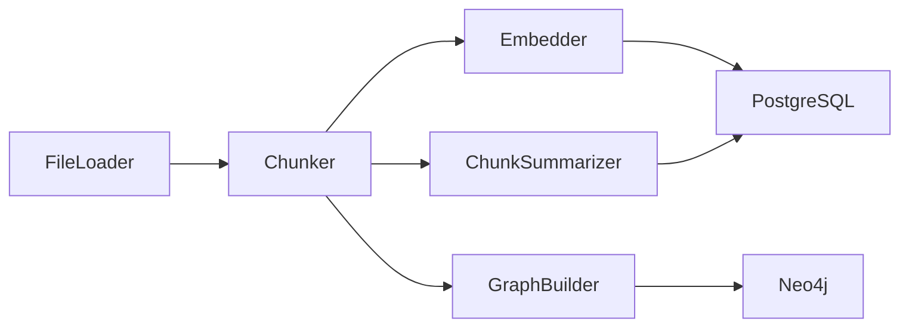

# Indexing Pipeline

<div class="grid chunk_summaries" markdown>

-   :material-file-find:{ .lg .middle } **Loader**

    ---

    Git-aware discovery honoring `.gitignore` with root-relative patterns.

-   :material-content-cut:{ .lg .middle } **Chunker**

    ---

    Fixed, AST-aware, or hybrid chunk strategies with line attribution.

-   :material-vector-polyline:{ .lg .middle } **Embedder**

    ---

    Deterministic local or provider-backed embeddings configured in Pydantic.

-   :material-text-short:{ .lg .middle } **Chunk Summaries**

    ---

    Optional LLM-generated `chunk_summaries` to improve sparse search.

-   :material-graph:{ .lg .middle } **Graph Builder**

    ---

    Entity/relationship extraction and Neo4j persistence.

</div>

[Get started](index.md){ .md-button .md-button--primary }
[Configuration](configuration.md){ .md-button }
[API](api.md){ .md-button }

!!! tip "Idempotent Indexing"
    Use `force_reindex=false` for incremental updates. The indexer skips unchanged files using mtime/hash checks where available.

!!! note "Storage Layout"
    Chunks, embeddings, and FTS are in PostgreSQL. Graph artifacts are in Neo4j. Sizes are summarized via dashboard endpoints.

!!! warning "Large Corpora"
    Configure Neo4j heap and page cache via environment for multi-million edge graphs. Monitor Postgres disk growth for pgvector indexes.

## Pipeline Flow



## Chunking & Embedding Controls (Selected)

| Section | Field | Default | Notes |
|---------|-------|---------|-------|
| chunking | `chunk_size` | 1000 | Target chars per chunk |
| chunking | `chunk_overlap` | 200 | Overlap for continuity |
| chunking | `chunking_strategy` | ast | `ast \| greedy \| hybrid` |
| chunking | `max_chunk_tokens` | 8000 | Split recursively if larger |
| embedding | `embedding_type` | openai | Provider selector |
| embedding | `embedding_model` | text-embedding-3-large | Model id |
| embedding | `embedding_dim` | 3072 | Must match model outputs |
| indexing | `bm25_tokenizer` | stemmer | Tokenizer for FTS |

## Start Indexing via API (Annotated)

=== "Python"
```python
import httpx
base = "http://localhost:8000"

req = {
    "corpus_id": "tribrid",   # (1)!
    "repo_path": "/work/src/tribrid",
    "force_reindex": False
}
httpx.post(f"{base}/index", json=req).raise_for_status()  # (2)!

status = httpx.get(f"{base}/index/status", params={"corpus_id": "tribrid"}).json()
print(status["status"], status.get("progress"))          # (3)!
```

1. Create/refresh a specific corpus
2. Start indexing
3. Poll progress

=== "curl"
```bash
BASE=http://localhost:8000
curl -sS -X POST "$BASE/index" -H 'Content-Type: application/json' -d '{
  "corpus_id":"tribrid","repo_path":"/work/src/tribrid","force_reindex":false
}'
curl -sS "$BASE/index/status?corpus_id=tribrid" | jq .
```

=== "TypeScript"
```typescript
import type { IndexRequest, IndexStatus } from "./web/src/types/generated";

async function reindex(path: string) {
  const req: IndexRequest = { corpus_id: "tribrid", repo_path: path, force_reindex: false } as any;
  await fetch("/index", { method: "POST", headers: {"Content-Type":"application/json"}, body: JSON.stringify(req) }); // (2)!
  const status: IndexStatus = await (await fetch("/index/status?corpus_id=tribrid")).json(); // (3)!
  console.log(status.status, status.progress);
}
```

## Graph Indexing (Neo4j)

| Field | Default | Meaning |
|-------|---------|---------|
| `graph_indexing.enabled` | true | Enable graph building during indexing |
| `graph_indexing.build_lexical_graph` | true | Add Chunk/NEXT_CHUNK structure |
| `graph_indexing.store_chunk_embeddings` | true | Store chunk vectors for Neo4j vector search |
| `graph_indexing.semantic_kg_enabled` | false | Extract concept relations (heuristic or LLM) |

??? info "Failure Modes"
    - File decoding errors: logged and skipped.
    - Embedding timeouts: retried with backoff; chunk remains un-embedded if persistent.
    - Graph build failures: retrieval continues with vector/sparse; flagged in logs.
