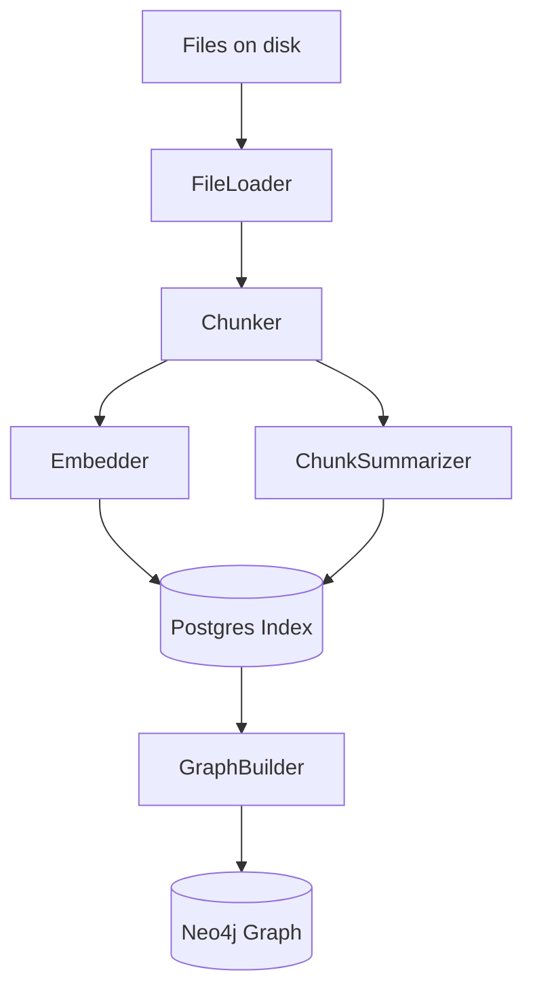

<div class="grid chunk_summaries" markdown>

-   :material-vector-combine:{ .lg .middle } **Chunking & Embedding**

    ---

    Chunker, Embedder, Summarizer components

-   :material-database:{ .lg .middle } **FileLoader & Patterns**

    ---

    FileLoader converts .gitignore patterns to gitwildmatch

-   :material-cog:{ .lg .middle } **Graph Builder**

    ---

    Extract entities and relationships to Neo4j

</div>

!!! tip "Pro Tip"
    Tune chunk_size and overlap in config to suit your LLM context window (see data/models.json for model contexts).

!!! note "Important"
    The Embedder is deterministic by default; provider-backed embedders are supported by configuration and models.json.

!!! warning "Data Warning"
    Reindexing can be IO and CPU intensive. Use force_reindex selectively and monitor IndexStatus endpoints.

??? note "Collapsible: Indexing flow"

    Indexing typically follows: FileLoader -> Chunker -> Embedder -> Postgres storage -> GraphBuilder





| Step | Component | Output |
|------|-----------|--------|
| 1 | FileLoader | Normalized file list (excludes via patterns) |
| 2 | Chunker | Chunks with token counts and metadata |
| 3 | Embedder | Embedding vectors for chunks |
| 4 | ChunkSummarizer | Short summaries (chunk_summaries) |
| 5 | GraphBuilder | Entities & relationships stored in Neo4j |


=== "Python"
    ```python
    from server.indexing.chunker import Chunker
    from server.indexing.embedder import Embedder

    chunker = Chunker()
    embedder = Embedder()

    chunks = chunker.chunk_file('src/main.py') # (1)
    embeddings = embedder.embed_chunks(chunks) # (2)
    ```

=== "curl"
    ```bash
    curl -X POST "http://localhost:8000/index" \
      -H 'Content-Type: application/json' \
      -d '{"repo_id":"my_corpus","repo_path":"/path/to/repo"}'
    ```

=== "TypeScript"
    ```typescript
    import { IndexRequest } from '../types/generated'

    const req: IndexRequest = { repo_id: 'my_corpus', repo_path: '/path' }
    await fetch('/api/index', { method: 'POST', body: JSON.stringify(req) })
    ```


1. Chunker splits file into manageable pieces with start/end lines
2. Embedder creates embeddings that are stored in Postgres


### Chunk summaries (UI term: chunk_summaries)

| Field | Description |
|-------|-------------|
| chunk_id | Unique id for chunk |
| summary | Short AI-generated text summary |
| token_count | Token budget used for embedding |


- [x] Validate file inclusion patterns
- [x] Monitor IndexStatus endpoints for progress
- [ ] Periodically rebuild vocabulary preview (VocabPreviewResponse)


??? note "Collapsible: Best practices"

    - Use consistent embedding models; changing models requires reindexing
    - Keep chunk sizes aligned with model context limits (see data/models.json)
