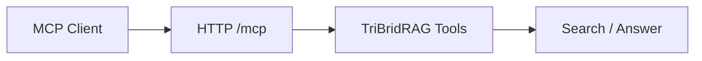

# MCP Integration (Model Context Protocol)

<div class="grid chunk_summaries" markdown>

-   :material-puzzle:{ .lg .middle } **Embedded MCP HTTP**

    ---

    Optional stateless HTTP transport for tools and clients.

-   :material-shield-check:{ .lg .middle } **Access Control**

    ---

    Allowed hosts/origins, optional API key, DNS rebinding protection.

-   :material-tune:{ .lg .middle } **Defaults**

    ---

    Per-endpoint defaults for retrieval mode and Top-K.

</div>

[Get started](../index.md){ .md-button .md-button--primary }
[Configuration](../configuration.md){ .md-button }
[API](../api.md){ .md-button }

!!! tip "Stateless Mode"
    Keep the embedded MCP HTTP endpoint stateless for easier scaling and isolation.

!!! note "Path and CORS"
    Align `mount_path`, `allowed_hosts`, and `allowed_origins` with your reverse proxy and UI origin to avoid CORS issues.

!!! warning "Auth"
    Use `require_api_key=true` in multi-tenant or exposed deployments.

## Configuration (Selected)

| Field | Default | Description |
|-------|---------|-------------|
| `mcp.enabled` | true | Enable embedded MCP HTTP endpoint |
| `mcp.mount_path` | `/mcp` | URL path for MCP endpoint |
| `mcp.stateless_http` | true | Stateless mode |
| `mcp.json_response` | true | Prefer JSON responses |
| `mcp.enable_dns_rebinding_protection` | true | Defense in depth |
| `mcp.allowed_hosts` | `localhost:*` | Allowed Host headers |
| `mcp.allowed_origins` | `http://localhost:*` | Allowed Origin values |
| `mcp.require_api_key` | false | Require `Authorization: Bearer` |
| `mcp.default_top_k` | 20 | Default Top-K when omitted |
| `mcp.default_mode` | `tribrid` | Default retrieval mode |



## Status Endpoint

=== "Python"
```python
import httpx
status = httpx.get("http://localhost:8000/mcp/status").json()
print(status)
```

=== "curl"
```bash
curl -sS http://localhost:8000/mcp/status | jq .
```

=== "TypeScript"
```typescript
async function mcpStatus() {
  const s = await (await fetch('/mcp/status')).json();
  console.log(s);
}
```

- [x] Set allowed hosts/origins
- [x] Enable API key when exposing outside localhost
- [x] Choose default retrieval mode/Top-K for tools
