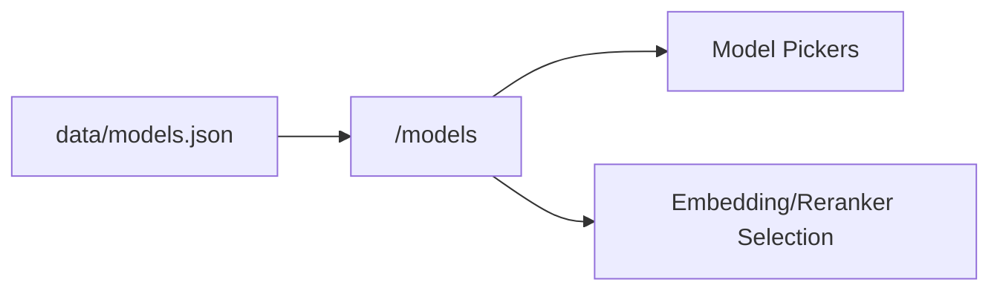

# Model Catalog (data/models.json)

<div class="grid chunk_summaries" markdown>

-   :material-currency-usd:{ .lg .middle } **Cost-Aware**

    ---

    Pricing per 1k tokens with provider and family classifications.

-   :material-brain:{ .lg .middle } **LLM/Embedding/Reranker**

    ---

    Centralized catalog for generation, embeddings, and rerank models.

-   :material-api:{ .lg .middle } **API-Served**

    ---

    UI and backend fetch from `/models/...`. No local lists.

</div>

[Get started](index.md){ .md-button .md-button--primary }
[Configuration](configuration.md){ .md-button }
[API](api.md){ .md-button }

!!! tip "Single Source"
    `data/models.json` is the authoritative source for model availability, pricing, and context sizes. Update it to change selectable models.

!!! note "Components"
    The `components` field indicates usage: `GEN` for generation, `EMB` for embeddings, `RERANK` for rerankers.

!!! warning "Pricing Staleness"
    Prices change over time. Keep `last_updated` current and reference sources in the file header.

## API Endpoints

| Route | Description |
|-------|-------------|
| `/models/by-type/{component_type}` | Filter by `GEN`, `EMB`, or `RERANK` |
| `/models/providers` | List providers |
| `/models/providers/{provider}` | Models for a specific provider |



=== "Python"
```python
import httpx
base = "http://localhost:8000"
gens = httpx.get(f"{base}/models/by-type/GEN").json()  # (1)!
providers = httpx.get(f"{base}/models/providers").json()  # (2)!
openai = httpx.get(f"{base}/models/providers/openai").json()  # (3)!
print(len(gens), providers, len(openai))
```

=== "curl"
```bash
BASE=http://localhost:8000
curl -sS "$BASE/models/by-type/GEN" | jq '.[0]'
curl -sS "$BASE/models/providers" | jq .
curl -sS "$BASE/models/providers/openai" | jq '.[].model'
```

=== "TypeScript"
```typescript
type ModelItem = { provider: string; family: string; model: string; components: string[] };

async function listGen(): Promise<ModelItem[]> {
  return await (await fetch("/models/by-type/GEN")).json();
}
```

??? info "UI Contract"
    All selectors in the UI must call these endpoints and use generated types for request/response where applicable.
