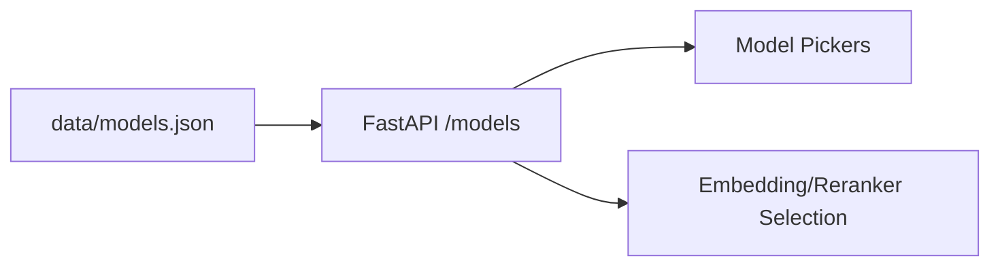

# Model Catalog (data/models.json)

<div class="grid chunk_summaries" markdown>

-   :material-currency-usd:{ .lg .middle } **Cost-Aware**

    ---

    Pricing per 1k tokens with provider and family classifications.

-   :material-brain:{ .lg .middle } **LLM/Embedding/Reranker**

    ---

    Centralized catalog for generation, embeddings, and reranking models.

-   :material-api:{ .lg .middle } **API-Served**

    ---

    UI and backend must fetch models from `/models/...`. No local lists.

</div>

[Get started](index.md){ .md-button .md-button--primary }
[Configuration](configuration.md){ .md-button }
[API](api.md){ .md-button }

!!! tip "Pro Tip — Single Source"
    `data/models.json` is the authoritative source for model availability, pricing, and context sizes. Update it to change selectable models.

!!! note "Components"
    The `components` field indicates usage: `GEN` for generation, `EMB` for embeddings, `RERANK` for cross-encoders.

!!! warning "Pricing Staleness"
    Prices may change. Keep `last_updated` current and reference sources in the file header.

## API Endpoints

| Route | Description |
|-------|-------------|
| `/models/by-type/{component_type}` | Filter by `GEN`, `EMB`, or `RERANK` |
| `/models/providers` | List providers |
| `/models/providers/{provider}` | Models for a specific provider |



## Example Queries

=== "Python"
    ```python
    import httpx

    base = "http://localhost:8000"
    gens = httpx.get(f"{base}/models/by-type/GEN").json()  # (1)
    providers = httpx.get(f"{base}/models/providers").json()  # (2)
    openai = httpx.get(f"{base}/models/providers/openai").json()  # (3)
    print(gens[0], providers, len(openai))
    ```

=== "curl"
    ```bash
    BASE=http://localhost:8000
    curl -sS "$BASE/models/by-type/GEN" | jq '.[0]'
    curl -sS "$BASE/models/providers" | jq .
    curl -sS "$BASE/models/providers/openai" | jq '.[].model'
    ```

=== "TypeScript"
    ```typescript
    type ModelItem = { provider: string; family: string; model: string; components: string[] };

    async function listGen(): Promise<ModelItem[]> {
      return await (await fetch("/models/by-type/GEN")).json();
    }
    ```

1. Generation models
2. Providers
3. Provider-specific listing

### Data Columns

| Field | Meaning |
|-------|---------|
| `provider` | e.g., `openai`, `cohere`, `voyage` |
| `family` | Logical family for grouping |
| `model` | Provider’s model identifier |
| `components` | `["GEN"]`, `["EMB"]`, `["RERANK"]` |
| `input_per_1k` / `output_per_1k` | Pricing in USD |
| `context` | Context window tokens |

!!! success "UI Contract"
    All selectors in the UI must call these endpoints and use generated types from Pydantic for request/response where applicable.

- [x] Update `models.json`
- [x] `uv run scripts/generate_types.py` if schema changed
- [x] Restart API if reloading is not enabled

??? note "Model Notes"
    The `notes` field documents special capabilities or context window exceptions.
