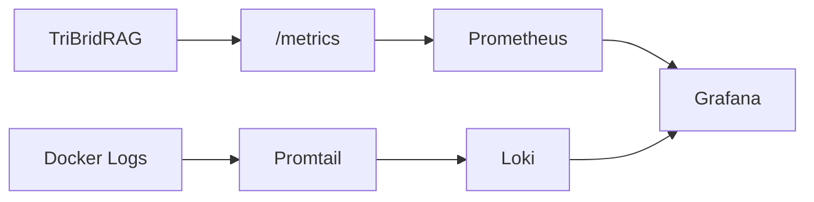

# Observability (Prometheus, Grafana, Loki)

<div class="grid chunk_summaries" markdown>

-   :material-chart-line:{ .lg .middle } **Metrics**

    ---

    `/metrics` endpoint + Postgres exporter.

-   :material-monitor:{ .lg .middle } **Dashboards**

    ---

    Grafana embedded with default UID `tribrid-overview`.

-   :material-clipboard-text-clock:{ .lg .middle } **Logs**

    ---

    Loki + Promtail for container logs and app logs.

</div>

[Get started](index.md){ .md-button .md-button--primary }
[Configuration](configuration.md){ .md-button }
[API](api.md){ .md-button }

!!! tip "Sampling"
    Adjust `tracing.trace_sampling_rate` to manage cost and overhead. Use 1.0 in dev and 0.1–0.2 in production.

!!! note "Anonymous Grafana"
    The compose stack enables anonymous access for embeds. Harden in production.

!!! warning "Timestamps"
    `DOCKER_LOGS_TIMESTAMPS=1` helps correlate events across services.

## Components

| Service | Port | Notes |
|---------|------|-------|
| Prometheus | 9090 | Scrapes `/metrics` and exporter |
| Grafana | 3001 | Embedded dashboard in UI |
| Loki | 3100 | Log aggregation |
| Promtail | — | Ships container/host logs |



=== "Python"
```python
import httpx
print(httpx.get("http://localhost:8000/metrics").text.splitlines()[:5])
```

=== "curl"
```bash
curl -sS http://localhost:8000/metrics | head -n 20
```

=== "TypeScript"
```typescript
const m = await (await fetch('/metrics')).text();
console.log(m.split('\n').slice(0,5));
```

??? info "Dashboards"
    Mount your own Grafana provisioning under `infra/grafana/provisioning` to add/override dashboards and datasources.
