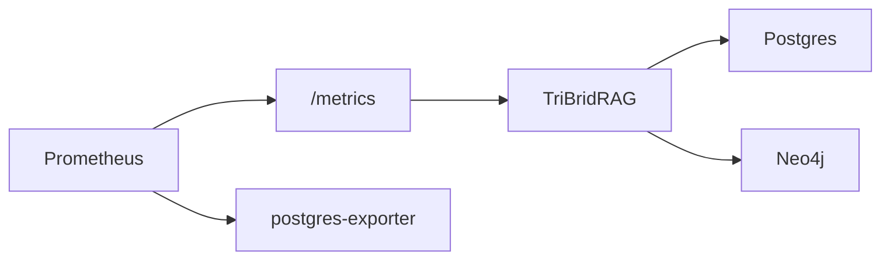

# Operations, Health, and Metrics

<div class="grid chunk_summaries" markdown>

-   :material-heart-pulse:{ .lg .middle } **Health**

    ---

    `/health` and `/ready` for liveness and readiness.

-   :material-chart-areaspline:{ .lg .middle } **Metrics**

    ---

    `/metrics` for Prometheus. Plus Postgres exporter for DB metrics.

-   :material-docker:{ .lg .middle } **Runtime Control**

    ---

    Inspect and restart containers via Docker endpoints.

</div>

[Get started](index.md){ .md-button .md-button--primary }
[Configuration](configuration.md){ .md-button }
[API](api.md){ .md-button }

!!! tip "Readiness Gate"
    Gate traffic on `/ready`. It verifies DB connectivity before admitting load.

!!! note "Container Logs"
    Use `/docker/{container}/logs` for ad-hoc log pulls, or rely on Loki for aggregation.

!!! warning "Restarts"
    Prefer coordinated restarts via the API (or compose) to avoid dropping in-flight requests.

## Endpoints

| Endpoint | Description |
|----------|-------------|
| `/docker/status` | Container status |
| `/docker/containers` | List TriBrid-managed containers |
| `/docker/containers/all` | List all containers |
| `/docker/{container}/restart` | Restart container |
| `/docker/{container}/logs` | Tail logs |



=== "Python"
```python
import httpx
print(httpx.get("http://localhost:8000/docker/status").json())
```

=== "curl"
```bash
curl -sS http://localhost:8000/docker/status | jq .
```

=== "TypeScript"
```typescript
await fetch('/docker/status').then(r => r.json())
```

- [x] Gate traffic with readiness
- [x] Alert on 5xx and slow search
- [x] Monitor DB connection pool saturation and timeouts
- [ ] Define SLOs for p95 latency per endpoint

??? note "Grafana"
    Default dashboard UID `tribrid-overview` is embedded in the UI. Customize datasource/dashboards via mounted provisioning files.
