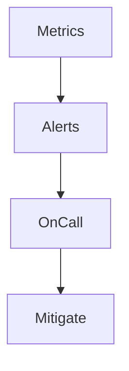

# Operations, Health, and Metrics

<div class="grid chunk_summaries" markdown>

-   :material-heart-pulse:{ .lg .middle } **Health**

    ---

    `/health` and `/ready` for liveness and readiness.

-   :material-chart-areaspline:{ .lg .middle } **Metrics**

    ---

    `/metrics` for Prometheus. Plus Postgres exporter for DB metrics.

-   :material-docker:{ .lg .middle } **Runtime Control**

    ---

    Inspect and restart containers via Docker endpoints.

</div>

[Get started](index.md){ .md-button .md-button--primary }
[Configuration](configuration.md){ .md-button }
[API](api.md){ .md-button }

!!! tip "Pro Tip — Readiness Gate"
    Deployments should route traffic only after `/ready` returns success. This ensures Postgres and Neo4j are available.

!!! note "Scopes"
    Health endpoints are cheap. Metrics scraping interval can be 10–30s depending on traffic and budget.

!!! warning "High-Cardinality Metrics"
    Avoid per-query labels in Prometheus if cardinality explodes. Aggregate at the corpus or retriever level.

## Endpoints

| Endpoint | Description |
|----------|-------------|
| `/health` | Process liveness |
| `/ready` | Readiness including DB checks |
| `/metrics` | Prometheus metrics |
| `/docker/status` | Container status |
| `/docker/{container}/restart` | Restart container |
| `/docker/{container}/logs` | Tail logs |

```mermaid
flowchart LR
    Scrape[Prometheus] --> API[/metrics]
    API --> App[TriBridRAG]
    App --> PG[(Postgres)]
    App --> NEO[(Neo4j)]
    Scrape --> PExp[postgres-exporter]
```

## Example: Metrics Scrape

=== "Python"
    ```python
    import httpx

    print(httpx.get("http://localhost:8000/metrics").text[:500])  # (1)
    ```

=== "curl"
    ```bash
    curl -sS http://localhost:8000/metrics | head -n 30
    ```

=== "TypeScript"
    ```typescript
    async function scrape() {
      const text = await (await fetch('/metrics')).text();
      console.log(text.split('\n').slice(0, 10).join('\n'));
    }
    ```

1. Prometheus-style exposition format

!!! success "Dashboards"
    The repository includes Grafana-ready metrics via `/metrics` and the Postgres exporter.

- [x] Gate traffic with `/ready`
- [x] Alert on high error rates and slow search latencies
- [x] Track index build durations and graph traversal times



??? note "Log Access"
    Use `/docker/{container}/logs` for quick log retrieval. For long-term retention, integrate with a centralized logging solution.
