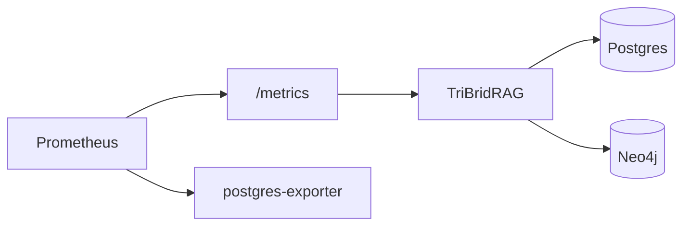
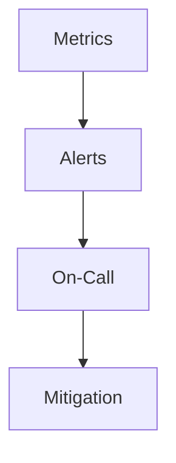

# Operations, Health, and Metrics

<div class="grid chunk_summaries" markdown>

-   :material-heart-pulse:{ .lg .middle } **Health**

    ---

    `/health` and `/ready` for liveness and readiness.

-   :material-chart-areaspline:{ .lg .middle } **Metrics**

    ---

    `/metrics` for Prometheus. Plus Postgres exporter for DB metrics.

-   :material-docker:{ .lg .middle } **Runtime Control**

    ---

    Inspect and restart containers via Docker endpoints.

</div>

[Get started](index.md){ .md-button .md-button--primary }
[Configuration](configuration.md){ .md-button }
[API](api.md){ .md-button }

!!! tip "Readiness Gate"
    Deployments should route traffic only after `/ready` returns success. This ensures PostgreSQL and Neo4j are reachable and responsive.

!!! note "Scrape Interval"
    Metrics scraping interval can be 10–30 seconds depending on traffic and budget.

!!! warning "High-Cardinality Labels"
    Avoid per-query labels in Prometheus if cardinality explodes. Aggregate at the corpus or retriever level.

## Endpoints

| Endpoint | Description |
|----------|-------------|
| `/health` | Process liveness |
| `/ready` | Readiness including DB checks |
| `/metrics` | Prometheus metrics |
| `/docker/status` | Container status |
| `/docker/{container}/restart` | Restart container |
| `/docker/{container}/logs` | Tail logs |



## Examples

=== "Python"
```python
import httpx
print(httpx.get("http://localhost:8000/health").json())
print(httpx.get("http://localhost:8000/ready").json())
print(httpx.get("http://localhost:8000/metrics").text.splitlines()[:5])
```

=== "curl"
```bash
curl -sS http://localhost:8000/health | jq .
curl -sS http://localhost:8000/ready | jq .
curl -sS http://localhost:8000/metrics | head -n 20
```

=== "TypeScript"
```typescript
await fetch('/health').then(r => r.ok || Promise.reject('down'))
await fetch('/ready').then(r => r.ok || Promise.reject('not ready'))
const sample = await (await fetch('/metrics')).text();
console.log(sample.split('\n').slice(0, 5));
```

- [x] Gate traffic with readiness
- [x] Alert on 5xx and slow search
- [x] Monitor DB connection pool saturation and timeouts



??? note "Log Access"
    Use `/docker/{container}/logs` for quick log retrieval. For long-term retention, integrate with a centralized logging solution. Loki is included in the compose stack.
