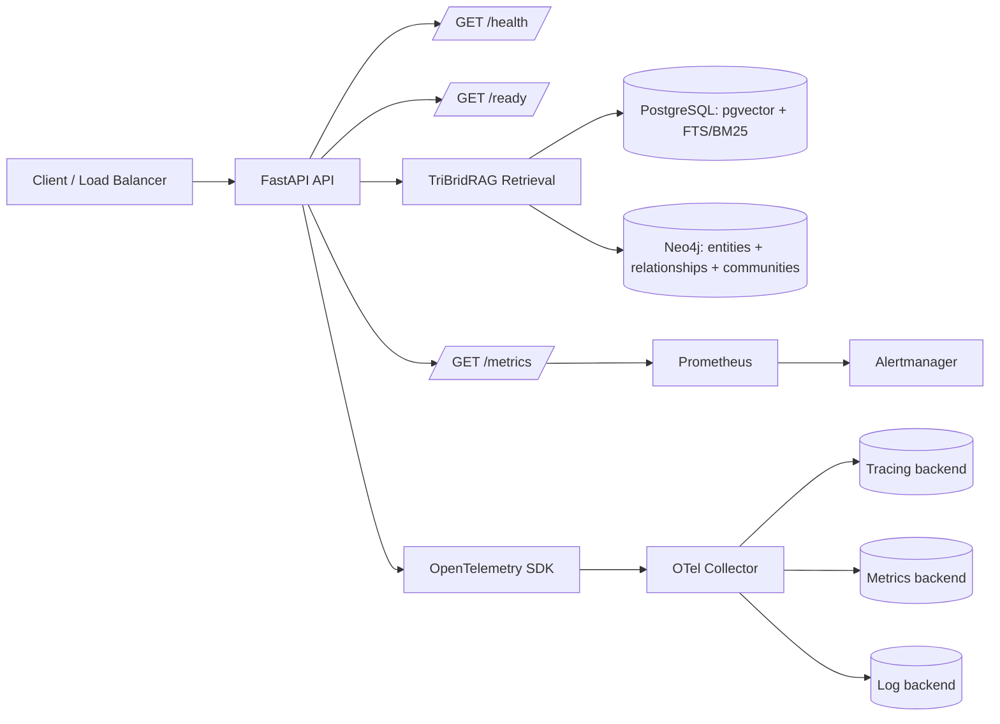

# Monitoring & Observability

TriBridRAG exposes a standard set of observability surfaces—health/readiness endpoints, Prometheus-compatible metrics, and OpenTelemetry tracing—so I can run it safely in production and diagnose issues across the tri-brid retrieval pipeline (vector + sparse + graph).

!!! warning
    The current source stubs (`server/api/health.py`, `server/observability/metrics.py`, `server/observability/tracing.py`) are placeholders. This page documents the intended contract and recommended implementation patterns. When you implement these modules, keep the public behavior stable so dashboards/alerts don’t break.

---

## Architecture overview



!!! note
    Observability should cover all three search legs and the fusion step (RRF or weighted scoring). If I can’t see per-leg latency and error rates, I can’t tune fusion or capacity plan.

---

## Health check endpoints

Source: [`server/api/health.py`](../api/health.md) (router stubs)

TriBridRAG exposes three endpoints:

- `GET /health` — liveness
- `GET /ready` — readiness (dependency checks)
- `GET /metrics` — Prometheus scrape endpoint

### `GET /health` (liveness)

**Purpose:** answers “is the process up and able to serve HTTP?”

- Must not perform deep dependency checks.
- Should be fast and non-blocking.
- Should return `200` if the API event loop is alive.

**Response contract (recommended):**

- `status`: `"ok"` or `"error"`
- `service`: service name (e.g., `"tribridrag-server"`)
- `version`: build/version string
- `time`: ISO timestamp

### `GET /ready` (readiness)

**Purpose:** answers “can this instance serve requests successfully right now?”

Readiness should validate connectivity to:

- PostgreSQL (vector + sparse live in the same Postgres instance)
- Neo4j (graph leg)
- Any required model/embedding provider (if applicable)
- Optional: background workers / ingestion pipelines (if they are required for serving)

**Response contract (recommended):**

- `status`: `"ready"` or `"not_ready"`
- `checks`: object keyed by dependency name with `ok`, `latency_ms`, and optional `error`

!!! tip
    In Kubernetes, wire `/health` to `livenessProbe` and `/ready` to `readinessProbe`. Keep `/health` shallow so transient DB issues don’t cause restart loops.

### `GET /metrics` (Prometheus)

**Purpose:** exposes Prometheus text format metrics.

- Must return `Content-Type: text/plain; version=0.0.4`
- Must be safe to scrape frequently (e.g., every 10–30 seconds)

---

## Metrics (Prometheus)

Source: [`server/observability/metrics.py`](../observability/metrics.md) (stub)

TriBridRAG is designed to export metrics that let me answer:

1. Is the API healthy (traffic, errors, latency)?
2. Which retrieval leg is slow or failing (vector vs sparse vs graph)?
3. Is fusion behaving as expected (RRF/weighted scoring)?
4. Are dependencies saturated (Postgres/Neo4j latency, pool exhaustion)?

### Recommended metric families

Below is the recommended baseline. Names are suggestions; keep them stable once published.

#### HTTP metrics

- `http_requests_total{method,route,status_code}`
- `http_request_duration_seconds_bucket{method,route}` (histogram)
- `http_inflight_requests{route}` (gauge)

#### Retrieval pipeline metrics (tri-brid)

- `retrieval_requests_total{mode}`  
  `mode`: `vector|sparse|graph|tri_brid`

- `retrieval_leg_duration_seconds_bucket{leg}` (histogram)  
  `leg`: `vector|sparse|graph|fusion|rerank`

- `retrieval_leg_errors_total{leg,error_type}`

- `fusion_candidates_total{leg}` (gauge or summary)  
  Number of candidates produced per leg before fusion.

- `fusion_method_total{method}`  
  `method`: `rrf|weighted`

!!! note
    Fusion metrics are not optional in a tri-brid system. If RRF is enabled, I want to see rank distributions and candidate counts per leg to detect regressions (e.g., graph leg returning zero candidates due to a Neo4j issue).

#### Dependency metrics

- `postgres_query_duration_seconds_bucket{query_name}`
- `neo4j_query_duration_seconds_bucket{query_name}`
- `db_pool_in_use{db}` / `db_pool_size{db}`

#### Process metrics

If you use the standard Prometheus client, you’ll also get:

- `process_cpu_seconds_total`
- `process_resident_memory_bytes`
- `python_gc_objects_collected_total` (Python runtime dependent)

### Instrumentation points

At minimum, instrument:

- API request lifecycle (middleware)
- Each retrieval leg:
  - vector search (pgvector)
  - sparse search (PostgreSQL FTS/BM25)
  - graph search (Neo4j)
- Fusion step (RRF or weighted scoring)
- Any reranking step (if present)

??? note "Click to expand: Example metric instrumentation skeleton"
    === "Python"
        ```python linenums="1" hl_lines="1 9 18"
        from prometheus_client import Counter, Histogram

        HTTP_REQUESTS = Counter(
            "http_requests_total",
            "Total HTTP requests",
            ["method", "route", "status_code"],
        )

        RETRIEVAL_LEG_LATENCY = Histogram(
            "retrieval_leg_duration_seconds",
            "Latency per retrieval leg",
            ["leg"],
            buckets=(0.005, 0.01, 0.025, 0.05, 0.1, 0.25, 0.5, 1, 2, 5, 10),
        )

        def observe_leg(leg: str):
            return RETRIEVAL_LEG_LATENCY.labels(leg=leg).time()
        ```

---

## Tracing (OpenTelemetry)

Source: [`server/observability/tracing.py`](../observability/tracing.md) (stub)

TriBridRAG uses OpenTelemetry to trace requests end-to-end, including:

- HTTP request span (root)
- Postgres spans (vector + sparse queries)
- Neo4j spans (graph queries)
- Fusion span (RRF/weighted scoring)
- Optional: embedding/reranking spans

### Trace structure (recommended)

A typical trace should look like:

- `HTTP GET /query` (root span)
  - `vector_search` (child span)
    - `postgres.query` (db span)
  - `sparse_search` (child span)
    - `postgres.query` (db span)
  - `graph_search` (child span)
    - `neo4j.query` (db span)
  - `fusion` (child span)
  - `rerank` (optional)

### Required span attributes

Use consistent attributes so I can filter and aggregate:

- `retrieval.leg`: `vector|sparse|graph|fusion|rerank`
- `retrieval.fusion_method`: `rrf|weighted`
- `retrieval.top_k`: integer
- `db.system`: `postgresql` or `neo4j`
- `db.statement`: avoid full raw queries if they contain sensitive data

!!! danger
    Do not attach raw user prompts, document text, or secrets to spans. If you need debugging context, attach hashed identifiers or bounded metadata (e.g., `doc_count`, `top_k`, `community_id`).

### Export model

Recommended deployment pattern:

- Application exports OTLP to an OpenTelemetry Collector
- Collector exports to your tracing backend (Jaeger/Tempo/etc.)

??? note "Click to expand: Example tracing setup skeleton"
    === "Python"
        ```python linenums="1" hl_lines="6 14 20"
        from opentelemetry import trace
        from opentelemetry.sdk.resources import Resource
        from opentelemetry.sdk.trace import TracerProvider
        from opentelemetry.sdk.trace.export import BatchSpanProcessor
        from opentelemetry.exporter.otlp.proto.http.trace_exporter import OTLPSpanExporter

        def setup_tracing(service_name: str, otlp_endpoint: str) -> None:
            resource = Resource.create({"service.name": service_name})
            provider = TracerProvider(resource=resource)
            trace.set_tracer_provider(provider)

            exporter = OTLPSpanExporter(endpoint=otlp_endpoint)
            processor = BatchSpanProcessor(exporter)
            provider.add_span_processor(processor)

        tracer = trace.get_tracer("tribridrag")
        ```

---

## Logging configuration

TriBridRAG logging should be:

- **Structured** (JSON preferred) for ingestion into log backends
- **Correlated** with traces (include `trace_id` / `span_id`)
- **Safe** (no secrets, no raw document payloads unless explicitly enabled)

### Recommended log fields

- `timestamp`
- `level`
- `logger`
- `message`
- `request_id` (if you generate one)
- `trace_id`, `span_id` (from OpenTelemetry context)
- `route`, `method`, `status_code`
- `retrieval.fusion_method`
- `retrieval.top_k`
- `latency_ms`

!!! tip
    If you already have OpenTelemetry, prefer log correlation via trace context propagation rather than inventing a parallel correlation ID scheme.

### Log levels

- `INFO`: request summaries, startup/shutdown, readiness transitions
- `WARNING`: degraded dependency, partial leg failures (e.g., graph leg timed out but vector+sparse succeeded)
- `ERROR`: request failures, repeated dependency failures
- `DEBUG`: gated behind config; never enable globally in production without sampling

??? note "Click to expand: Minimal Python logging skeleton (structured)"
    ```python linenums="1" hl_lines="7 14"
    import logging
    import json
    from datetime import datetime, timezone

    class JsonFormatter(logging.Formatter):
        def format(self, record: logging.LogRecord) -> str:
            payload = {
                "timestamp": datetime.now(timezone.utc).isoformat(),
                "level": record.levelname,
                "logger": record.name,
                "message": record.getMessage(),
            }
            return json.dumps(payload, ensure_ascii=False)

    handler = logging.StreamHandler()
    handler.setFormatter(JsonFormatter())

    root = logging.getLogger()
    root.setLevel(logging.INFO)
    root.addHandler(handler)
    ```

---

## Alerting setup

Alerting should be driven by symptoms that matter to users and by signals that indicate one of the tri-brid legs is failing.

### Recommended alert categories

#### Availability & traffic

- API error rate elevated (5xx)
- API latency elevated (p95/p99)
- No traffic (if unexpected)

#### Dependency health

- Postgres query latency elevated
- Neo4j query latency elevated
- Connection pool saturation
- Readiness failing for > N minutes

#### Retrieval quality signals (operational proxies)

- Graph leg returning zero candidates unexpectedly
- Sparse leg returning zero candidates unexpectedly
- Fusion candidate counts drop sharply
- Reranker timeouts (if reranking exists)

!!! warning
    Alerting on “quality” is hard. Start with operational proxies (candidate counts, leg error rates, timeouts) before attempting semantic quality alerts.

### Example Prometheus alert rules (illustrative)

??? note "Click to expand: PrometheusRule examples"
    ```yaml linenums="1" hl_lines="8 20 33"
    groups:
      - name: tribridrag-api
        rules:
          - alert: TriBridRAGHigh5xxRate
            expr: |
              sum(rate(http_requests_total{status_code=~"5.."}[5m]))
              /
              sum(rate(http_requests_total[5m])) > 0.02
            for: 10m
            labels:
              severity: page
            annotations:
              summary: "High 5xx rate in TriBridRAG API"

          - alert: TriBridRAGHighLatencyP99
            expr: |
              histogram_quantile(
                0.99,
                sum by (le) (rate(http_request_duration_seconds_bucket[5m]))
              ) > 2
            for: 10m
            labels:
              severity: page
            annotations:
              summary: "High p99 latency in TriBridRAG API"

          - alert: TriBridRAGNeo4jSlowQueries
            expr: |
              histogram_quantile(
                0.95,
                sum by (le) (rate(neo4j_query_duration_seconds_bucket[5m]))
              ) > 1
            for: 15m
            labels:
              severity: ticket
            annotations:
              summary: "Neo4j p95 query latency elevated"
    ```

---

## Configuration (Pydantic-driven)

!!! note
    **Pydantic is the law.** All observability configuration should be modeled in `tribrid_config_model.py`, and any TypeScript types must be generated from that model (never hand-written). This keeps server behavior, deployment values, and UI/admin tooling aligned.

### Suggested configuration parameters

Use a dedicated section in the Pydantic config model for observability.

Observability settings (suggested)
: `service_name`  
  : Service name used for logs/traces/metrics labels.
: `metrics_enabled`  
  : Enable Prometheus metrics endpoint.
: `metrics_path`  
  : Path for metrics scraping (default `/metrics`).
: `tracing_enabled`  
  : Enable OpenTelemetry tracing.
: `otlp_endpoint`  
  : OTLP exporter endpoint (HTTP or gRPC depending on exporter).
: `trace_sample_ratio`  
  : Head sampling ratio (0.0–1.0).
: `log_format`  
  : `json` or `text`.
: `log_level`  
  : `DEBUG|INFO|WARNING|ERROR`.

!!! tip
    Keep the `/metrics` endpoint enabled by default in non-public networks. If you expose it publicly, protect it (network policy / auth proxy) to avoid leaking operational details.

---

## Related pages

- [API](../api/index.md)
- [Configuration](../configuration/index.md)
- [Retrieval pipeline (TriBrid)](../retrieval/index.md)
- [Graph RAG (Neo4j)](../graph/index.md)